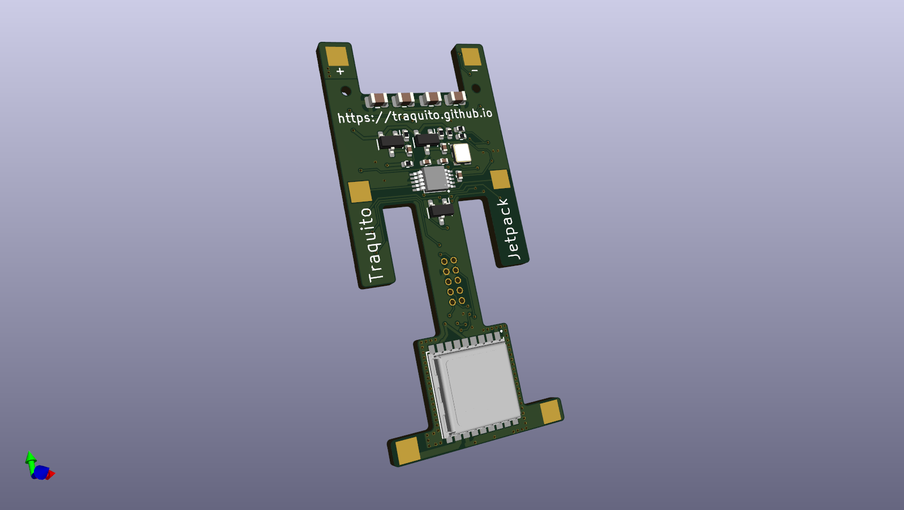
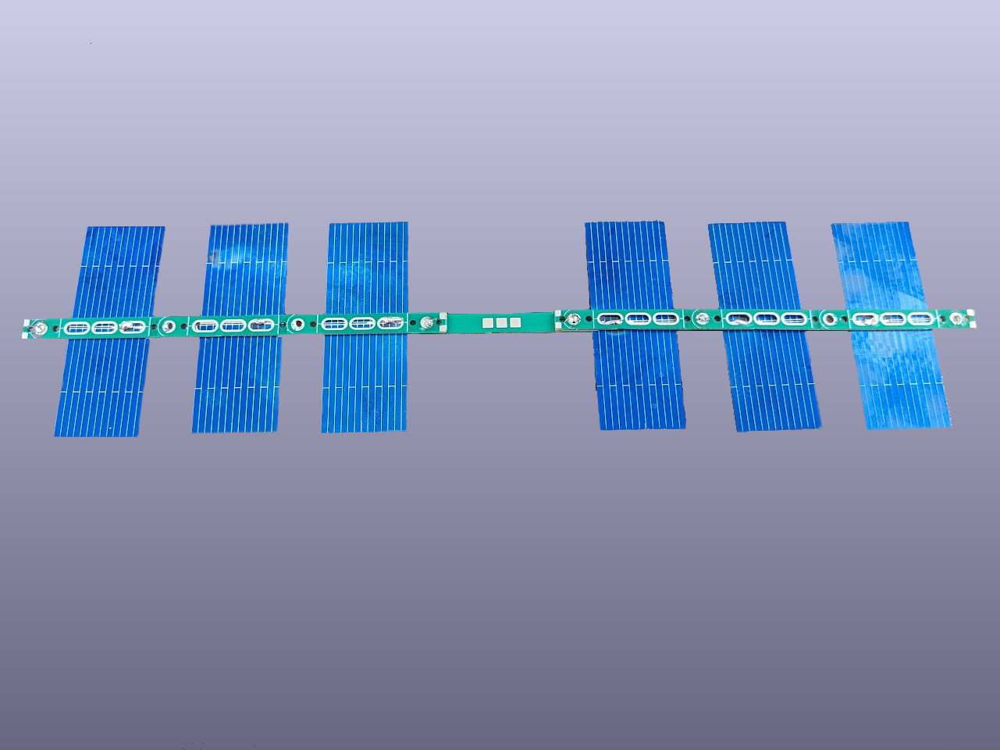
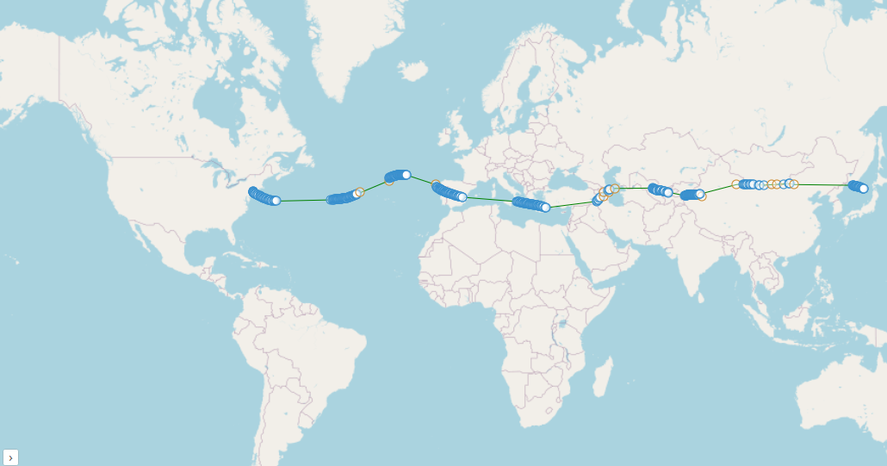
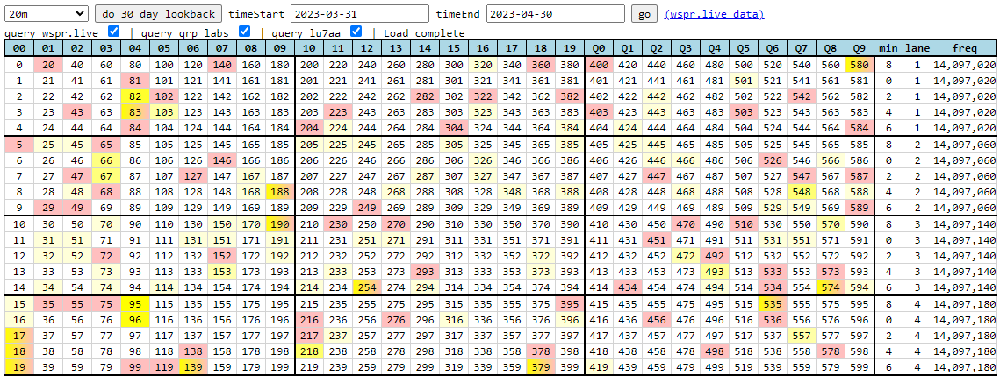
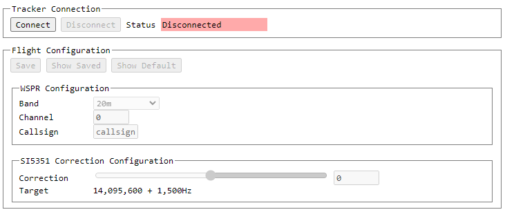
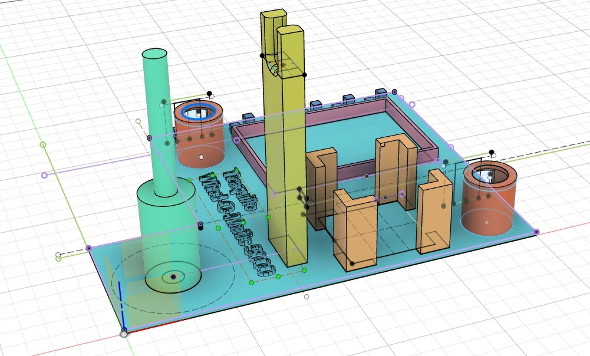

# Traquito WSPR Pico Balloon Resources

- <a class="card" href="./tracker/">
    <figure markdown="span">
        
        <figcaption>Jetpack WSPR Tracker</figcaption>
    </figure>
  </a>

- <a class="card" href="./solar/">
    <figure markdown="span">
        
        <figcaption>Solar System</figcaption>
    </figure>
  </a>

- <a class="card" href="./search/spots/dashboard/example/" target="_blank">
    <figure markdown="span">
        
        <figcaption>Spot Search</figcaption>
    </figure>
  </a>

- <a class="card" href="./channelmap/">
    <figure markdown="span">
        
        <figcaption>Channel Map</figcaption>
    </figure>
  </a>

- <a class="card" href="./trackergui/">
    <figure markdown="span">
        
        <figcaption>Tracker GUI</figcaption>
    </figure>
  </a>

- <a class="card" href="./WOM5000/">
    <figure markdown="span">
        
        <figcaption>Wind-O-Matic 5000</figcaption>
    </figure>
  </a>

- <a class="card" href="./pro/">
    <figure markdown="span">
        
        <figcaption>Pro Tools</figcaption>
    </figure>
  </a>

- <a class="card" href="./updates/">
    <figure markdown="span">
        
        <figcaption>Updates</figcaption>
    </figure>
  </a>

- <a class="card" href="./faq/">
    <figure markdown="span">
        
        <figcaption>FAQ</figcaption>
    </figure>
  </a>

