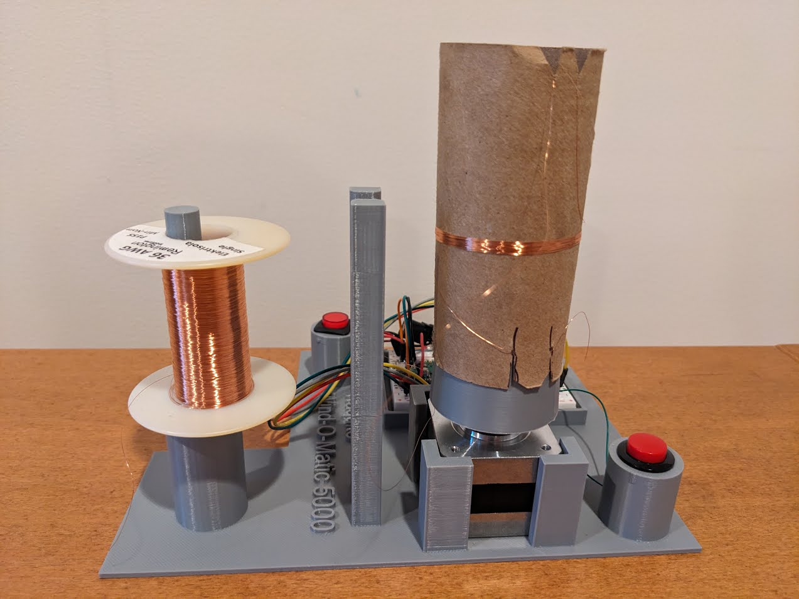

# Wind-O-Matic 5000

## Overview

Wind-O-Matic 5000 is a device which makes measuring out wire antennas for 20m band effortless.

!!! success "30 seconds to success!"
    - Attach antenna wire to your spool tube
    - Mount spool tube on the WOM5000
    - Press the "Activate" button
    - 30 seconds later the right length of wire for 20m (199.2") has been spooled!

<video width="720" autoplay loop muted controls>
    <source src="demo.mp4" type="video/mp4" />
</video>

## How to Get

!!! info "There are several sets of things you need"
    - [List of circuit components](https://www.adafruit.com/wishlists/586617){:target="_blank"} from Adafruit
    - The 3D print files for the WOM5000 Platform and Drum
    - The firmware to run the RPi Pico

You probably already have some of the components you need.  

File downloads below.
            

## Wind-O-Matic 5000 3D Parts

There are two 3D parts -- the platform and the drum.

### The platform

All sections necessary to hold everything together neatly.

### The drum 

Press fit to the stepper, used to hold your antenna spool in place during winding.

            

## How to Assemble

!!! info "Assmble the 3D parts"
    - Press-fit (hard) the Drum to the stepper motor shaft
    - Insert the stepper motor into the 4-corner retention area
    - Flash the RPi Pico with firmware
    - Solder headers on the RPi Pico and Stepper Controller
    - Put RPi Pico and Stepper Controller on a mini breadboard on the Platform
    - Use jumper wires to wire up the RPi Pico and Stepper Controller (see below)
    - Wire in 5v regulator (see below)
    - Wire in stepper (see below)
    - Wire in power button (not shown below)
    - Wire in Activate button (not shown below)

!!! note "Soldering is required for some connections!"

Details of how to wire in the buttons are left to the user.  

The buttons are not meant to be mounted with screw backing, use a dab of hot glue or superglue to hold in place.  

### Wiring Diagram

### Front View

### Top View

            

## File Downloads

| File | Description |
| --- | --- |
| [Wind-O-Matic 5000 Platform 3D Model](WOM5000.platform.2024-01-30.3mf) [Wind-O-Matic 5000 Drum 3D Model](WOM5000.drum.2024-01-30.3mf) [Wind-O-Matic 5000 RPi Pico Firmware](WOM5000.firmware.2024-01-30.uf2) | Released 2024-01-30 |
