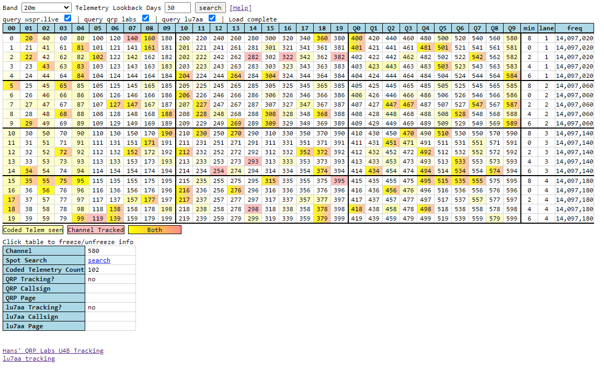
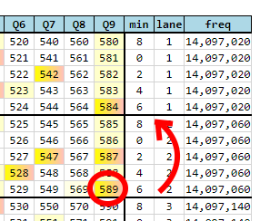
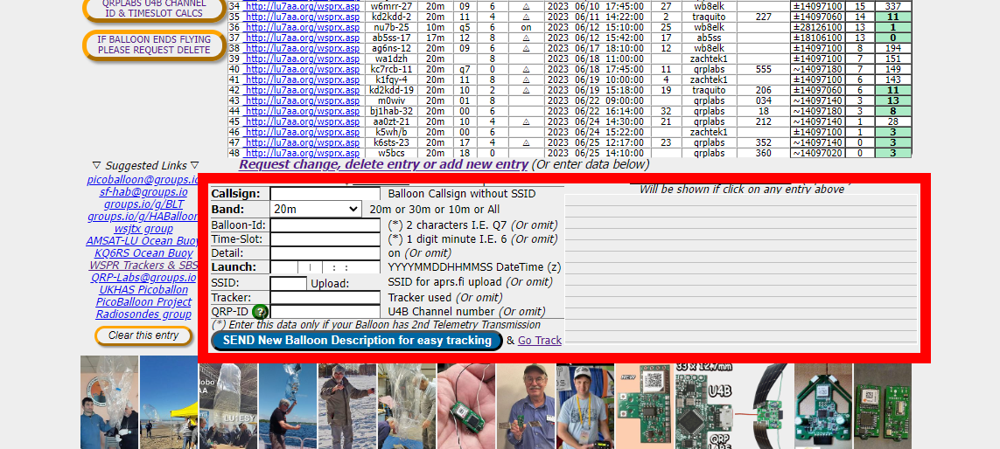
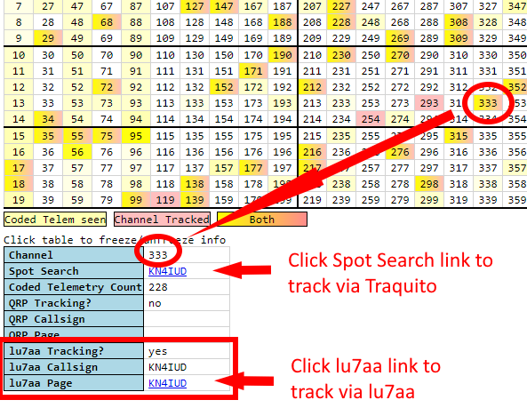

# Channel Map Help

## Overview

This page describes Channels, the [Channel Map](../../channelmap/README.md), and how to use them when flying a tracker.

## Channels

A Channel is a number that you configure your tracker with. It informs your tracker how to transmit data simultaneously with other trackers without them interfering with each other.

## Channel Map

The [Channel Map](../../channelmap/README.md) is a visualization that helps users more intuitively understand the relationship between channel number, transmission schedule, registration, and other details.

Each number in the table is a channel. There are 600 channels ranging from number 0 to 599.

The color of each channel tells you something about whether the channel is being used or not.

!!! info "Channel Colors"
    Red = Channel registered and in use.

    Yellow = Probably in use (but not registered).

    White = Available for registration and use.

!!! tip "Hovering your mouse over each channel reveals details about that channel in the box below the map."

## Schedule

The channel informs your tracker when to transmit.

!!! info "Tracker message sending schedule"
    Every 10 minutes, the tracker sends two messages: Regular and Telemetry.

    The Regular message is sent first. 
    The Telemetry message is sent second.

    Each message starts at a 2 minute boundary.

    | start minute | + 2 min   | + 4 min | + 6 min | + 8 min |
    |--------------|-----------|---------|---------|---------|
    | Regular      | Telemetry | -       | -       | -       |

    The start minute is indicated by the Channel Map.

!!! example "Finding the schedule for channel 589"
    On the Channel Map:

    - Find channel 589
    - Follow the row 589 is on until you intersect with the column labeled `min`.
    - This is the start minute that the Regular message will be sent on

    

    For channel 589:

    - Start Minute = 6, so:
        - The Regular message is sent at 12:06, 12:16, 12:26, ...
        - The Telemetry message is sent at 12:08, 12:18, 12:28, ...

!!! warning
    You can only use one channel at a time with the same start minute.

    That means a maximum of 5 flights simultaneously, each with a different channel and different minute.

    This applies to flights using the same callsign on the same band.

## Frequency

!!! note "There is a frequency column"
    The channel you select is also associated with a given transmission frequency.
    
    This differentiates channels with the same start minute value.

## Other Channel Map Columns

!!! note "There are many other columns"
    The top row of the Channel Map has columns ranging from `00` through `Q9`.

    These are unique identifiers that get embedded in the Telemetry data your tracker sends to uniquely identify it as yours.

## Band

!!! note "There is a Channel Map per-WSPR band"
    

    You can select between all the different WSPR bands (eg 20m, 10m, etc).

!!! info "Channels on band 20m do not conflict with any other band (eg 10m)!"

## Registering a Channel

It is encouraged to register the channel you want to use for your flight. You should select an available channel to register.

You can register your flight in advance of your launch, or on the day of.

Once you have identified an available channel, you will want to register it on the [LU7AA website](http://lu7aa.org/wsprset.asp).

!!! info "How to fill out the registration fields"
    - Callsign - Your callsign
    - Band - probably 20m, but make sure it's the same as what you chose on the Channel Map
    - Balloon-ID - Ignore
    - Time-Slot - Ignore
    - Detail - Ignore
    - Launch - The time of the launch, in UTC
    - SSID - Ignore
    - Tracker - The name of the [tracker](../../tracker/README.md) you are flying, eg `traquito` if using the Traquito Jetpack tracker
    - QRP-ID - The channel number you have selected

    Then click the blue button to submit.

Once you have registered your channel, the Channel Map will show that channel highlighted in red.

You will also be able to click the "Spot Search" link to track your balloon once you launch it.

