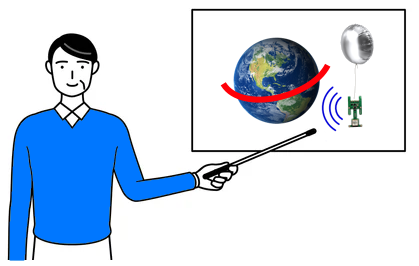
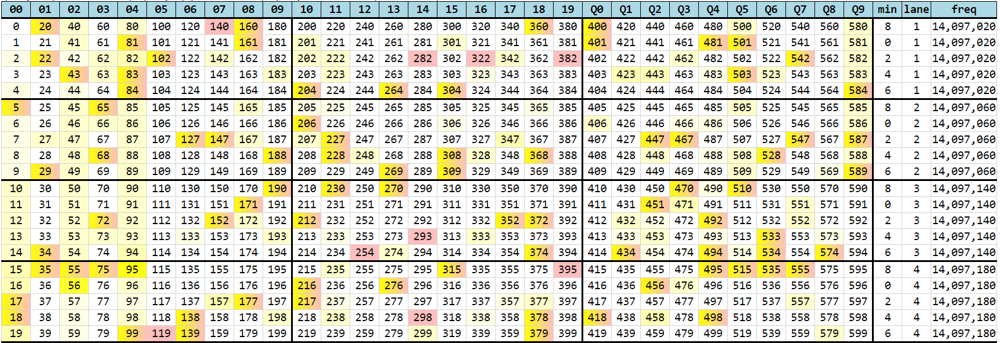
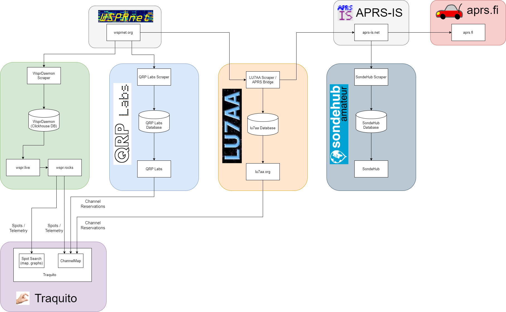
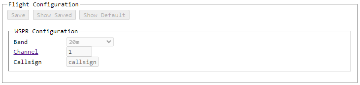
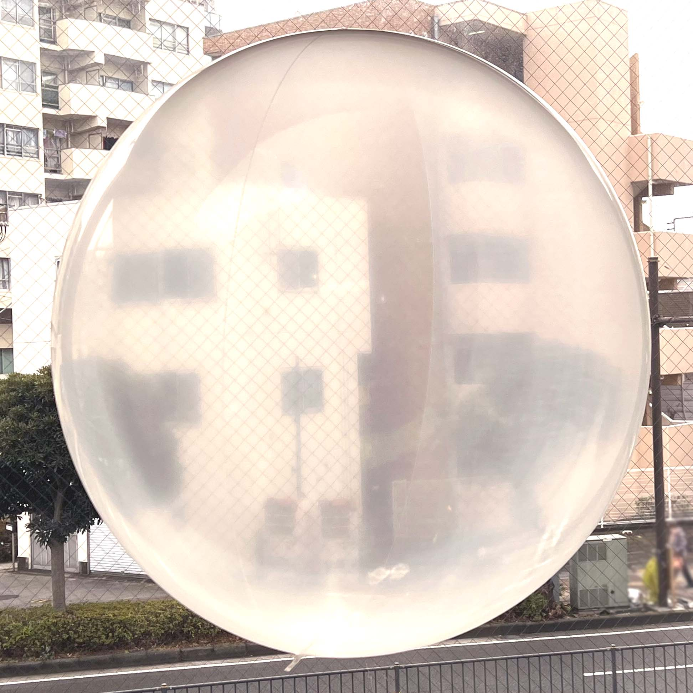
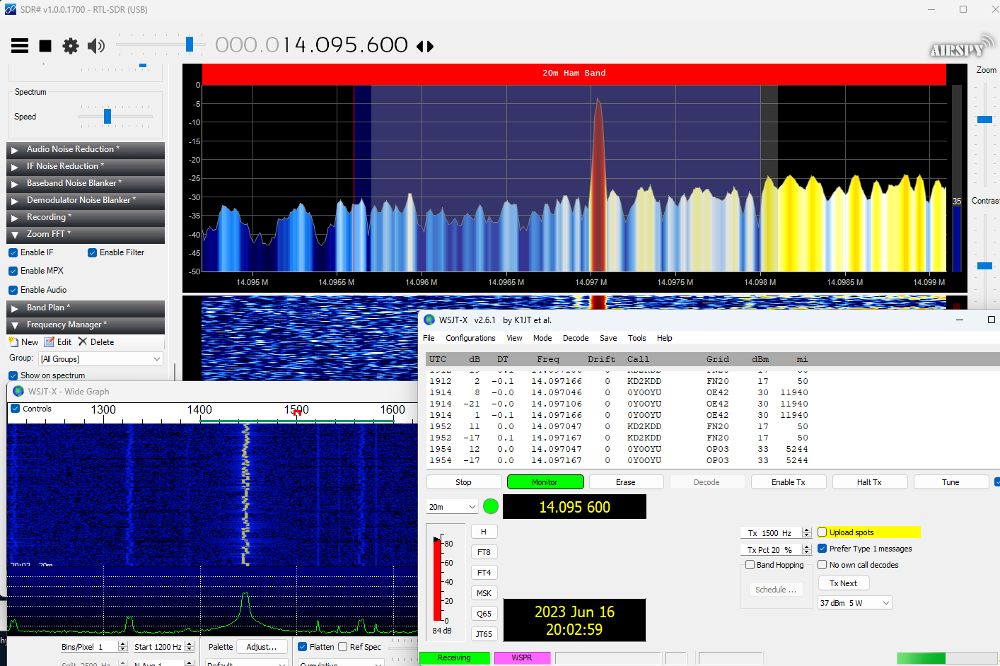

# FAQ Index

- <a class="card" href="./about/">
    <figure markdown="span">
        
        <figcaption>About</figcaption>
    </figure>
  </a>

- <a class="card" href="./bigidea/">
    <figure markdown="span">
        
        <figcaption>Big Idea</figcaption>
    </figure>
  </a>

- <a class="card" href="./channels/">
    <figure markdown="span">
        
        <figcaption>Channels</figcaption>
    </figure>
  </a>

- <a class="card" href="./sites/">
    <figure markdown="span">
        
        <figcaption>Site Relationships</figcaption>
    </figure>
  </a>

- <a class="card" href="./trackergui/">
    <figure markdown="span">
        
        <figcaption>Tracker GUI Howto</figcaption>
    </figure>
  </a>

- <a class="card" href="./balloons/buying/">
    <figure markdown="span">
        
        <figcaption>Buying Balloons</figcaption>
    </figure>
  </a>

- <a class="card" href="./jlcpcb/">
    <figure markdown="span">
        
        <figcaption>Ordering from JLCPCB</figcaption>
    </figure>
  </a>

- <a class="card" href="./receiving/">
    <figure markdown="span">
        
        <figcaption>Setup WSPR Reception</figcaption>
    </figure>
  </a>

