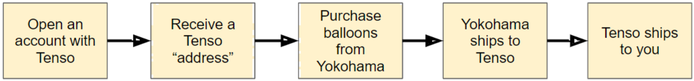
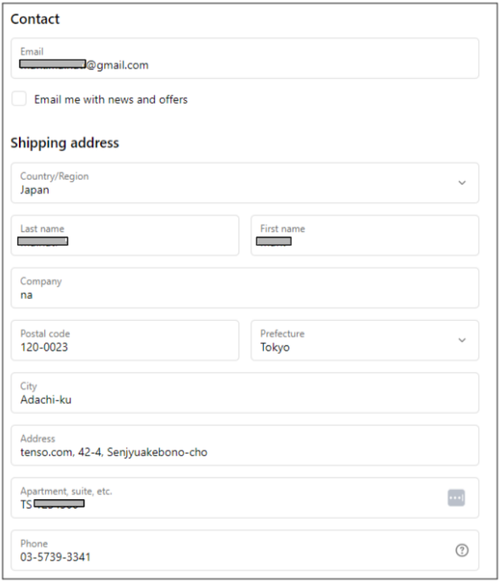

# Buying Balloons

## What balloons to buy for Pico Ballooning?

This document is about buying Yokohama balloons from Japan.

They have a great track record, at a cost.
Other alternatives exist, but this document is only about Yokohama.
            

## Buying Yokohama Balloons

Ordering is 10 balloons (minimum order quantity).

!!! info "You have two options for purchase"
    1. Medium-fast and most expensive (4 days, $250)
        - Buy direct from Yokohama
    2. Medium-slow and less expensive (18 days, $209)
        - Buy through a forwarding service (save money on shipping)

If you want the forwarding service, see below.
            

## Using Tenso to buy Yokohama balloons

Tenso is a forwarding service.
            

### 1. Open an account with Tenso

Go to [tenso.com](https://www.tenso.com/en), click the button "Sign up".

Provide your email address, you will receive a registration link in your email - follow that link.

Provide your proof of identification, method of payment, and your address.                
            

### 2. Receive a Tenso "address"

Tenso receives packages from lots of places, for lots of people.

They only know a package is for you if it's addressed to them, with a special identifier for you only.

That is the Tenso "address."

!!! example "Example of a Tenso address"
    Address: 〒120-0023

    東京都足立区千住曙町42-4 TSxxxxxxx転送コム

    Phone: 03-5739-3341
            

Once you sign up with Tenso, you will receive a "Registration Completed" email, it will include your Tenso address.

The address is partly in Japanese, partly in English, use [Google Translate](https://translate.google.com/) for English.

A "TS" number will be part of the address, that is how Tenso identifies you.
            

### 3. Purchase balloons from Yokohama

Go to the [Yokohama website](https://yokohamaballoon.com/products/sphere-balloon32inch?variant=41763086729369) and purchase your 32 inch clear balloons.  

You will pay for the balloons, the tax, and the domestic shipping.

Use the Tenso provided phone number.

Use your name and your Tenso address. 

Tenso includes [examples](https://www.tenso.com/en/my_page/address) of how to populate the address.

!!! example "Tenso address filled out"
    

### 4. Yokohama ships to Tenso

Yokohama sends you an email saying they have shipped to the address you provided.
            

### 5. Tenso Receives the package

Tenso identifies you from the TS number.

Tenso checks the items (there are boxes, packages & items).
            

### 6. Tenso confirms shipping details

Tenso emails you to confirm it is your merchandise.

You declare the value in JPY - it cannot be zero

Tenso asks you to select a shipper.

You select the shipper with help from the [shipping calculator](https://www.tenso.com/en/estimate).

!!! example
    For a box of ten balloons I used 1.5 pounds and a box size of 23” x 6.5” x 4.5”

You pay at this point.
            

### 7. Tenso ships to you

Tenso emails you to confirm the package has been shipped, with a tracking number.
            

!!! example "My first experience"
    May 2, 2023 		I ordered balloons from Yokohama, balloons $150, tax $15, shipping $7.27.

    May 12, 2023		Tenso receives the balloons.

    May 13, 2023		I selected “AIR/International Parcel” as the shipper, $36.48.

    May 20, 2023 		I received the balloons, enjoying a savings of $56.25 from the original $100.

