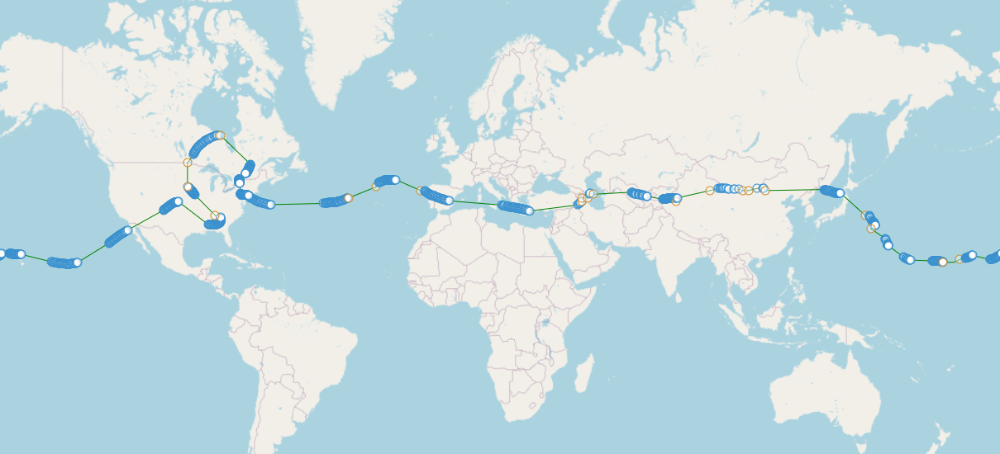

# Big Idea

## Pico Balloons

This site is all about flying Pico Balloons as a hobby or as a school STEM activity.

Pico Balloons is shorthand for attaching a small computer to a balloon, releasing it, and tracking the balloon as it flies with the wind, ideally around the world!

Many people have succeeded at circling the Earth once, some many times!

A lot of the fun comes from tracking your flight and exploring new ideas about how to improve your next flight based on what did or didn't work from your prior flight.
            

## Who does this?

The people involved in the hobby tend to have an interest in some kind of technical area, frequently computers, electronics, or wireless (radio) systems.

Everyone involved has a [HAM Radio License](https://www.arrl.org/ham-radio-licenses).

The HAM Radio License, granted to you by the FCC (after taking a test), gives you the right to send wireless radio transmissions.  The wireless radio transmissions are how the balloon computer (a [tracker](../../tracker/README.md)) tells you its location as it flies around.
            

## How it's done

Once licensed, you're able to fly.

Flying involves constructing a Pico Balloon, involving

*   A [balloon](../balloons/buying/README.md)
*   A [tracker](../../tracker/README.md) (small computer)
*   Solar panel (to power it over long durations)

Once the Pico Balloon is ready to go, you:

*   Select a [channel](../channels/README.md)
*   [Configure](../../trackergui/README.md) the tracker
*   [Launch](https://www.picoballoons.com/trackers/wspr-launch-process) it
*   [Track](../../search/spots/dashboard/example/README.md) it

            

## Things people focus on

Because the balloon flies around without control, avoiding bad weather is a big task.

To do that, flights tend to try to reach high altitudes (around 40,000 feet / 12,000 meters) in the hopes of simply flying above the storms.  Reaching higher altitudes means 1) bigger balloons and 2) lighter trackers.

So people like making smaller and lighter trackers, as well as trying out different solar panel configurations to see what gets them the best performance.

There are many aspects beyond this as well.  Join the forum and find out what appeals to you!
            

## How do I get involved?

Read the [About](../about/README.md) page to learn about the online forum, sign up to the forum, read some posts, and make some posts of your own!

Browse the other pages on this site.

Read about pico balloons on the internet or [https://picoballoons.com](https://picoballoons.com).