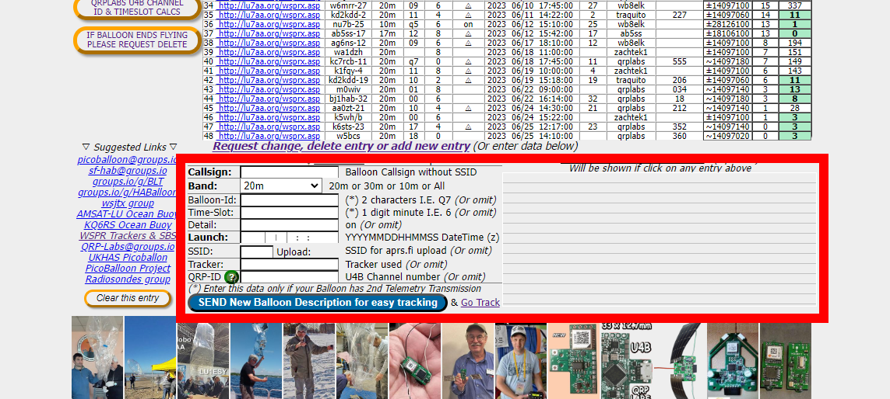
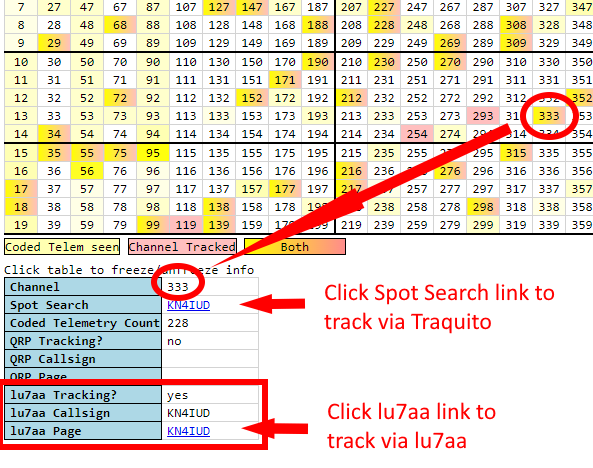

# Channel Map Usage

## How Channels work

This page describes the Channel Map and how to use it

But first, a note:

!!! note "Pico Ballooning is an amateur, non-commercial hobby."
    There is no central authority for how people do it, the way they transmit, make trackers, or any other aspect of it.

    That said, it's in everyone's benefit to work collaboratively because less chance of accidental interference.

    This page represents a way of avoiding interference when flying pico balloons.  There are other ways.
               

## What channels are

Pico Balloon [trackers](../../tracker/README.md) use radio transmissions to announce their location so that you can [track](/search/spots/dashboard/?band=20m&channel=269&callsign=KD2KDD&limit=2000&dtGte=2023-05-08&dtLte=2023-06-01) them.

Without care, however, one tracker can conflict with another, messing up each other's data.

To avoid that conflict, a scheme was developed whereby each flying tracker could be assigned a number (a "channel"), which would differentiate it from another tracker.

This is visually indicated in the [Channel Map](../../channelmap/README.md) page.

Each number in the table is a channel.  

The color of each channel tells you something about whether the channel is being used or not.

            

## Selecting and using a channel

If you're going to fly, you need to use a channel which isn't in use already.

Any channel which is red is in use.
Any channel which is yellow is probably in use.
Pick one which is neither.

Hovering your mouse over each channel reveals details about that channel in the box below the map.

!!! warning
    You can only use one channel at a time with the same minute (see the "min" value on the rightmost part of the Channel Map).

    That means a maximum of 5 flights simultaneously, each with a different channel and different minute.

The day you are going to fly you will want to select a channel.

Once you have your channel in mind, you will want to register it on the [LU7AA website](http://lu7aa.org/wsprset.asp).

!!! info "The registration fields"
    - Callsign - Your callsign
    - Band - probably 20m, but make sure it's the same as what you chose on the Channel Map
    - Balloon-ID - Ignore
    - Time-Slot - Ignore
    - Detail - Ignore
    - Launch - The time of the launch, in UTC
    - SSID - Ignore
    - Tracker - The name of the [tracker](../../tracker/README.md) you are flying, eg traquito if using the Traquito Jetpack tracker
    - QRP-ID - The channel number you have selected

Then click the blue button to submit.

Once you do that, the channel you selected on the Channel Map will be highlighted red.

You will also be able to click the "Spot Search" link to track your balloon once you launch it.

            

## Some specifics about tracker messages

To understand the details of the Channel Map you need to understand a few details about the messages that get sent by trackers.

Trackers typically use WSPR protocol for sending messages while flying.

WSPR protocol is a wireless radio protocol that has extremely long range (thousands of miles) but extremely small data payloads (only a handful of characters sent).

!!! info "A WSPR message has the following fields"
    - Callsign
    - Maidenhead Grid Locator 4-char (basically compressed GPS coordinates)
    - Power Indicator

These messages can only be sent at the start of an even minute (eg 12:02, 12:04, 12:06, ...).  Each message takes 1 minute 50 seconds to send.

This isn't very much data, and doesn't tell you interesting "telemetry" like altitude, speed, etc.

To overcome these limitations, the additional data is sent in a second specially-formatted (encoded) message.  The U4B protocol was developed to encode this data.
            

## U4B Protocol

U4B protocol basically answers the question of "how can I encode data in the callsign, grid, and power fields?"

EG, a real WSPR message might be: KD2KDD FN20 17 (real values)
An encoded WSPR message might be: 1V0CDC HN48 37 (encoded data that looks like real values)

Inside the encoded message is telemetry.

!!! info "Here are the fields, and the range of supported values"
    - Altitude    = 0m/0ft to 21,340m/70,000ft
    - Temperature = -50C/-58F to 39C/102F
    - Voltage     = 3.0v to 4.95v
    - Speed       = 0kph/0mph to 151kph/94mph

Jetpack "clamps" its reports to the ranges supported.  Meaning, for example, if the real measured voltage is below 3.0v, 3.0v will be reported.  Similarly, if the real measured voltage is above 4.95v, 4.95v will be reported.  This approach is used for all fields.

Special decoding logic is used to extract the telemetry from the encoded form.

When doing "window testing" (letting your tracker run in Flight Mode) at home, you will see your tracker transmit both the Regular and Encoded messages.
            

## Schedule

In U4B protocol, two messages are sent instead of one.

The first message, the Regular message, is sent once every 10 minutes, at the minute indicated by the channel.

The second message, the Encoded message, is sent in the 2 minute slot after the Regular message.

!!! example "For example, take channel 589"
    - Minute = 6, so the Regular message is sent at 12:06, 12:16, 12:26, ...
    - Minute + 2 = 8, so the Encoded message is sent at 12:08, 12:18, 12:28, ...

Notice that there is a "lane" concept, corresponding to a specific frequency, which differentiates some channels from others, despite having the same minute ("min") value.

            

Tying together Regular and Encoded messages

When you [track](/search/spots/dashboard/?band=20m&channel=269&callsign=KD2KDD&limit=2000&dtGte=2023-05-08&dtLte=2023-06-01) your flight, in addition to a map and graphs, you also get a table of data.

Traquito automatically finds and aligns the two messages, as well as decodes the messages, then maps/graphs them.

            

## Credit

[Hans Summers](http://www.hanssummers.com/) designed the channel scheme as well as the U4B protocol.  It was in use in his [U4B tracker](https://qrp-labs.com/u4b.html) first, before Traquito existed.

Pedro Converso runs the [LU7AA](http://lu7aa.org/wsprset.asp) tracking and registration website.

To learn more about the relationship between different WSPR Pico Balloon sites, see the FAQ page on [Site Relationships](../sites/README.md).