# Ordering from JLCPCB Instructions

## Ordering from JLCPCB

[jlcpcb.com](https://jlcpcb.com/) fabricates PCBs and assembles them as well, meaning they can produce a fully-populated PCB, shipped directly to you.

The [Traquito Jetpack](/tracker/#hardware-design-file-downloads) tracker Add-on Module is available to you directly through this service.

There are 3 files you will need to provide to JLCPCB during the ordering process.  You don't need to know anything about these files, just submit them and JLCPCB will take care of the rest.

A walkthrough of how to order is presented below.

!!! info "The set of files used for ordering"
    - BOM ("bill of materials" aka list of parts)
    - CPL part placement file (describes where each component should be placed/soldered on the PCB)
    - Gerber files in a .zip (describes the PCB itself - track location, shape of board, etc)

!!! warning
    The steps below should "just work."

    If you find yourself having to do something unexpected to "get it to work" then something is probably wrong.  Please reach out for help!

!!! tip
    Make sure you have an account created, and that you're logged in, before beginning.

!!! note
    Also, note that JLCPCB sometimes shows the PCB outline as a rectangle, depending on a bug on their side.
    
    The order is fine, though, this is known and you can continue.

    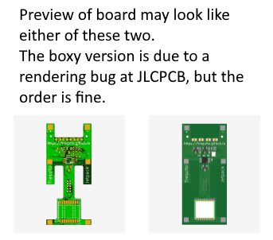
            

### Step 1

[jlcpcb.com](https://jlcpcb.com/)

Drag the gerber zip file onto the circled target on the JLCPCB site.
            

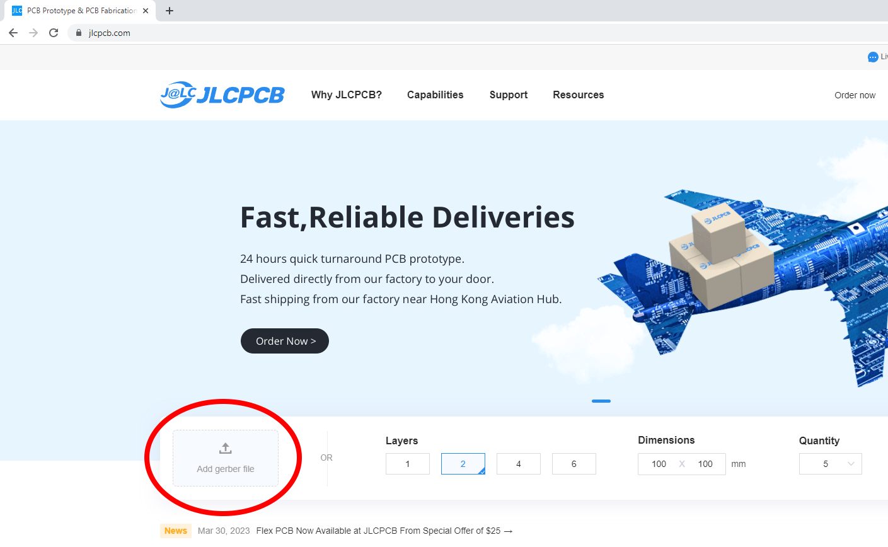

### Step 2

This page appears and is mostly defaulted correctly.

You only need to change the parts highlighted in red.
            

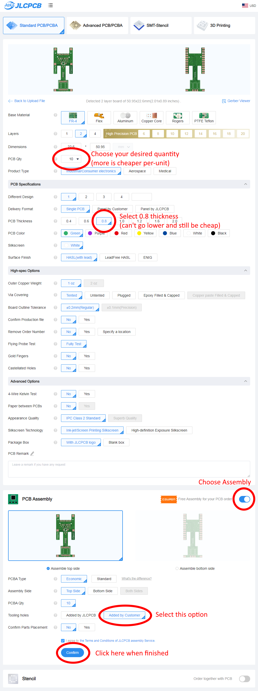

### Step 3

Click Next.
            

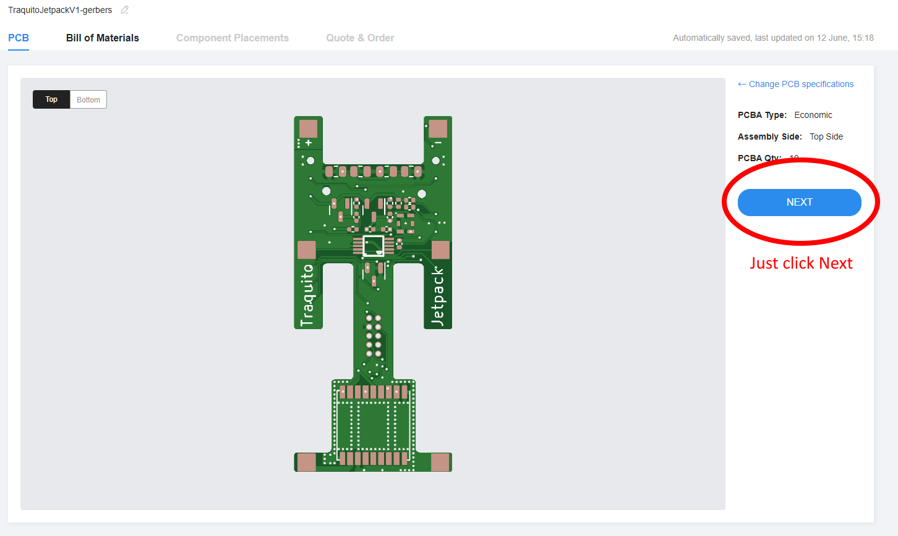

### Step 4

Provide the BOM and placement files.
            

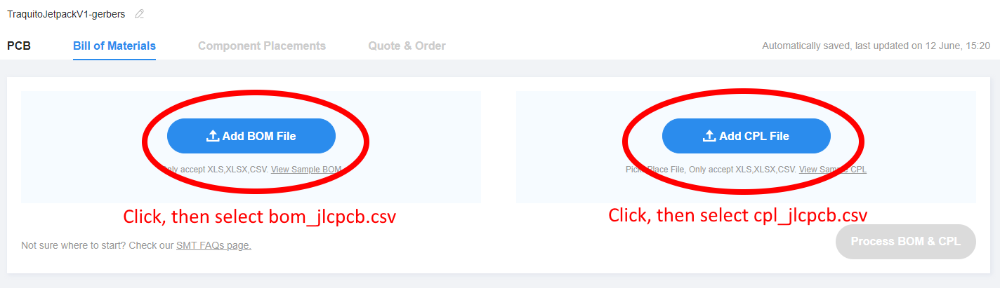

Click to continue when ready.
            

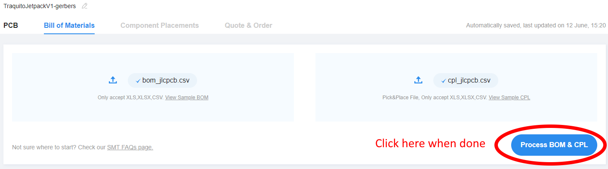

### Step 5

Click Next.
            

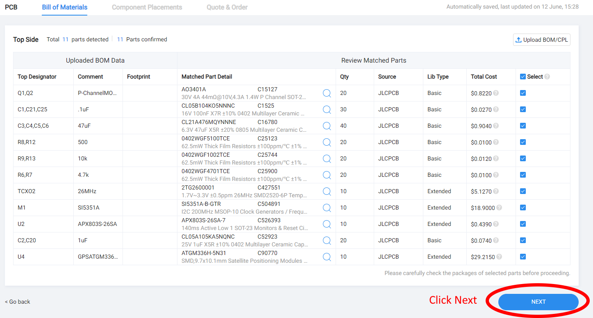

It is possible one or more parts are out of inventory (a "shortfall").

Click [here](./preorder) to learn how to preorder parts (no additional cost) to overcome this, or just check back later and hope there is more parts in the JLCPCB inventory.

[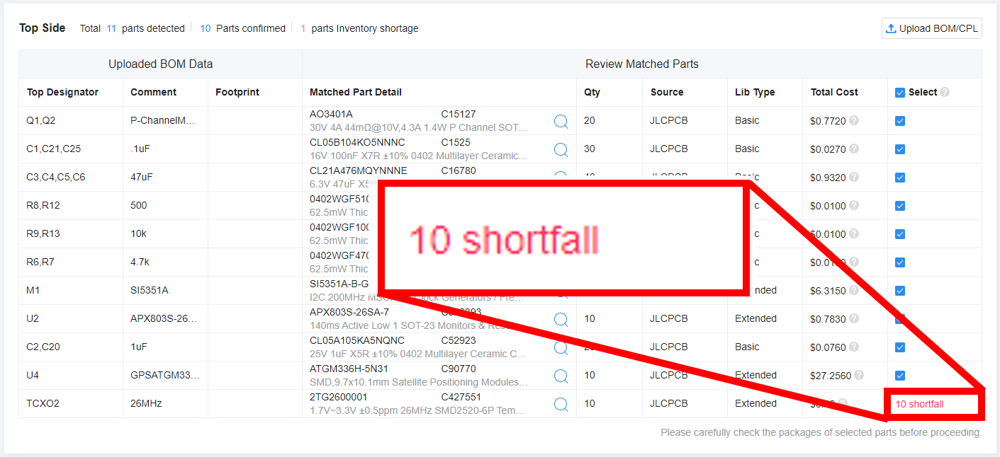](./preorder)
            

### Step 6

Click Next.
            

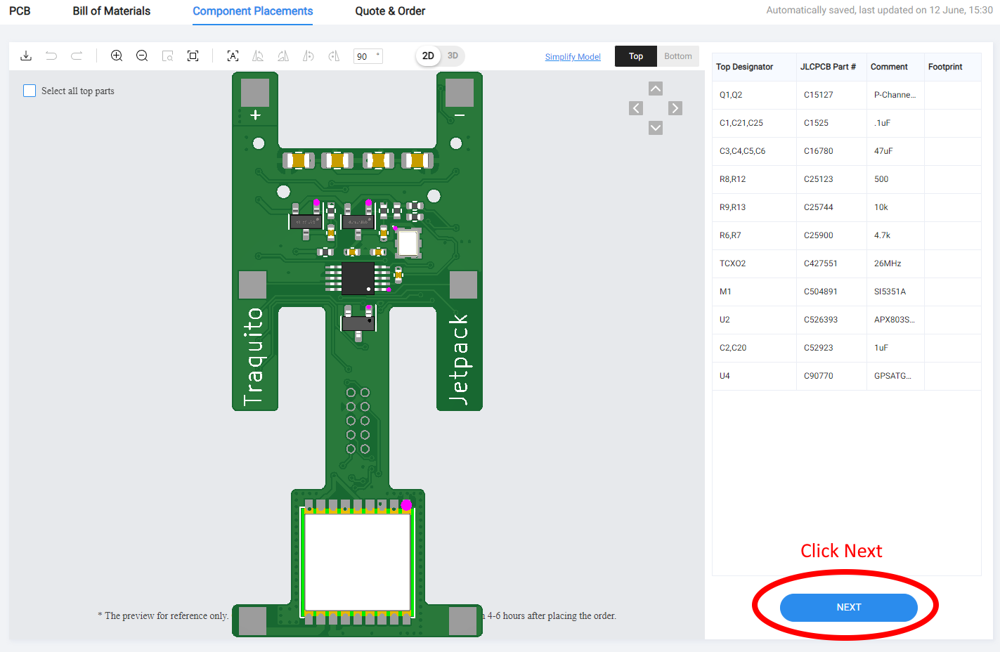

### Step 7

You need to declare what type of board this is -- it's DIY.

Save to cart when done.
            

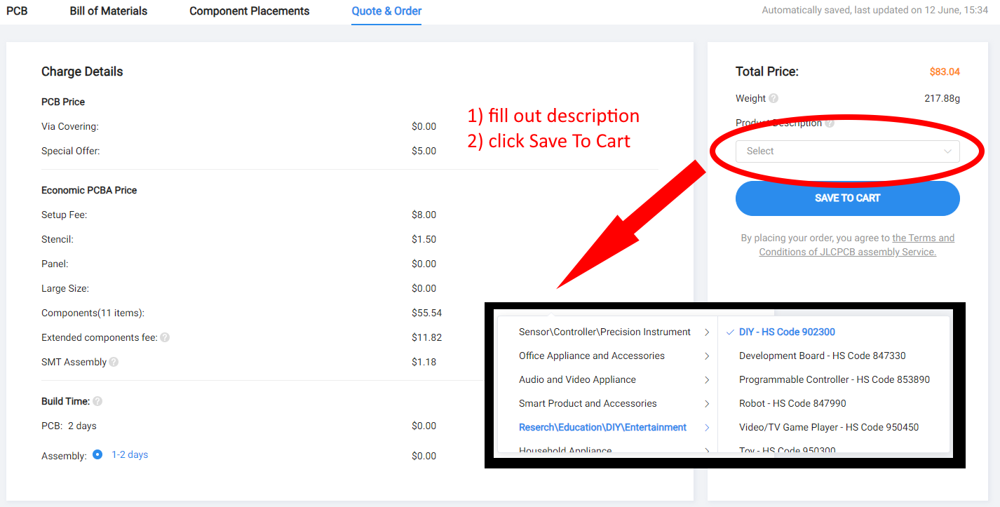

### Step 8

Time to check out
            

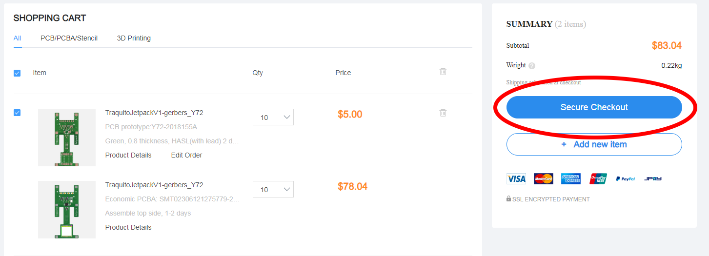

### Step 9

The rest of the process is straightforward payment and shipping address setup.

A note about shipping methods -- they all basically cost the same (around $20).

The exception the "Global Standard Direct Line," which I have never used before.

DHL has done a great job every time.

I recommend just picking a typical carrier.
            

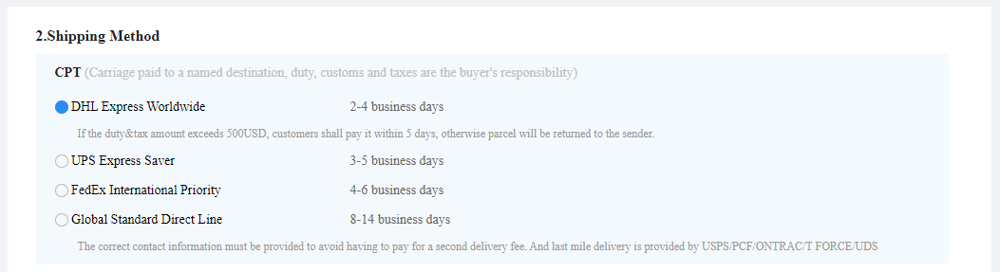

## Re-Ordering in the future

In the future, if you want to order additional Add-on Modules, you can, without going through the whole process again.

Instead, first, go to the order history page
            

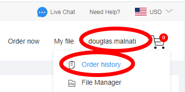

Then, find the last order, and click Reorder to begin the process.
            

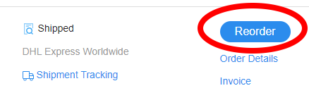