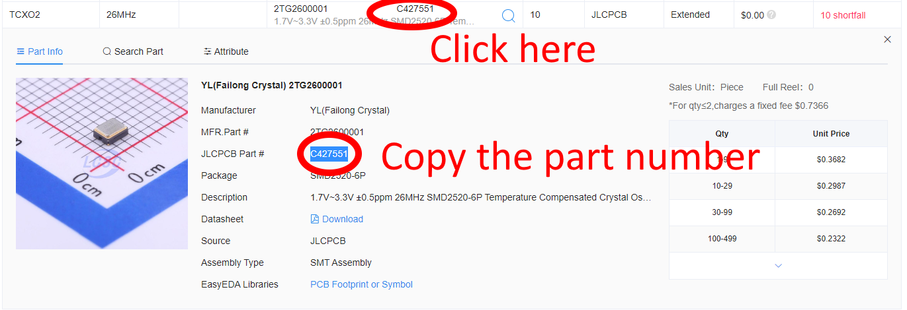
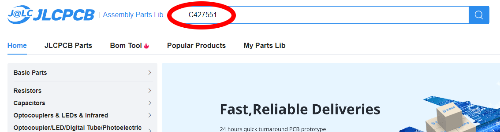
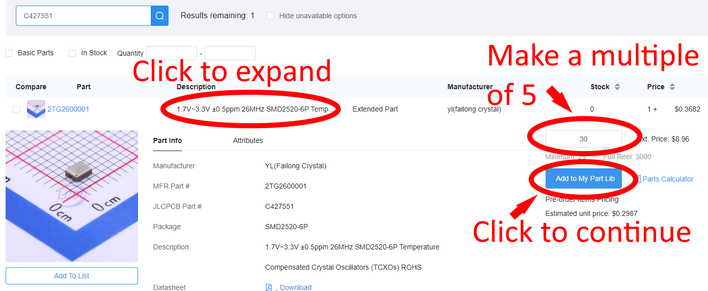
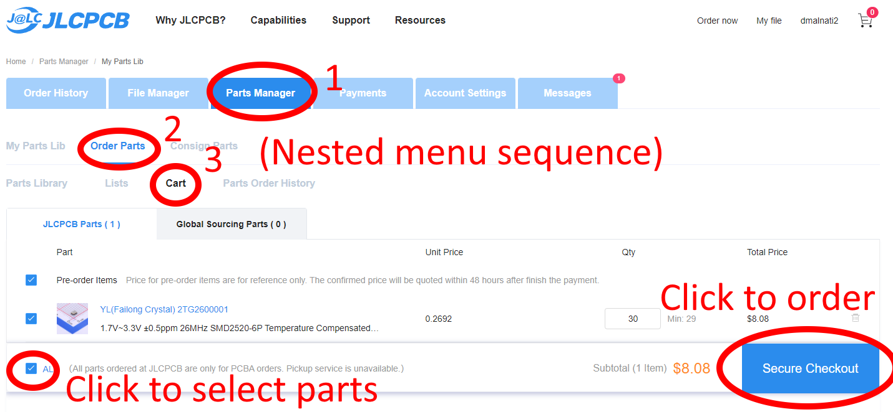
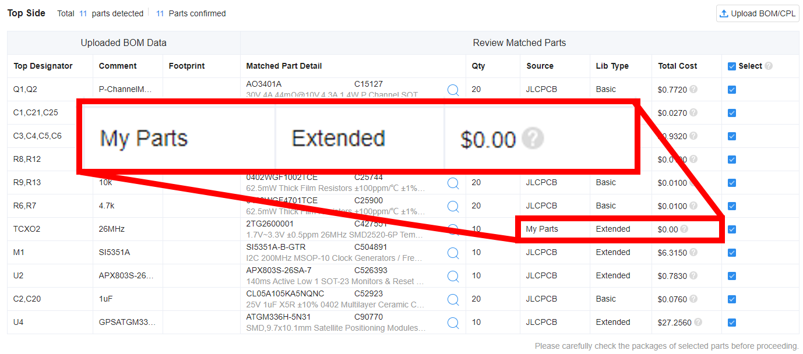

# Pre-Ordering Parts from JLCPCB

## Overview

During the process of ordering an assembled PCB from JLCPCB, it is possible that one or more parts specified in the BOM is not in stock.

If that is the case, you won't be able to complete your order at that time.

You can "pre-order" the parts, at no additional cost, and they are is kept in your private inventory until you order boards which use those parts.

If you do pre-order the parts, you need to wait for them to be made available at JLCPCB (they will email you to let you know).  After that, you can order the board again and JLCPCB will use your private inventory to fulfill that part.
            

## Step 1

Click the part with the shortfall and copy the part number.
            

## Step 2

Search for the part in the JLCPCB [parts library](https://jlcpcb.com/parts).
            

## Step 3

Do this.
            

You will see a popup saying the part has been added to your part cart.
            

## Step 4

Go to your [Parts Manager](https://jlcpcb.com/user-center/smtPrivateLibrary/?index=1&subindex=1) to check out.

Order parts.  You pay now based on the estimated price.

You will later get an email with the exact price, and a refund of any difference.

Once JLCPCB has confirmed you have your parts available, you can order the board you tried to before again, and your private inventory will be used for that missing part.
            

## Next time you order

Next time you order, you will see the parts come from your inventory and have no additional cost.
            

