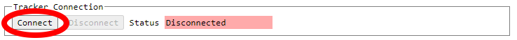

# Tracker Configuration GUI Howto

## Tracker Configuration GUI Howto

The [Jetpack tracker](../../tracker/README.md) has a [Configuration GUI](../../trackergui/README.md) which allows easy configuration and basic testing of the tracker features.

The tracker must have had software loaded onto it before it can be configured.  See the Jetpack tracker page for details.

This page highlights the functionality of the Configuration GUI.
            

## Layout

!!! info "The GUI is laid out in 3 sections"
    - Tracker Connection
    - Flight Configuration
    - Test

The highlighting in the below screenshot identifies each of those sections.

            

## Tracker Connection

The Configuration GUI communicates with the tracker via USB connection.

To begin configuration, plug your tracker into the computer via USB.

Then, click the "Connect" button.

You will be presented with a dialog window allowing you to choose the tracker to configure.  Only trackers will be present in the list.

**Notice that the tracker name is not yet selected.  You must select it** by clicking on the name of the tracker.

Select the tracker, then click the dialog "Connect" button.

You will now see the Status field is green, as well as hardware and software version information of the tracker.

You will also see a dialog reminding you to save your configuration when you're done.  You close it with the circled X.

You are now ready to use the rest of the GUI.
            

## Flight Configuration

The tracker will regularly transmit messages that you will later be able to see on a [dashboard](../../search/spots/dashboard/example/README.md).

!!! info "In order for this to work properly, the tracker needs 3 pieces of information"
    - The frequency band (usually 20m)
    - The [channel](../channels/README.md) (pick one someone else isn't using)
    - Your callsign

The channel and callsign input boxes initially have no configuration and so are colored red.

You set these parameters using the input boxes circled.

When done, save your configuration.  (TEST is not a valid callsign of course).

If you change a saved parameter, the input box will become highlighted in yellow as a visual indicator that you have unsaved changes.

Either save the configuration, or revert back to the saved configuration.

Once you have saved your configuration, your tracker is ready to fly.  Disconnect the tracker from your computer.

You should do some window testing before launching it, though.
            

## Test

The Test section of the Configuration GUI is not required to be used.

The purpose of this section is to provide interactive controls to test the functions of the tracker.

Voltage
Voltage is NOT shown because when connected to USB, the tracker is receiving a constant 5v supply.  Not very useful to measure.

Temperature
The tracker measures and transmits the temperature as part of its telemetry.

Here you can see the current temperature, updated each second.

Send WSPR Message
This control allows you to send a Regular Type 1 WSPR message using your tracker.

You likely want to be able to [receive and decode](../receiving/README.md) WSPR messages if you intend to use this functionality.

Be sure you have at least small antennas (eg 3 inches) soldered to the transmitter antenna pads.

You are able to input the 3 Type 1 WSPR fields of Callsign, Grid, and Power.

The band and channel frequency are determined using your saved values from Flight Configuration.

When you click Send, you will see a dialog appear which indicates the tracker is transmitting a message.

This dialog will close by itself after the message is sent.

WSPR messages must be sent only on even minutes, at 1 second past the minute.

When Jetpack is in Flight Mode, this is handled automatically by synchronizing with GPS time.

When in Configuration Mode (using this GUI), you should use your eyeballs to look at a clock and decide when to send.  [time.is](https://time.is/) is useful for this.

GPS Monitor / Control

!!! info "The section here consists of"
    - GPS reset control buttons
    - GPS time and lock status
    - Live scrolling NMEA messages from the GPS

The GPS "Reset Modes" refer to the linked-to GPS-software-controlled reset states.

!!! info "The GPS "Power" gives you interactive control over how the GPS module itself is powered"
    1. On, Battery On = main power supplied, battery supply also on
    2. Off, Battery On = main power cut, battery supply on (should retain data for fast lock)
    3. Off, Battery Off = main power cut, battery supply off, module is completely cold

For #1, this is how the tracker runs the GPS when searching for a lock.

For #2, this is how the tracker runs the GPS when locked, and waiting to transmit.

For #3, this is what the tracker does if the GPS malfunctions and needs a hard reset.
