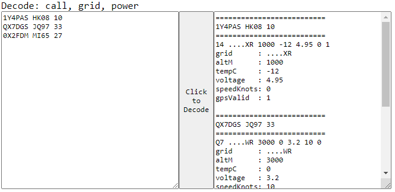
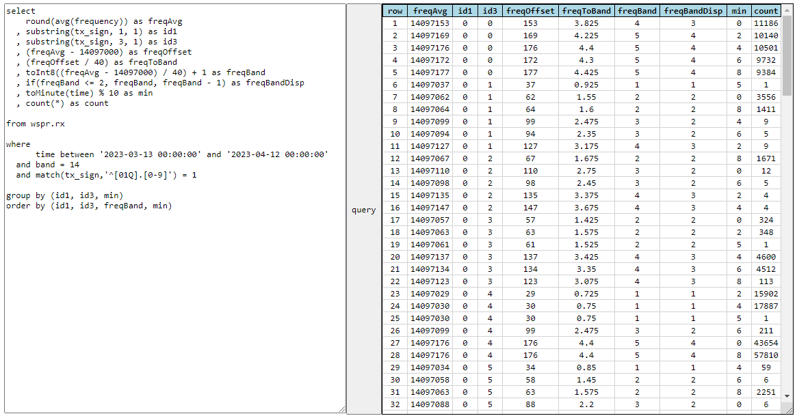
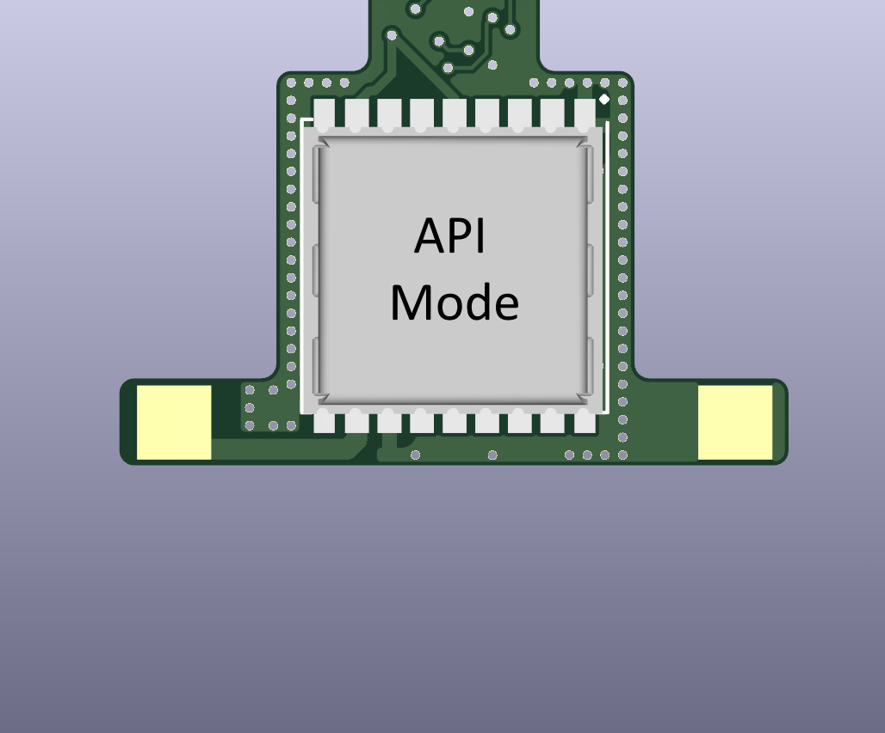
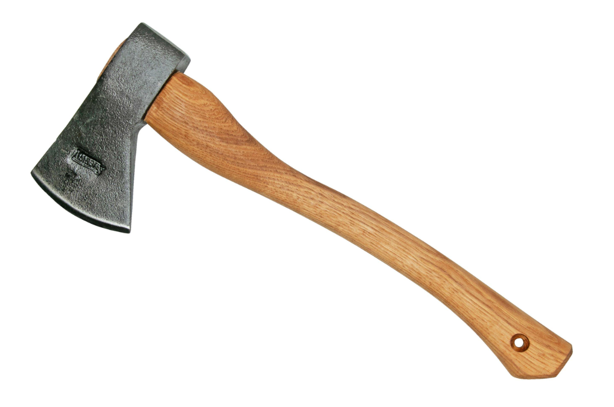
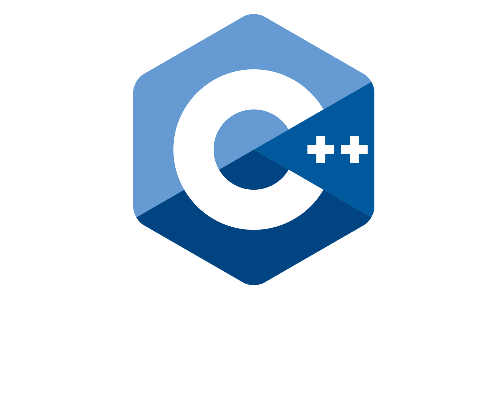

# Pro Tools

- <a class="card" href="./decode/">
    <figure markdown="span">
        
        <figcaption>Decode</figcaption>
    </figure>
  </a>

- <a class="card" href="./query/">
    <figure markdown="span">
        
        <figcaption>Query</figcaption>
    </figure>
  </a>

- <a class="card" href="./apimode/">
    <figure markdown="span">
        
        <figcaption>API Mode</figcaption>
    </figure>
  </a>

- <a class="card" href="./trackerhacker/">
    <figure markdown="span">
        
        <figcaption>Tracker Hacker</figcaption>
    </figure>
  </a>

- <a class="card" href="./code/">
    <figure markdown="span">
        
        <figcaption>C++ Code U4B</figcaption>
    </figure>
  </a>

