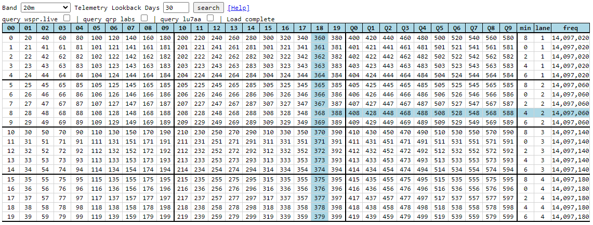

# C++ Code U4B

## U4B Protocol

As described in the [Channel Map Help](../../channelmap/help/README.md) about Channels and U4B protocol, the [Jetpack](../../tracker/README.md) tracker implements the U4B protocol. 

This page makes available the source code used to do the above for those who might also want to build a U4B tracker, or who are just curious.


## Aspects of encoded telemetry

!!! note "Implementing U4B protocol constituents"
    - Scheduling (as described in the FAQ)
    - Encoding of actual data (eg temperature, altitude, etc) into a WSPR message (callsign, grid, power)


## C++ Code

!!! abstract "There are 3 files available"
    - [WSPR.h](WSPR.h)
    - [WSPRMessage.h](WSPRMessage.h)
    - [WSPRMessageU4B.h](WSPRMessageU4B.h)


### WSPR.h

!!! info "WSPR.h gives you"
    - Details about WSPR bands and frequencies
    - U4B Channel Details

!!! example "Imagine you want to operate on the 20m band on channel 368"
    For that, you need to know:

    - The id13 value for encoded transmission (18 in this case)
    - The minute you should transmit the regular message (4 in this case)
    - The frequency you should transmit on (14,097,060 in this case)

    You can see that with you eyes on the Channel Map, but you need code to do that in a tracker.
    

Usage:
```c++
string   band    = "20m";
uint16_t channel = 368;

ChannelDetails cd = WSPR::GetChannelDetails(band, channel);

// cd.id1  == '1'
// cd.id3  == '8'
// cd.id13 == "18"
// cd.min  == 4
// cd.freq == 14'097'060
```
        

### WSPRMessage.h and WSPRMessageU4B.h

U4B message encoding is handled by WSPRMessage.h and WSPRMessageU4B.h.

!!! info "WSPR Type 1 Message structure"
    Normal WSPR Type 1 messages consist of a callsign, grid, and power fields.

!!! info "Encoded data is encoded into Type 1 Message structure"
    The U4B encoded data (altitude, temperature, etc) are encoded into valid forms of the WSPR Type 1 fields.

So, if you can transmit a Type 1 message, you can transmit a U4B encoded message also, because it's those same 3 fields, but with encoded data.

!!! info "Using the code"
    The way to use the code above to accomplish this is:

    - WSPRMessage is a class which lets you set/get callsign, grid, and power
    - WSPRMessageU4B is a class which:
        - inherits WSPRMessage interface
        - allows you to set all the U4B fields (altitude, temp, etc)
            - each time you set a field, the new encoded callsign, grid, power are made available
    - you can then:
        - extract the encoded callsign, grid, power
        - transmit those encoded fields the same way as your normal wspr message

Usage:

```c++
WSPRMessageU4B msgU4b;

msgU4b.SetId13("Q5");
msgU4b.SetGrid56("JM");
msgU4b.SetAltM(5120);
msgU4b.SetTempC(-5);
msgU4b.SetVoltage(3.25);
msgU4b.SetSpeedKnots(25);
msgU4b.SetGpsValid(true);

string  callsign = msU4b.GetCallsign();
string  grid4    = msgU4b.GetGrid();
uint8_t pwrDbm   = msgU4b.GetPowerDbm();

// callsign == "QD5WPK"
// grid4    == "IR39"
// pwrDbm   == 47
```

!!! note "Value Clamping"
    You can input any value you want to the API.  However, the code will clamp within min/max range, and subsequently snap values to align.

!!! example
    For example, above, speed was set to 25 knots.
    
    If you decode that, you'll see 26 knots.
    
    That's because there is a granularity minimum of 2 knots for speed.

You can see the field definitions on the decode page (linked below).
            

## Validation

You can use the online [decoder](../decode/README.md) to validate that your program is operating as expected.
            

## Questions / Support

This code is provided as-is and may not work at all.

Please post to the forum if any issues.