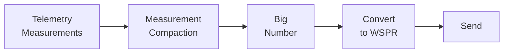
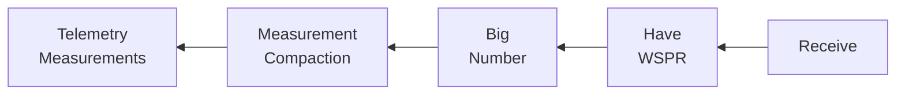

# WSPR Telemetry

## Overview

Trackers are able to send a useful amount of telemetry data despite the extremely minimal data-transfer abilities of the WSPR protocol.

This is accomplished by disguising the telemetry data as other types of data. This process is Encoding.

This page sets out to cover the basics of Encoding.

Subsequent sub-pages go into specifics of encoding in more detail.

## Transmission Problem

!!! info "The WSPR protocol defines only 3 message types, amounting to 50 bits of data each"
    - Type 1: <callsign\> <grid\> <power\>
    - Type 2: <callsign_long\> <power\>
    - Type 3: <callsign_hash\> <grid_long\> <power\>

These messages do not directly support arbitrary telemetry transfer.

## Solution - Encoding

Encoding is the process of taking telemetry, eg Altitude, and changing it into a form which can be transmitted through the WSPR protocol.

The encoded data is then sent as a WSPR Message, received, and Decoded, which results in the receiver acquiring the previously-encoded telemetry.

!!! note "For technical reasons, the WSPR Type 1 message is used for this purpose."

## Telemetry Encoding Process

The specific encoding/decoding technique relies on multiple different techniques, applied sequentially.

The encoded data can decoded by performing reverse of those operations in the opposite sequence.

The subsections below walk through the encoding stages and notes how the reverse operation would be performed.

The processes described below only introduce the techniques applied in encoding, and do not spell out the precise technical specifics required to encode or decode a specific message.

### Measurement Compaction Stage

!!! question "In what ways are measurements of Altitude and Voltage the same as one another?"
    They both have:

    - Units
    - Measurement resolution
    - Ranges you can expect to measure within

!!! example "Altitude measurement definition example"
    Let's define measuring Altitude to be deciding:

    - Units = Meters
    - Resolution = 20m
    - Range = 0 to 100m

    With this definition, you know you have `6` possible measurements `(0, 20, 40, 60, 80, 100)`.

!!! note "Everything that follows using the Altitude example could be performed using Voltage, or any other measurement defined in the same terms."

!!! example "Compaction example"
    The computer representation of the Altitude value `100` takes 7 bits.

    Consider instead using an `index` into that list of possible measurements:

    |     |     |     |     |     |     |     |
    | --- | --- | --- | --- | --- | --- | --- |
    | value | `0` | `20` | `40` | `60` | `80` | `100` |
    | index | `0` |  `1` |  `2` |  `3` |  `4` |   `5` |

    By transmitting instead the `index`, now the highest value you would need to transmit is `5`, taking 3 bits.

    7 bits to 3 bits is a good savings.

    The reverse of the above, for decoding a value, is hopefully clear.

### Conversion to `big number` Stage

The following packing operation saves bit space at the expense of complexity.

In essence, this allows you to use a decimal number of bits (eg 2.58 bits) instead of a whole number of bits (eg 3 bits) for number storage.

!!! example "Whole bits vs decimal bits"
    Consider our Altitude measurement again.

    Our Altitude `index` range is `0-5` (6 values).

    In a typical computer storage system, we need to allocate 3 bits of storage space to that number to easily store and retrieve any value in the range of `0-5`.

    However, 3 bits can actually store a range of values between `0-7` (8 values).

    That means we are underutilizing the capacity of the 3 bits. In fact, we're underutilizing it by 25%. This is very wasteful.

    The packing operation below allows us to use 2.58 bits to store the number range `0-5` instead, which is exactly the amount required.

    The packing approach saves when multiple values are packed, not just a single value. The space savings is the accumulation of savings by (say) the 2nd value sharing some of the original 3 bit bitspace of the 1st value, and so on, across all values.

!!! example "Packing values into a `big number`, and restoring them after"
    Let's say there are two `index` numbers, A and B.

    A has a range of `0-20` (range of 21 values), and a value of 15. 
    B has a range of `0-6` (range of 7 values), and a value of 4.

    Can we combine them into a single number C? (yes)

    C = 0

    C = C * 21  // multiply by # of values A can take 
    C = C + A   // add A

    C = C * 7   // multiply by # of values B can take 
    C = C + B   // add B

    C now equals 109.
    
    If we only have C, have we lost the values of A and B? (no). 
    We can get them back if we know:

    - The range of values of A and B
    - The order that we combined A and B together

    Let's extract A's value into AA and B's value into BB to demonstrate it. 
    But we have to do the operations in reverse.

    BB = C % 7 // get the remainder after dividing by # of values B can take 
    C = C / 7  // divide away from C the # of values B can take

    AA = C % 20 // get the remainder after dividing by # of values A can take 
    C = C / 20  // divide away from C the # of values A can take

    AA now equals A (which is 15). 
    BB now equals B (which is 4).

    You can give A and B any value in their range and this process will work.

The above allows you to combine any arbitrary number of values, of different ranges, into a single `big number`.

### Converting the `big number` into a WSPR Message Stage

#### Type 1 Message Format

To encode our telemetry into a WSPR message, we first need to look at our target message format.

!!! info "WSPR Type 1 Message Format"
    | Type 1 Field | Legal Values | \# Values |
    | ------------ | ------------ | --------- |
    | Callsign 1   | 0,1,Q        | 3         |
    | Callsign 2   | 0-9,A-Z      | 36        |
    | Callsign 3   | 0-9          | 10        | 
    | Callsign 4   | A-Z,space    | 27        |
    | Callsign 5   | A-Z,space    | 27        |
    | Callsign 6   | A-Z,space    | 27        |
    | Grid 1       | A-R          | 18        | 
    | Grid 2       | A-R          | 18        | 
    | Grid 3       | 0-9          | 10        | 
    | Grid 4       | 0-9          | 10        | 
    | Power        | ...          | 19        |

#### Converting to WSPR Message

We saw above that our `big number` C (value 109) was able to be restored back into A and B's original values. This was done by knowing the original range of values of A and B.

If we can encode our `big number` C into a WSPR message, and send it, the receiver should be able to extract the `big number` C, and then restore A and B's values, completing the encoded transfer.

!!! example "Converting the `big number` into a WSPR message"
    Note WSPR Type 1 fields `Grid 2` with range of `A-R` (18 values) and `Grid 3` with range of `0-9` (10 values).

    We will spread the `big number` C value of 109, across `Grid 2` and `Grid 3`'s legal values (in a way where the values of the input A and B are preserved).

    By knowing the range of `Grid 2` and `Grid 3` we can map to them. G2 is short for `Grid 2` and G3 is short for `Grid 3`.

    G2 = C % 18 // get the remainder after dividing by # of values `Grid 2` can take 
    C = C / 18 // divide away from C the # of values `Grid 2` can take

    G3 = C % 10 // get the remainder after dividing by # of values `Grid 3` can take 
    C = C / 10 // divide away from C the # of values `Grid 3` can take

    G2 and G3 now are index values into their range of values. 
    G2 now equals 1 (letter `B`) 
    G3 now equals 6 (number `6`).

    If we only have the WSPR Message fields `Grid 2` and `Grid 3`, can we restore the value of C? (yes)

    Let's extract `Grid 2` and `Grid 3`'s values into CC to demonstrate it.

    This is performed in the mathematically reverse order of the operations to get here.

    CC = 0

    CC = CC * 10    // multiply by the number of values `Grid 3` can take 
    CC = CC + G3    // add the `Grid 2` value

    CC = CC * 18    // multiply by the number of values `Grid 2` can take 
    CC = CC + G2    // add the `Grid 3` value

    CC now equals C (which is 109). 
    We have recovered our `big number`, which means A and B can be restored (decoded) as well.

### Telemetry Encoding Sequence

### Telemetry Decoding Sequence

## Shared Knowledge

Both the sender and receiver of encoded data must know the particular details of the encoding scheme in order for the encoded data to be decoded.

These details are specified in following sections.

