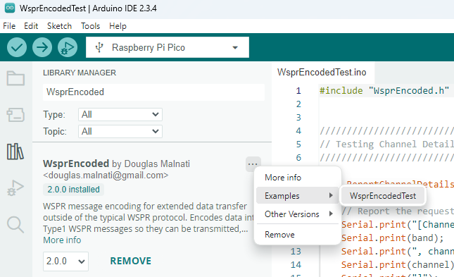

## Arduino

### Platform Compatibility

!!! success "Works on old and new IDE"
    | Platform   | IDE 1.8.19 | IDE 2.3.3 |
    |------------|------------|-----------|
    | RP2040     | Yes        | Yes       |
    | Atmega328p | No         | No        |

!!! note "Atmega328p is limited by the Arduino IDE itself"
    The Atmega328p can be programmed by C++20 and beyond, it is simply the compiler Arduino comes with which is the holdup.

    There are other ways to build code for Atmega328p, perhaps worth a try!

### Library Manager Support

!!! example "Install the library, and build its example code"
    


### Example program

!!! example "Example [program](https://github.com/traquito/WsprEncoded/blob/main/examples/WsprEncodedTest/WsprEncodedTest.ino){:target="_blank"}"
    ```c++ linenums="1" title="WsprEncodedTest.ino" 
    #include "WsprEncoded.h"

    /////////////////////////////////////////////////////////////////////
    // Testing Channel Detail Lookup
    /////////////////////////////////////////////////////////////////////

    void ReportChannelDetails(const char *band, uint16_t channel)
    {
        // Report the requested band and channel
        Serial.print("[Channel details for band ");
        Serial.print(band);
        Serial.print(", channel ");
        Serial.print(channel);
        Serial.print("]");
        Serial.println();

        // Look up channel details by band and channel
        WsprChannelMap::ChannelDetails cd = WsprChannelMap::GetChannelDetails(band, channel);

        // Report the channel details for the given band and channel    
        Serial.print("id1 : "); Serial.println(cd.id1);
        Serial.print("id3 : "); Serial.println(cd.id3);
        Serial.print("id13: "); Serial.println(cd.id13);
        Serial.print("min : "); Serial.println(cd.min);
        Serial.print("freq: "); Serial.println(cd.freq);
        Serial.println();
    }

    void TestLookupChannelDetails()
    {
        const char *band    = "20m";
        uint16_t    channel = 368;

        ReportChannelDetails(band, channel);
        Serial.println();
    }


    /////////////////////////////////////////////////////////////////////
    // Testing Message Encoding
    /////////////////////////////////////////////////////////////////////

    void ReportEncodeBasicTelemetry(const char *id13,
                                    const char *grid56,
                                    int32_t     altitudeMeters,
                                    int8_t      temperatureCelsius,
                                    double      voltageVolts,
                                    uint8_t     speedKnots,
                                    bool        gpsIsValid)
    {
        // Create the message encoder
        WsprMessageTelemetryBasic msg;

        // Set the telemetry fields
        msg.SetGrid56(grid56);
        msg.SetAltitudeMeters(altitudeMeters);
        msg.SetTemperatureCelsius(temperatureCelsius);
        msg.SetVoltageVolts(voltageVolts);
        msg.SetSpeedKnots(speedKnots);
        msg.SetGpsIsValid(gpsIsValid);

        // Set Encoding parameter
        msg.SetId13(id13);

        // Report the parameters passed, and if they got automatically clamped
        Serial.println("Encoded WSPR BasicTelemetry Type1 Message for:");
        Serial.print("id13      : input as  : "); Serial.println(id13);
        Serial.print("          : clamped to: "); Serial.println(msg.GetId13());
        Serial.print("grid56    : input as  : "); Serial.println(grid56);
        Serial.print("          : clamped to: "); Serial.println(msg.GetGrid56());
        Serial.print("altM      : input as  : "); Serial.println(altitudeMeters);
        Serial.print("          : clamped to: "); Serial.println(msg.GetAltitudeMeters());
        Serial.print("tempC     : input as  : "); Serial.println(temperatureCelsius);
        Serial.print("          : clamped to: "); Serial.println(msg.GetTemperatureCelsius());
        Serial.print("voltage   : input as  : "); Serial.println(voltageVolts);
        Serial.print("          : clamped to: "); Serial.println(msg.GetVoltageVolts());
        Serial.print("speedKnots: input as  : "); Serial.println(speedKnots);
        Serial.print("          : clamped to: "); Serial.println(msg.GetSpeedKnots());
        Serial.print("gpsValid  : input as  : "); Serial.println(gpsIsValid);
        Serial.print("          : clamped to: "); Serial.println(msg.GetGpsIsValid());
        Serial.println();

        // Do encoding
        msg.Encode();

        // Extract the WSPR Type1 Message fields from the encoder
        const char *callsign = msg.GetCallsign();
        const char *grid4    = msg.GetGrid4();
        uint8_t     powerDbm = msg.GetPowerDbm();

        // Report what the Type1 Message fields are
        Serial.print("callsign: "); Serial.println(callsign);
        Serial.print("grid4   : "); Serial.println(grid4);
        Serial.print("pwrDbm  : "); Serial.println(powerDbm);
        Serial.println();

        // Give a URL to check decoding at
        std::string url = "";
        url += "https://traquito.github.io/pro/decode/";
        url += "?decode=";
        url += callsign;
        url += "%20";
        url += grid4;
        url += "%20";
        url += std::to_string(powerDbm);
        url += "&encode=";

        Serial.print("Check decoding at: "); Serial.println(url.c_str());
        Serial.println();
    }

    void TestEncodeBasicTelemetry_NonClampedValues()
    {
        const char *id13               = "Q5";
        const char *grid56             = "JM";
        int32_t     altitudeMeters     = 5120;
        int8_t      temperatureCelsius = -5;
        double      voltageVolts       = 3.25;
        uint8_t     speedKnots         = 25;
        bool        gpsIsValid         = true;

        Serial.println("[Testing Non-Clamped Encoded Values]");
        ReportEncodeBasicTelemetry(id13, grid56, altitudeMeters, temperatureCelsius, voltageVolts, speedKnots, gpsIsValid);
    }

    void TestEncodeBasicTelemetry_ClampedValues()
    {
        const char *id13               = "Q5";
        const char *grid56             = "JM";
        int32_t     altitudeMeters     = 25000;
        int8_t      temperatureCelsius = 45;
        double      voltageVolts       = 5.6;
        uint8_t     speedKnots         = 96;
        bool        gpsIsValid         = true;

        Serial.println("[Testing Clamped Encoded Values]");
        ReportEncodeBasicTelemetry(id13, grid56, altitudeMeters, temperatureCelsius, voltageVolts, speedKnots, gpsIsValid);
    }

    void TestEncodeBasicTelemetry()
    {
        TestEncodeBasicTelemetry_NonClampedValues();
        Serial.println();
        
        TestEncodeBasicTelemetry_ClampedValues();
        Serial.println();
    }


    /////////////////////////////////////////////////////////////////////
    // Setup and Loop logic
    /////////////////////////////////////////////////////////////////////

    void setup()
    {
        Serial.begin(9600);
    }

    void loop()
    {
        Serial.println("--------------");
        Serial.println("Start of tests");
        Serial.println("--------------");
        Serial.println();

        TestLookupChannelDetails();
        TestEncodeBasicTelemetry();

        Serial.println();

        delay(5000);
    }
    ```

!!! quote "Output"
    ```
    --------------
    Start of tests
    --------------

    [Channel details for band 20m, channel 368]
    id1 : 1
    id3 : 8
    id13: 18
    min : 4
    freq: 14097060

    [Testing Non-Clamped Encoded Values]
    Encoded WSPR BasicTelemetry Type1 Message for:
    id13      : input as  : Q5
              : clamped to: Q5
    grid56    : input as  : JM
              : clamped to: JM
    altM      : input as  : 5120
              : clamped to: 5120
    tempC     : input as  : -5
              : clamped to: -5
    voltage   : input as  : 3.25
              : clamped to: 3.25
    speedKnots: input as  : 25
              : clamped to: 25
    gpsValid  : input as  : 1
              : clamped to: 1

    callsign: QD5WPK
    grid4   : IR39
    pwrDbm  : 47

    Check decoding at: https://traquito.github.io/pro/decode/?decode=QD5WPK%20IR39%2047&encode=


    [Testing Clamped Encoded Values]
    Encoded WSPR BasicTelemetry Type1 Message for:
    id13      : input as  : Q5
              : clamped to: Q5
    grid56    : input as  : JM
              : clamped to: JM
    altM      : input as  : 25000
              : clamped to: 21340
    tempC     : input as  : 45
              : clamped to: 39
    voltage   : input as  : 5.60
              : clamped to: 4.95
    speedKnots: input as  : 96
              : clamped to: 82
    gpsValid  : input as  : 1
              : clamped to: 1

    callsign: QD5XUP
    grid4   : RK54
    pwrDbm  : 43

    Check decoding at: https://traquito.github.io/pro/decode/?decode=QD5XUP%20RK54%2043&encode=
    ```
