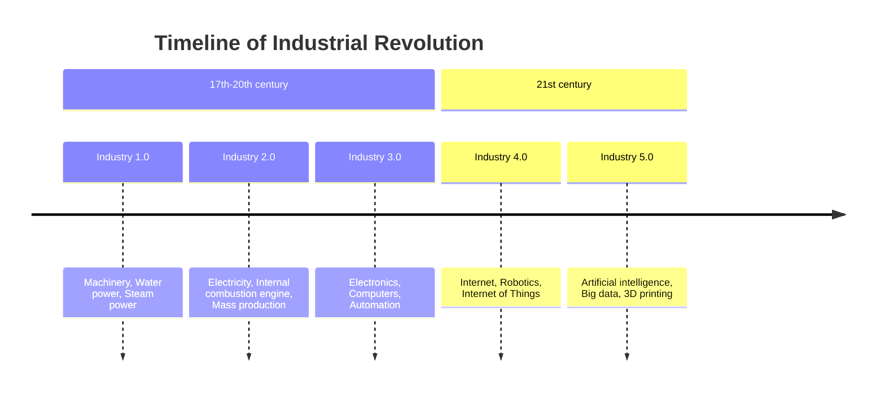

# History

## Links

HOJO:

  - ([link](http://hojoham.blogspot.com/2016/03/wisp1-telemetry.html){:target="_blank"}) HOJO Telemetry 1
  - ([link](http://hojoham.blogspot.com/2016/05/wisp1-telemetry-revisited.html){:target="_blank"}) HOJO Telemetry 2
  - ([link](http://hojoham.blogspot.com/2016/09/secondary-telemetry-packet.html){:target="_blank"}) HOJO Telemetry 3
  - ([link](http://hojoham.blogspot.com/2016/10/known-flight-ids.html){:target="_blank"}) HOJO Known Flight IDs

QRP-Labs:

  - [Ultimate 4](https://qrp-labs.com/ultimate3/ve3kcl-balloons/ve3kcl-s4.html#protocol){:target="_blank"}

