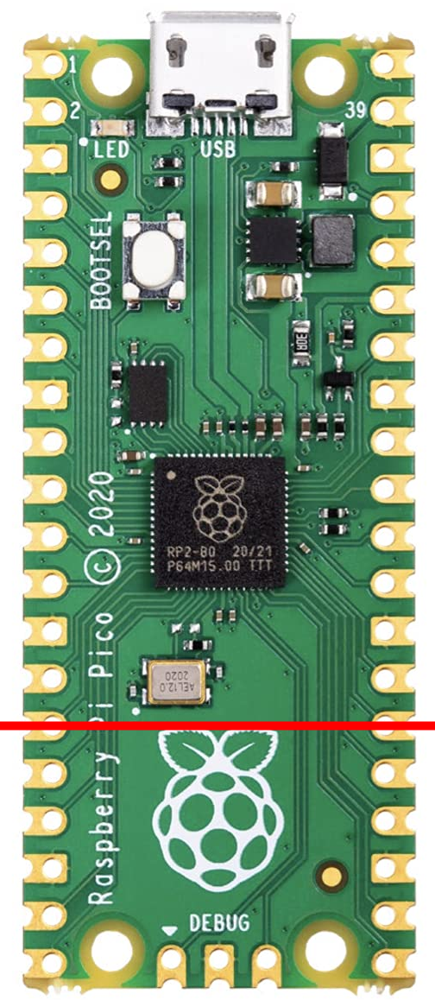
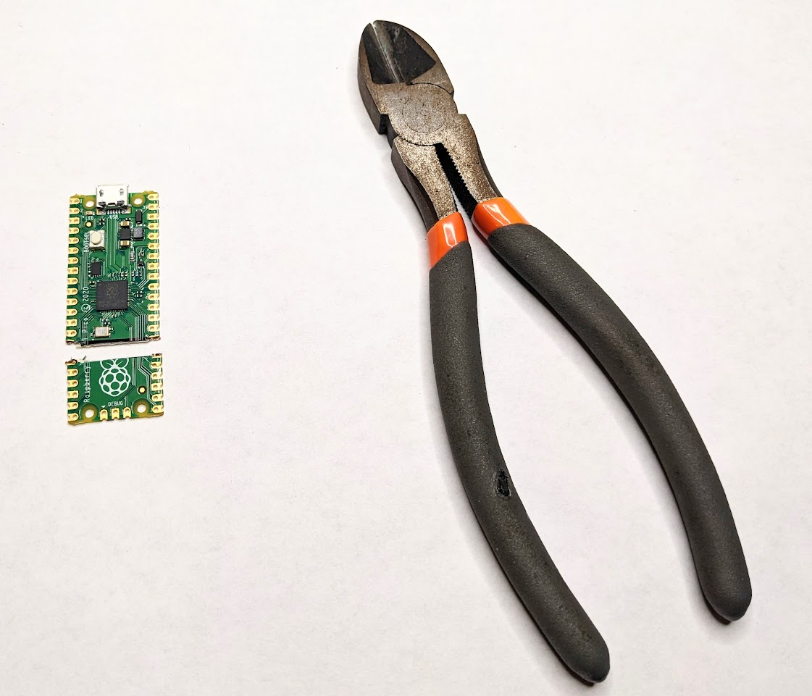
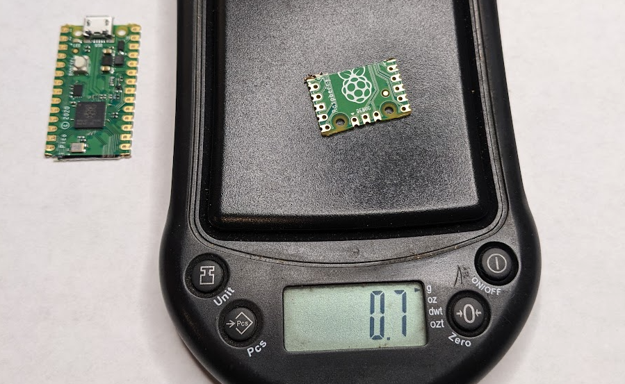
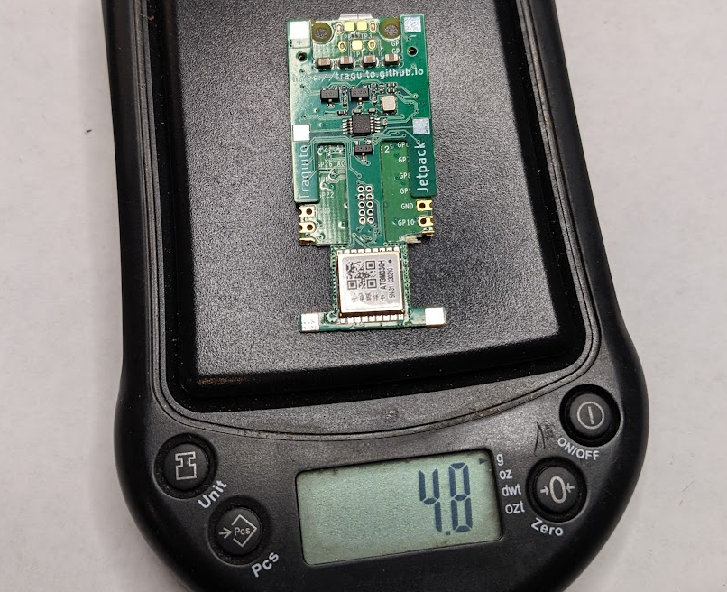
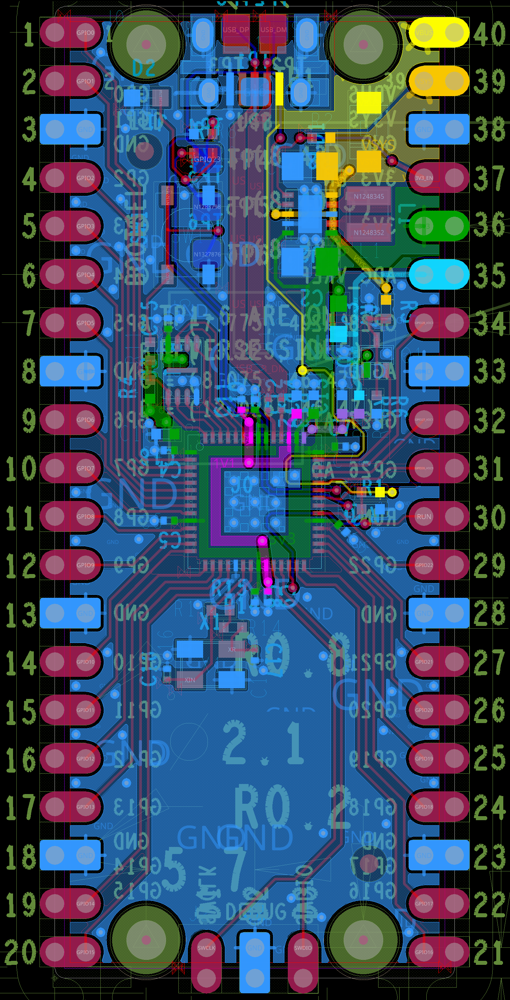

# Tracker Hacker

## Tracker Hacker

The [Jetpack](/tracker) tracker is designed to be easy to assemble and fly.

The weight of the combined RPi Pico + Add-on Module works perfectly, and with larger balloons weight hardly matters at all.

However, for those who want to shave off every milligram of weight possible, there are options.

!!! note "You really don't need to do this.  It's just for the fanatical."

!!! warning "You will probably destroy your RPi Pico trying to do this.  Don't do it."
            

## Chop the RPi Pico

The bottom portion of the RPi Pico is only broken out pins from the RP2040.

The Add-on Module doesn't need any of those pins, so feel free to chop.

{: style="height: 500px;" }
            

### Process

Get a big pair of sidecutters, align with the pins below the crystal, and cut.

No need to "snip" along the length.  Just align across the entire body of the RPi Pico and squeeze.

Surprisingly easy.

            

## Savings

You save around 0.7 grams.

Fully soldered (without antennas):

            

## RPi Pico Schematic

The full schematic of the RPi Pico can be seen here (in high-resolution), showing nothing but breakout, hence the safe chop:

[{: style="height: 500px;" }](rpi_pico_pcb_layout.png)