# Solar System

## Overview

Solar System is a kit that makes making your own solar panels easy.

The Solar System works for any tracker, but also has special features making it work especially well with [Traquito Jetpack](/tracker) tracker.

!!! success "The cost of kit + solar cells for a tracker is $1.27!"

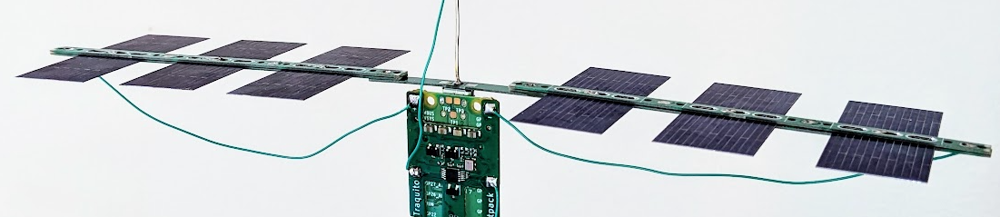
            

## Solar Cells and Panels Background

Solar cells have a positive and negative side, and produce 0.5v voltage apiece.
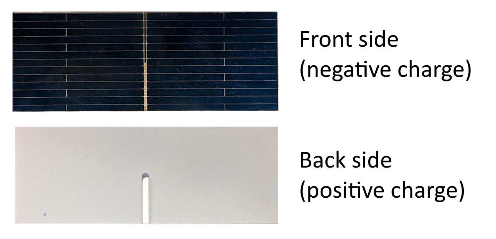

A solar panel is an arrangement of cells, and in the case of trackers, cells in series to equal a higher combined voltage.

That means soldering the cells in series (front to back), just as you would combine batteries to achieve a higher voltage.

In this diagram, we see 6 cells assembled into a panel which has 3.0v output.
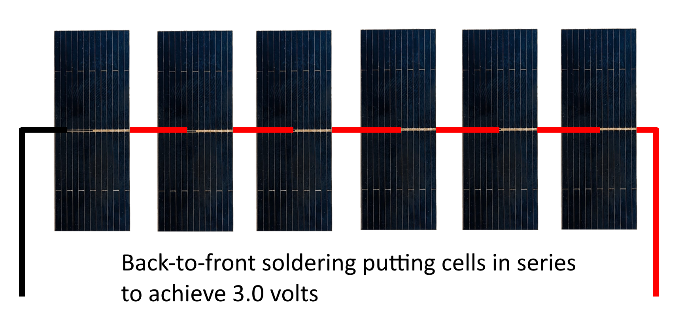

Here is a similar 3-cell view from the side:
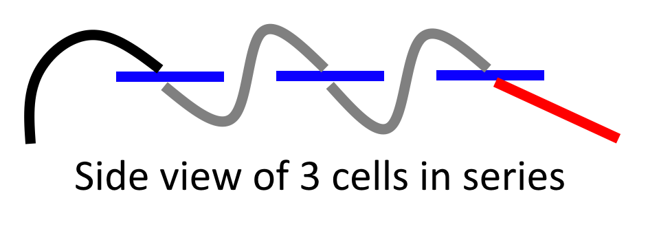
            

## DIY Solar Panel Problems

!!! warning "Solar cell problems"
    Solar cells are very fragile!

    Solar cells are very tricky to solder to.

    Solar cells then need to be arranged on a support structure (panel) and mounted to a tracker in order to fly.

This is very error prone, time consuming, and boring.
            
!!! success "The solution - Solar System!"

## Making it Easier

Solar System lets you build solar panels quickly and easily by sandwiching solar cells between two PCBs that do all the electrical connections for you.

This is the PCB:

When you solder one PCB on the top of the solar cells, another PCB on the bottom, the internal circuitry of the PCB will combine the cells and make a complete panel.

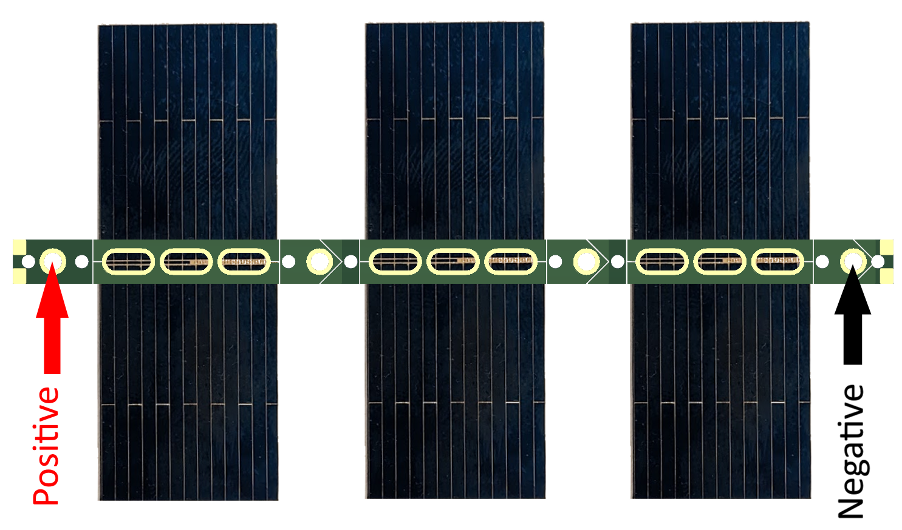

!!! info "Making a 3v solar panel"
    A set of 3 cells together makes a 1.5v panel (3 * 0.5v).
    
    Once you have one set of 3 cells assembled, make another, and combine together.

    The two 1.5v panels in series makes a 3v panel.

!!! success "A 3v panel is can easily power a tracker!"
            

## Components

!!! info "The 3-cell jig"
    

!!! info "The center piece"
    

!!! info "The whole thing assembled together"
    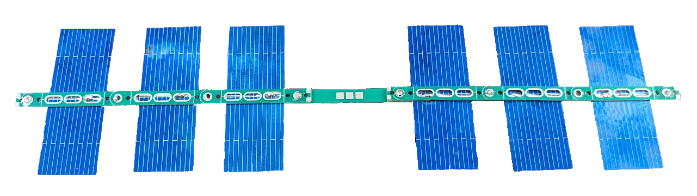
            

## Assembly

The orientation of the 3-cell jig PCB is critical.

The arrows on the PCB must face in opposite directions on the top and bottom of the cells.  As in, you should be able to flip the 3-cell jig over (like turning a page in a book) and the arrows stay pointing to the right no matter which side you look at.

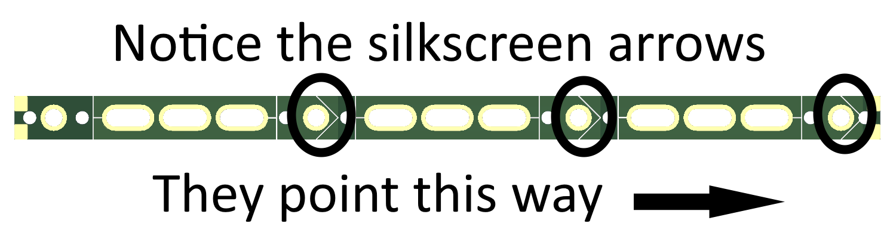

Take note that the silkscreen marks the 3 sections where each cell goes, each with 3 oval slots per-cell.

Also note -- The 3-cell jig PCB is used both on the top and bottom of the cells, and there is no "front" or "back" of the PCBs themselves.  The PCB design lets this happen.

Solder the cells into place both on the top and bottom.  No need to use more than one oval per-side per-cell.  No need fill the oval with solder, just use enough to make the connection.

This amount of solder is just fine:

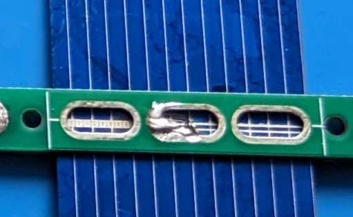

### Top View

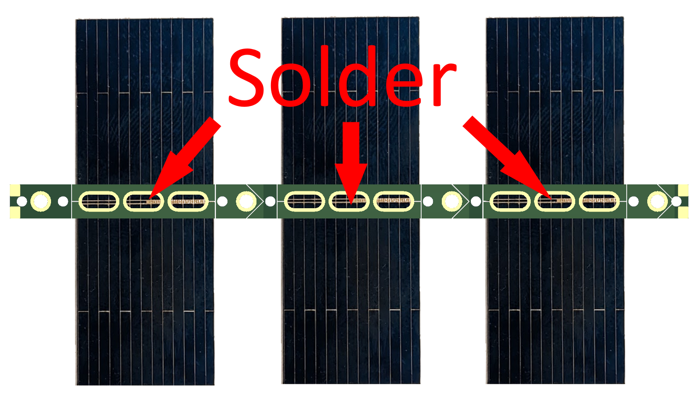

### Bottom View

(You see this if you flip the jig over top-to-bottom, but don't do that, this is illustration only.  See assembly instructions below.)

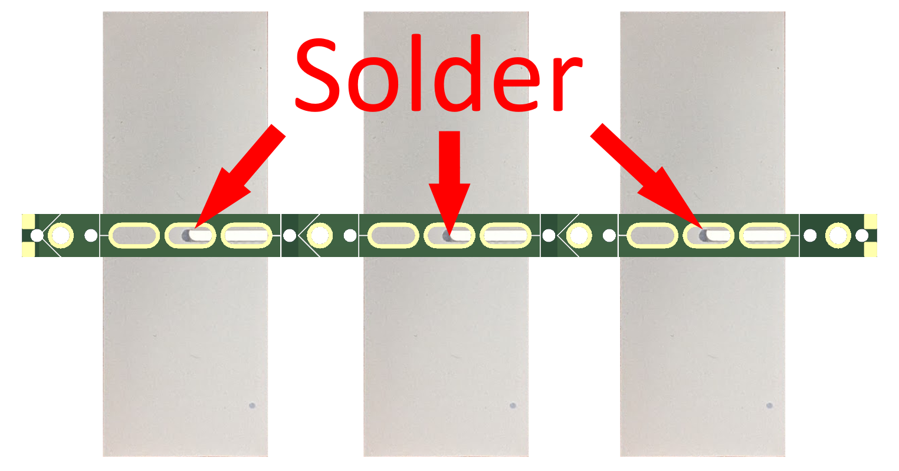

Once you have soldered the cells in place, solder the plated holes throughout the strip.

Best if you have a fine-point soldering iron which you can stick into each hole, swirl around, and feed enough solder such that the two PCBs become connected across the small vertical gap separating them.

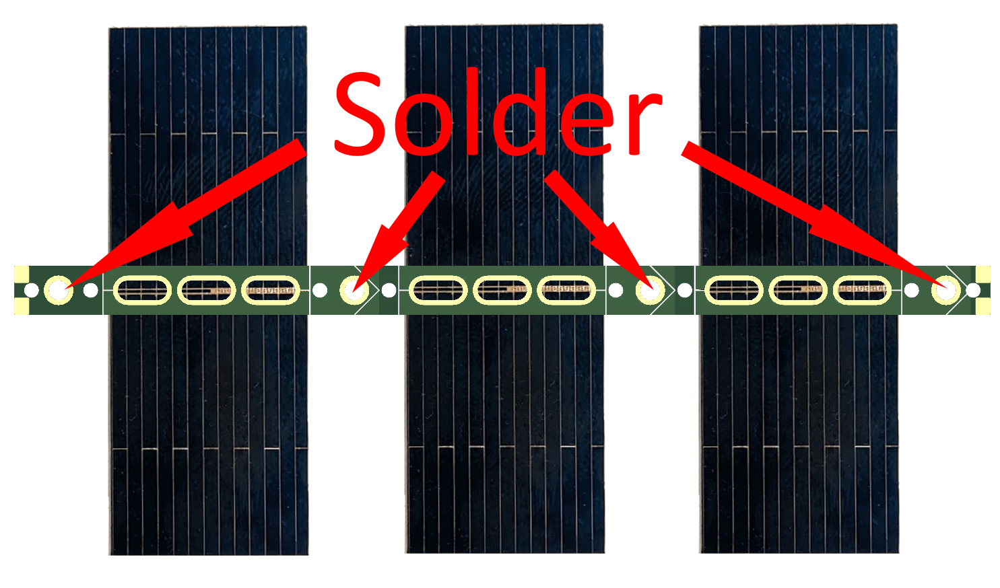

!!! tip
    It can be very helpful to weigh the cells and PCBs down as you work through them.
    
    A pair of cutters with padded handles works very well.

    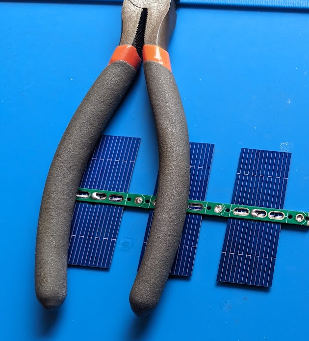{: style="height: 500px;" }

!!! info "Sequence for assembling a 3-cell jig"
    - You need 3 solar cells and 2 3-cell jig PCBs
    - Put your 3 solar cells to the side of your work area face-down
    - Take one of the cells and put in center of your work area
    - Lay down a 3-cell jig PCB on top of the one cell, in the left-most slot, arrows facing right
    - Weight down the work
    - Solder the cell (place tip on edge of oval and also touching cell, wait 3 sec, then slowly feed solder)
    - Repeat this for the 2 remaining cells, moving weight as needed
    - Flip the now-soldered 3-cell PCB to its back, as though you're turning a page of a book, to show the top side of the cells
    - Place another 3-cell jig PCB on top of the cells, arrows facing right
    - Weight down the work
    - Solder the plated holes along the length of the jig
    - Solder the top of the solar cells within the oval
    - Test by measuring voltage across the 3 cells

            

## Soldering Demo

Here is a demonstration of soldering the Solar System PCB to a solar cell.

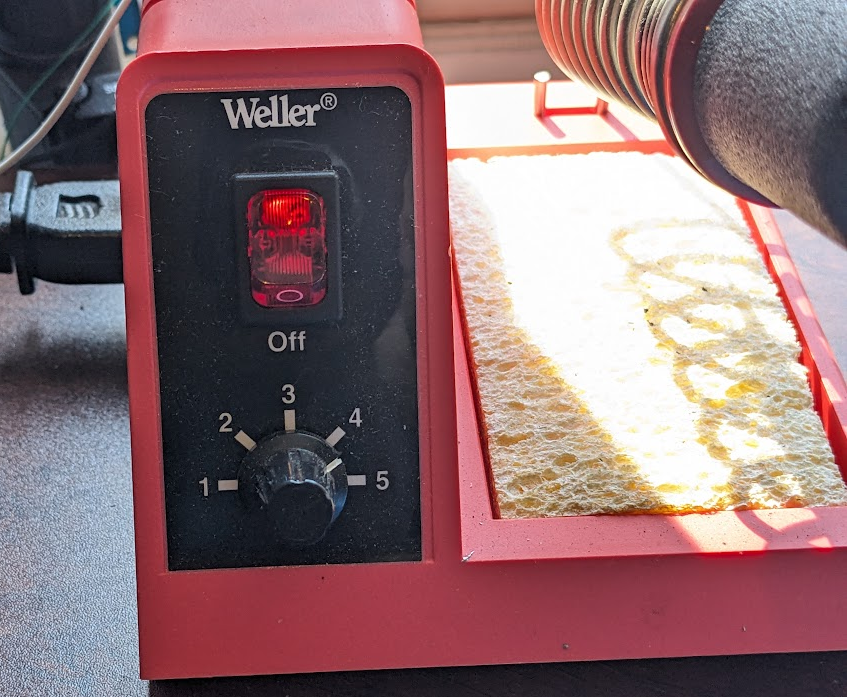{: style="height: 500px;"}

<video width="720" autoplay loop muted>
    <source src="solder.mp4" type="video/mp4" />
</video>

## Soldering Jig (3D Printed)

!!! success "There is a jig you can 3D print to make soldering easier!"

The jig is sized for the [solar cells](https://www.amazon.com/gp/product/B01NCQRCQR/ref=ppx_yo_dt_b_search_asin_title?ie=UTF8&psc=1) specified at the end of this page.  (These cells are frequently in stock, cheaep, and work great).

Use it to assemble both of the 3-cell halves of the Solar System.

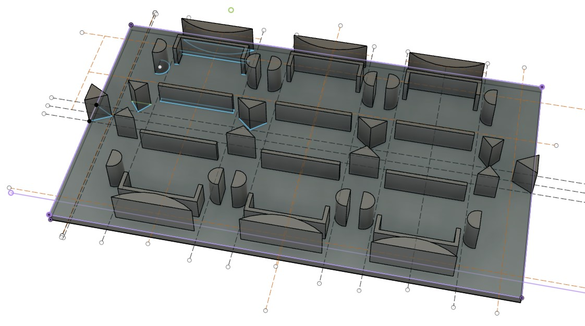

### Soldering Jig File Downloads

Soldering Jig 3D Print File | Description
-- | --
[Solar_System_Soldering_Jig_2024-01-01.stl](Solar_System_Soldering_Jig_2024-01-01.stl) | Released 2024-01-01
    

            

## Assembly - Combined

Combine the two 3-cell jigs together, in series, using the center piece.

The arrows must all point in the same direction, left to right, when looking top-down.

Simply place a 3-cell jig on top of the center piece, overlapping one hole, then melt the solder from the jig into the center piece.

The center piece should have the 3 square pads facing up.

Do that for each of the 3-cell jigs.

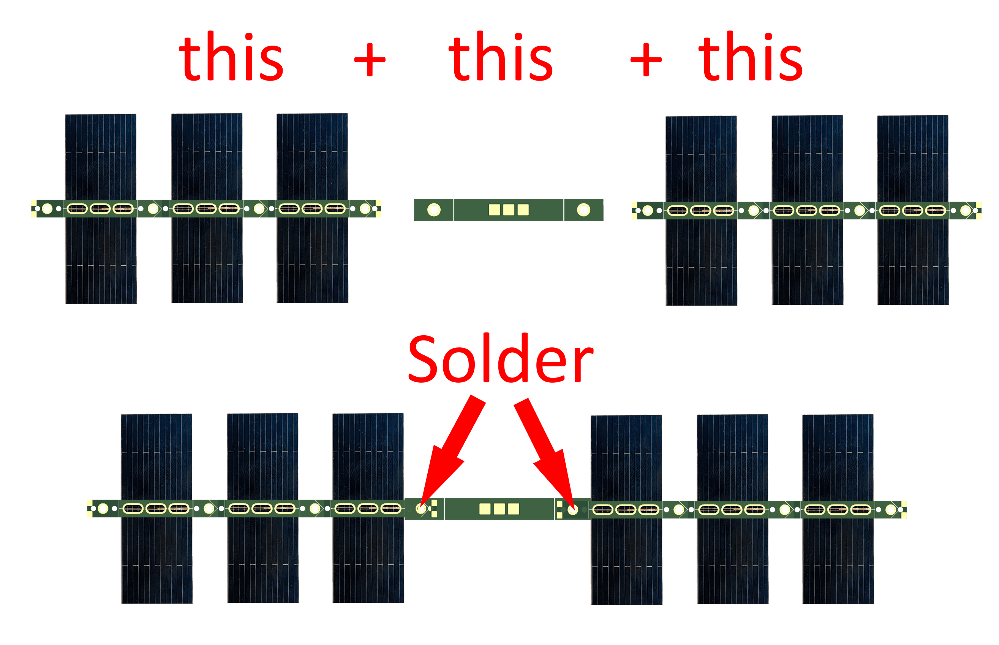

You end up with stack of PCBs at the connection point to the center piece.  You get small spaces when a solar cell is sandwiched between.

Observe this side view, where the 3-cell jig and solar cells are on the left, connected to the center piece on the right.

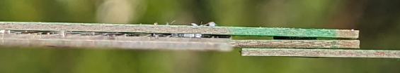
            

## Testing

Make sure you test your panel during assembly and after final assembly.

Note -- The PCB arrows point to the plated circle at the end of each 3-cell jig.

The circle the arrows point to has the same charge as the side of the cells you're looking at.

!!! info "Put simply"
    - If you're looking at the top of the cells (negative), the arrows point to the negative circle
    - If you're looking at the bottom of the cells (positive), the arrows point to the positive circle

Once you have assembled the 6-cell panel, the above still holds true, but now across 6 cells.

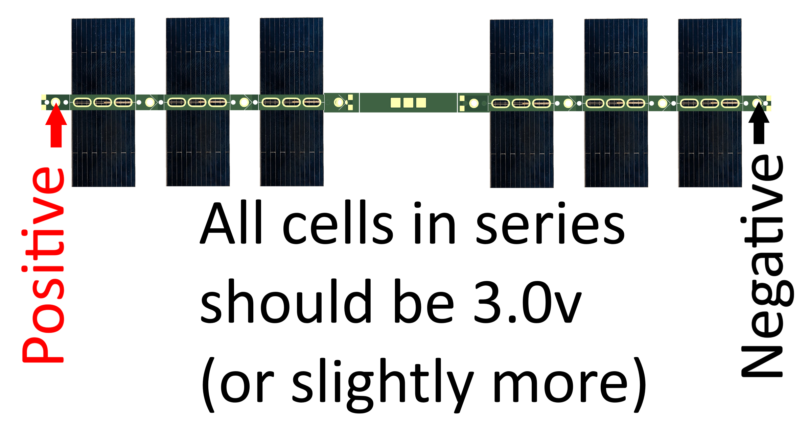

To test during or after assembly, you can test between any cell or range of cells.

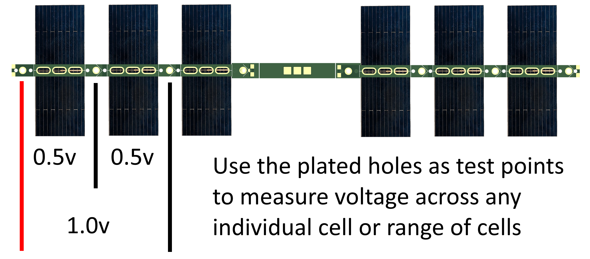
            

## Electrical Hookup

To use the panel in your tracker, run a wire from the positive and negative end of the panel to your tracker power input.

An 11cm / 4.5" length of wire works great for Jetpack.
            

## Mounting

If you are using [Traquito Jetpack tracker](/tracker), then there is a special design detail that makes attaching the panel to the tracker very easy.

The rear of the center piece has an exposed rectangle copper pad.  This pad is not electrical, it is purely for mechanical connections to the tracker.

If you flip the assembled panel over you can get access to this pad.
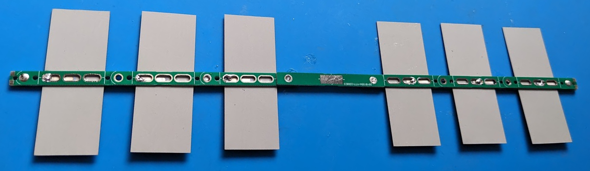

You can solder the USB connector of the assembled Jetpack onto the rectangle to easily mount the cells to the tracker.  You don't need a lot of solder.

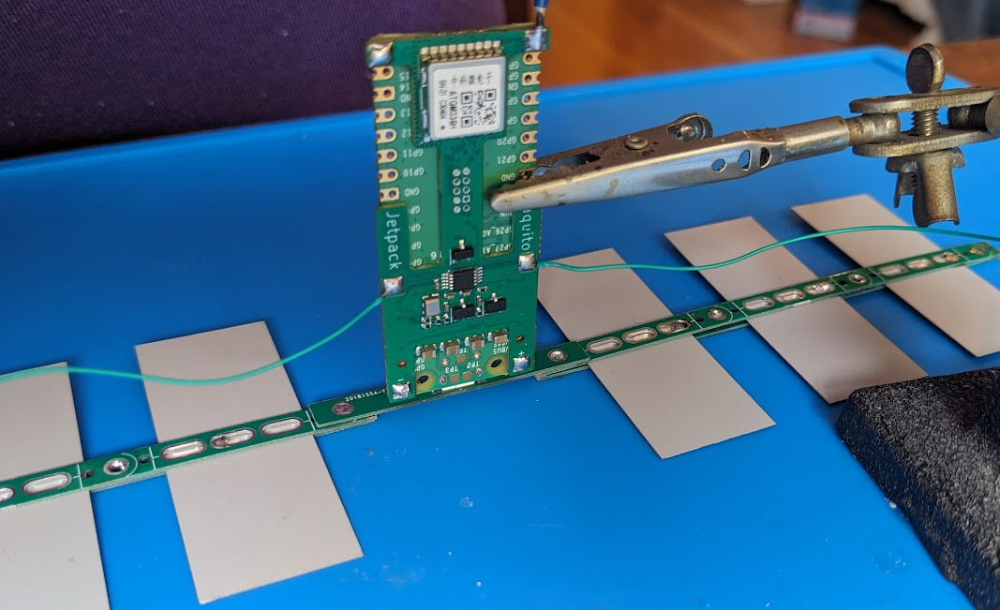

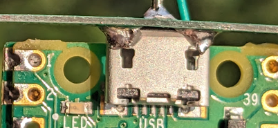

When using this approach, make sure you orient the Jetpack so the positive power pad is on the same side of the panel as the positive connection (follow the arrows).

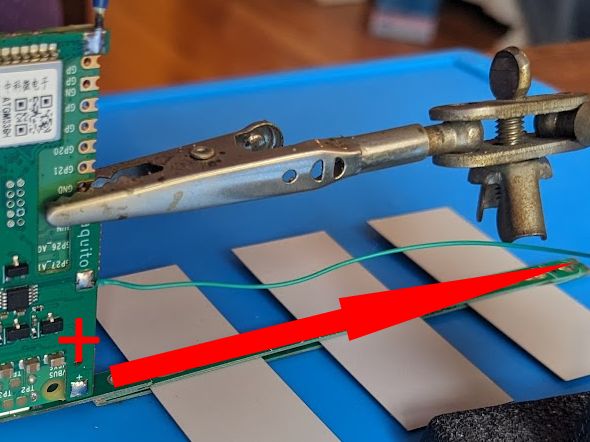

            

## Extra Features

Each 3-cell jig has 4 non-electrically connected pads per-side.  They are each a copper island connected to nothing else.  You can use them to mechanically attach the jig to something else if useful, or just leave as-is.

There are also unplated holes throughout the jig if useful.

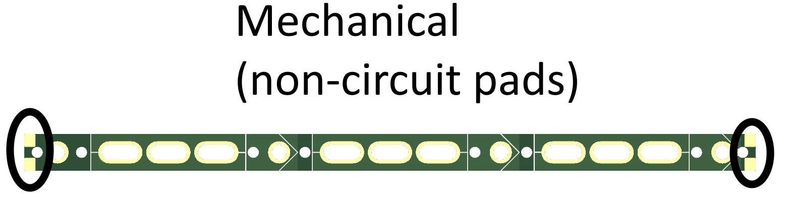

The center piece, on the top, in the middle, has 3 non-electrically connected copper island pads as well.

The middle pad is very useful for soldering a short length of semi-rigid wire, which you can then tape your antenna/suspension to.

Any fine-tuning of balance can be achieved by bending of the wire.

The wire also acts as a mechnical strain relief on the solder connection on the tracker (solder connection points should have taped relief also, not shown in the image).

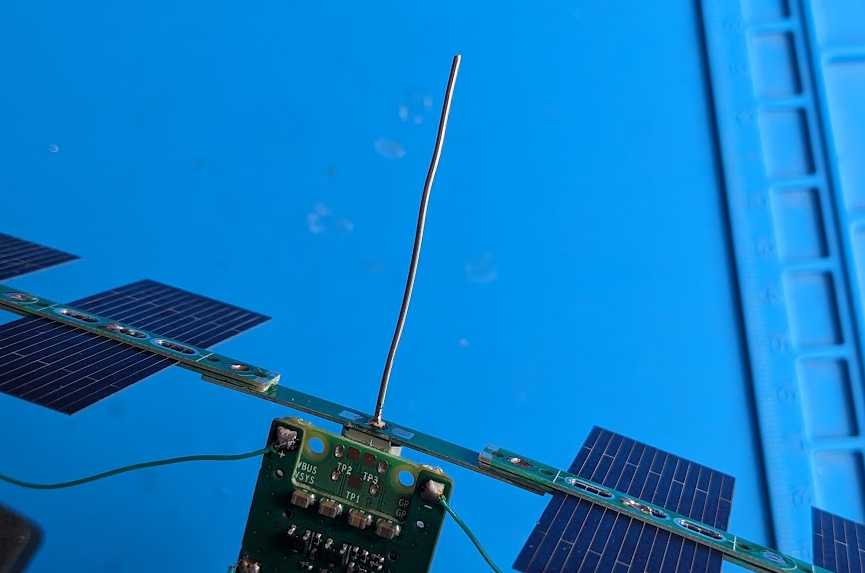

Here is an example of a fully-assembled Jetpack tracker with Solar System.

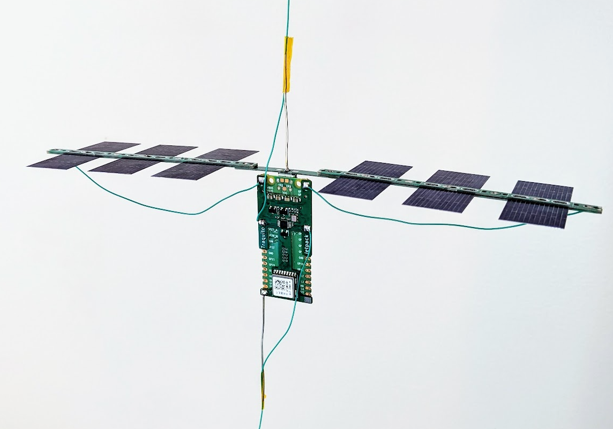
            

## Weight

Solar System fully assembled: 5.9 grams

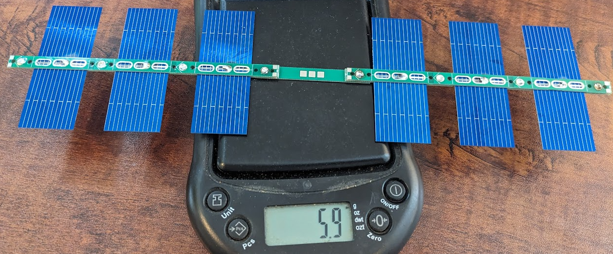

Jetpack + Solar System fully assembled: 11.3 grams

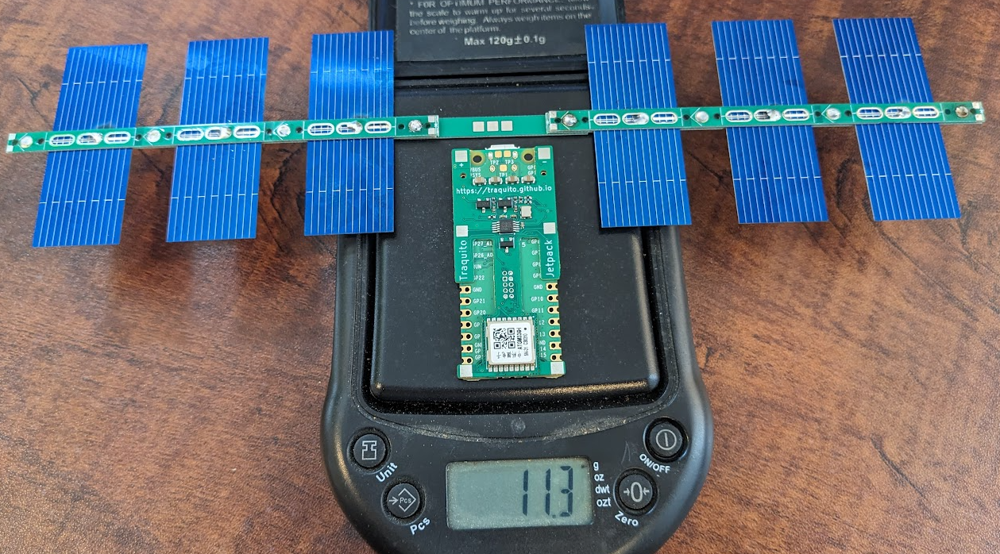
            

## Dimensions

Center PCB: 5mm x 43mm / 0.2" x 1.7"

3-cell jig PCB: 5mm x 99mm / 0.2" x 3.9"

The 3-cell jig PCB was designed around a solar cell which is 19mm / 0.75", but as long as the cell fits between the plated holes you're ok.

Fully assembled Solar System: 5mm x 224mm / 0.2" x 8.8"
            

## Costs

Total cost per solar panel: $1.27
(this does not include shipping, as this should be added onto a tracker order for maximum savings).

The solar cells used in pricing were the cells below.

100 cells for $16 = $0.16 apiece.

6 cells \* $0.16 = $0.96.

[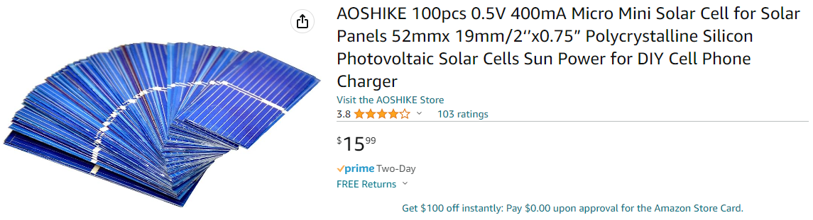](https://www.amazon.com/gp/product/B01NCQRCQR/ref=ppx_yo_dt_b_search_asin_title?ie=UTF8&psc=1)

The Solar System kit PCBs cost $9.10 for 30 kits = $0.31 apiece.

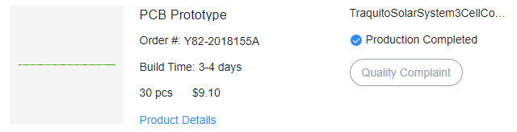
            

## Ordering and Handling Details

For maximum savings (avoiding shipping), add this PCB to your order when ordering Jetpack.  It can be purchased by itself of course.

Also JLCPCB is WAY cheaper when you order fewer long boards instead of many small boards.

Because of that "fewer boards" savings, the Solar System kit was designed as one long PCB strip.  That strip is 5mm x 441mm / 0.2" x 17.4" (pretty long).

When it arrvies to you, you need to cut the strip into the pieces described above.  You do that with a side cutter (very easy).

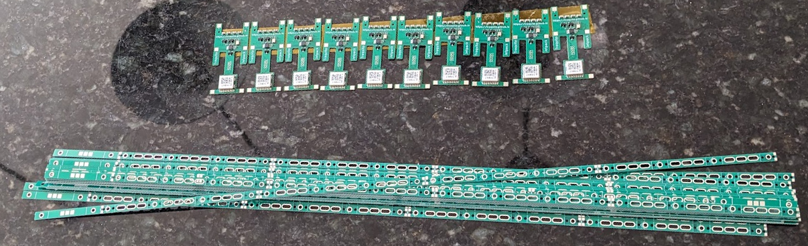

The PCB is marked with a special line with an "X" through it showing where to cut.

When ordering from JLCPCB (see link below), make sure for these PCBs (unlike the Jetpack) that you choose a quantity no higher than 30, and a 0.6mm thickness.

If you choose a quantity higher than 30 the price blows up for some reason.  Same with a thickness less than 0.6mm.

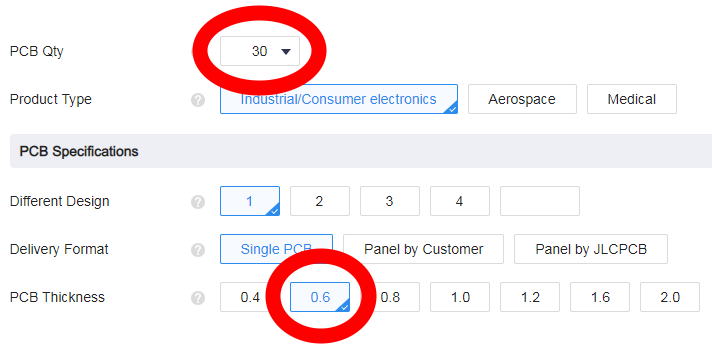

Also note -- This is just a PCB order, not an assembled PCB.  There are no parts to assemble, no BOM, no CPL.  Just the PCBs.
            

## JLCPCB Over-Cautiousness

!!! warning
    JLCPCB may email you and ask if you are comfortable with the very thin/long boards and whether you accept any risk of poorly produced boards.

    **You should say yes.**

    That being said, there is the possibility that perhaps something does go wrong on their side, though, these boards have been ordered before and have worked just fine (so don't sweat it).

    It is also possible that JLCPCB cancels your order or states that the boards are not within their capabilities. **This is not correct.** You can politely explain that these boards have been made before, you do want these boards manufactured, and that you do accept any risks they are concerned about.
            

## Hardware Design File Downloads

Use these to order the Solar System from JLCPCB.

!!! note "See here for ordering instructions: [Ordering from JLCPCB](/faq/jlcpcb)"

| JLCPCB Assembly Files | Description |
| --- | --- |
| [TraquitoSolarSystem3CellComplete-gerbers.zip](TraquitoSolarSystem3CellComplete-gerbers.zip) | Released 2023-07-10 |