# Tracker Hardware - Traquito Jetpack

## Jetpack Overview

Jetpack is a custom Traquito-designed pico balloon WSPR tracker aimed at beginners and experienced alike.

The hardware design and software are freely available to all -- you order, assemble, and fly.

!!! success "Fly cheap - $14 per-tracker, shipped!"
    - Uses [Raspberry Pi Pico](https://www.adafruit.com/product/4864){:target="_blank"} as base board
    - Solder on the Add-on Module to complete the Jetpack tracker

!!! success "Simple to set up and use!"
    - Hardware setup takes 5 minutes and a soldering iron
    - Plug into USB to drag/drop the tracker software (UF2)
    - Stay plugged into USB and use the <a href='/faq/trackergui' target="_blank">webpage-based configuration utility</a>
    - Great for schools or beginners

!!! success "Telemetry out of the box!"
    Works with the U4B-protocol telemetry of GPS coordinates, Altitude, Speed, and Voltage.
    
    Pick a free <a href='/faq/channels' target="_blank">channel</a>, then <a href='/search/spots/dashboard/?band=20m&channel=269&callsign=KD2KDD&limit=2000&dtGte=2023-05-08&dtLte=2023-06-01' target="_blank">track</a> your flight!

!!! success "Easy to power!"
    Wide range of input voltages (3.0V to 5.5V) thanks to buck/boost regulator.

    This allows significant flexibility in powering the unit, such as by:

    - Solar
    - LiPo
    - 2 or 3 AAA/AA lithium cells in series

!!! success "All frequencies!"
    Supports all WSPR bands (20m and all others).

Add-on Module       | Jetpack = RPi Pico + Module
------------------- | ---------------------------
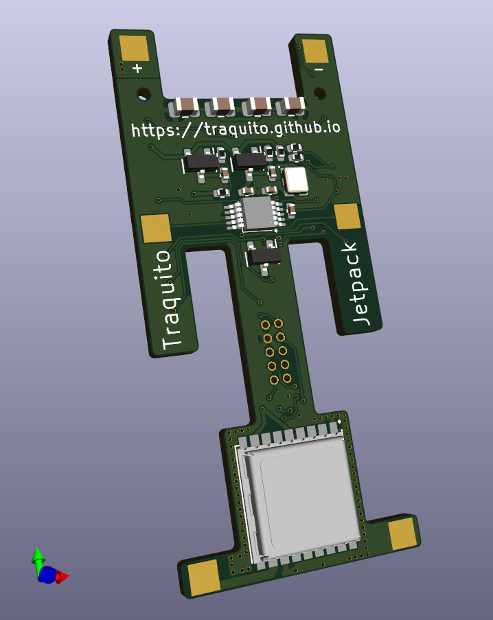 | 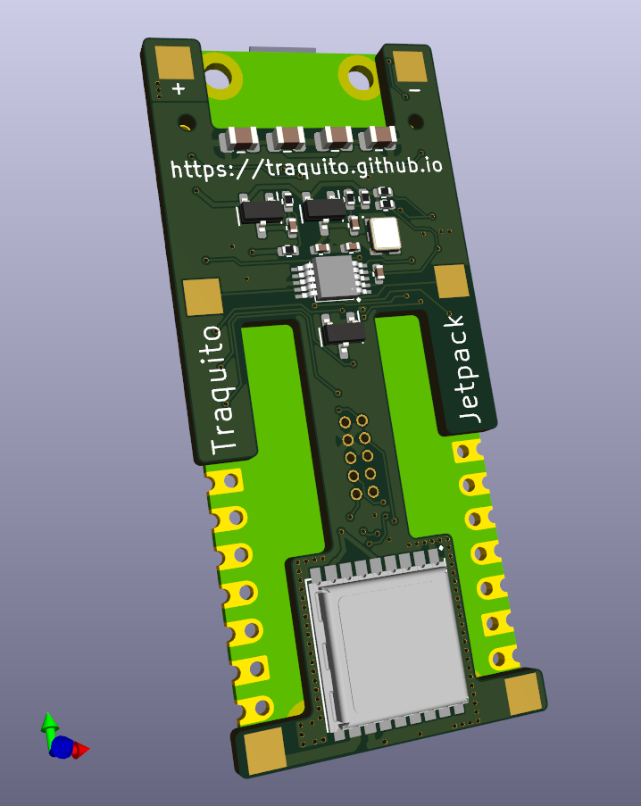
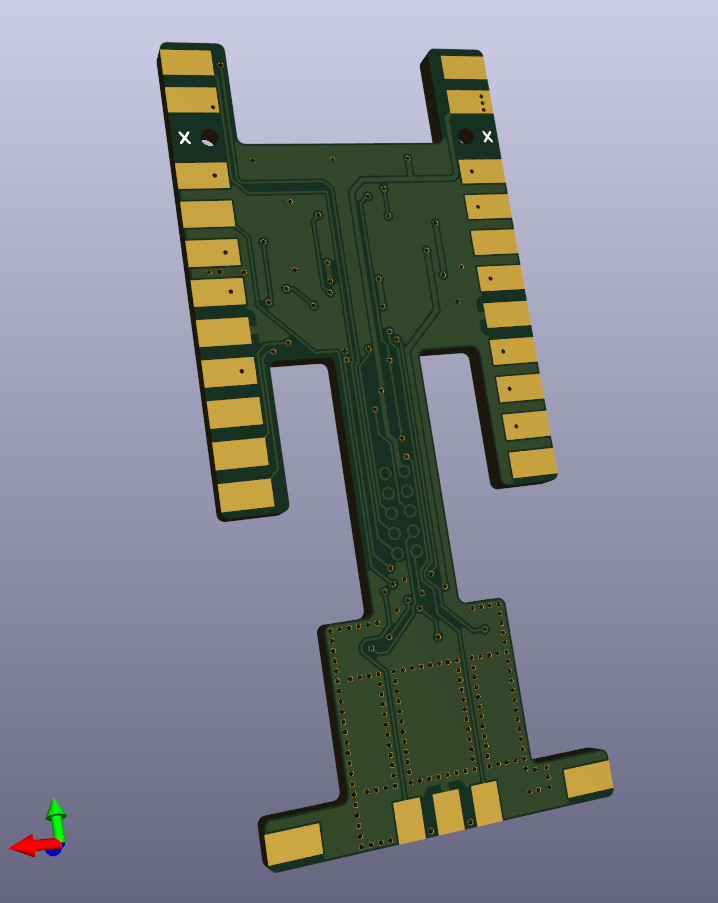  | 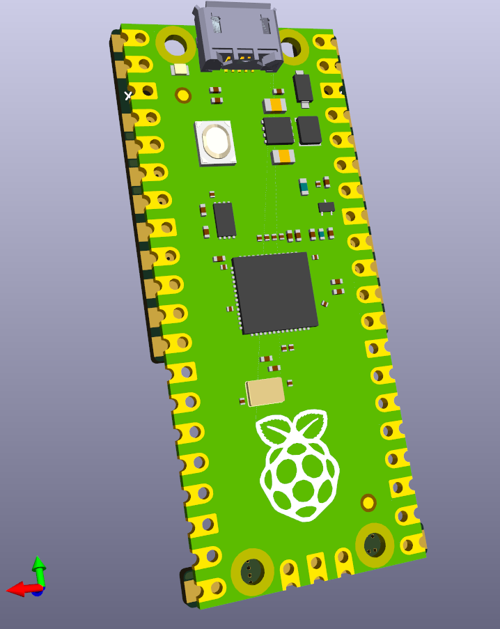

## Jetpack Detailed Description
            
<a href="./V1" target="_blank">See this page for details</a>

## Getting It
            
!!! info "The tracker comes in two parts that you will assemble (solder together) yourself"
    - Raspberry Pi Pico
    - Add-on Module

Getting the Raspberry Pi Pico means buying it from somewhere, [Adafruit](https://www.adafruit.com/product/4864){:target="_blank"} is a good option.
(Get the cheapest no-header version, should be $4).

Getting the Add-on Module means submitting an order to the PCB Assembly service at JLCPCB -- See here: (<a href="/faq/jlcpcb" target="_blank">link</a>)

Solder the Add-on Module to the back of the RPi Pico to create the Jetpack tracker.

## Assembling
            
It is best to assemble (solder together) on a breadboard, using two header pins to lock together the alignment of the Add-on Module and the RPi Pico.

!!! info "Assembly Instructions"
    - Place the header pins on the 3rd row and 3rd column of each of the two halves of the breadboard
    - Place the Add-on Module, flipped, so the back pads are facing upward
    - Place the RPi Pico on top
    - Now you are ready to solder the two parts together
    - (See image below for guidance on which pads to solder)

!!! warning "Don't solder the alignment pins to the tracker!"
    Solder all other pads first, then remove the tracker from the breadboard and solder the final two pads that were used for alignment.

!!! warning "Please take note of the orientation!"
    The RPi Pico and Add-on Module must be aligned back-to-back as shown below.

Alignment:
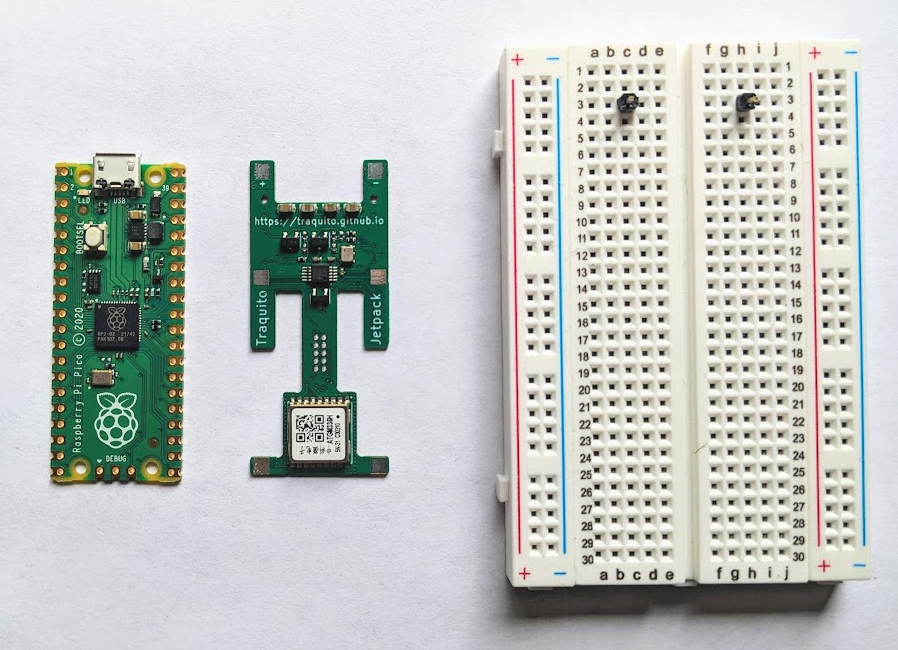
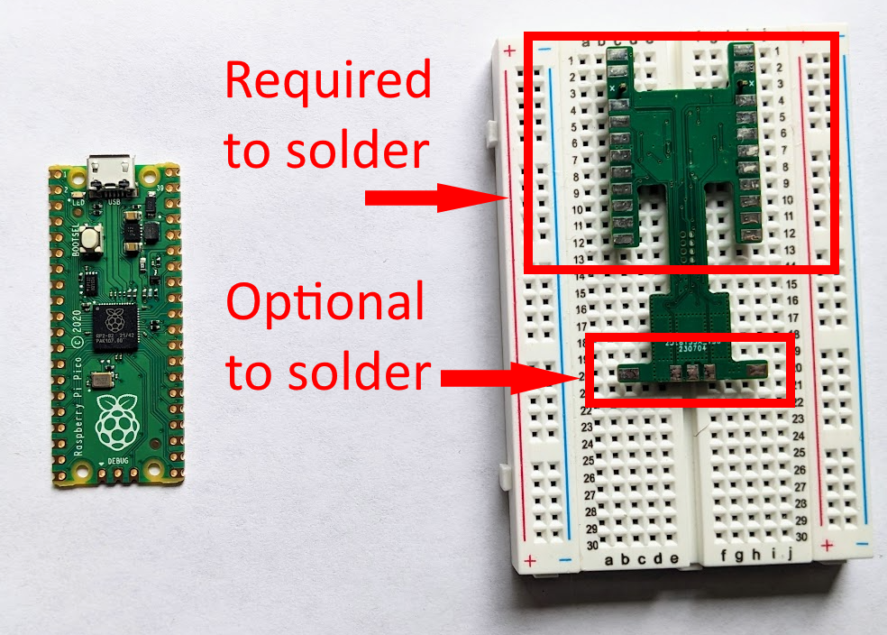

Notice there is a silkscreen "X" on the alignment hole pad.  You do not need to solder this.
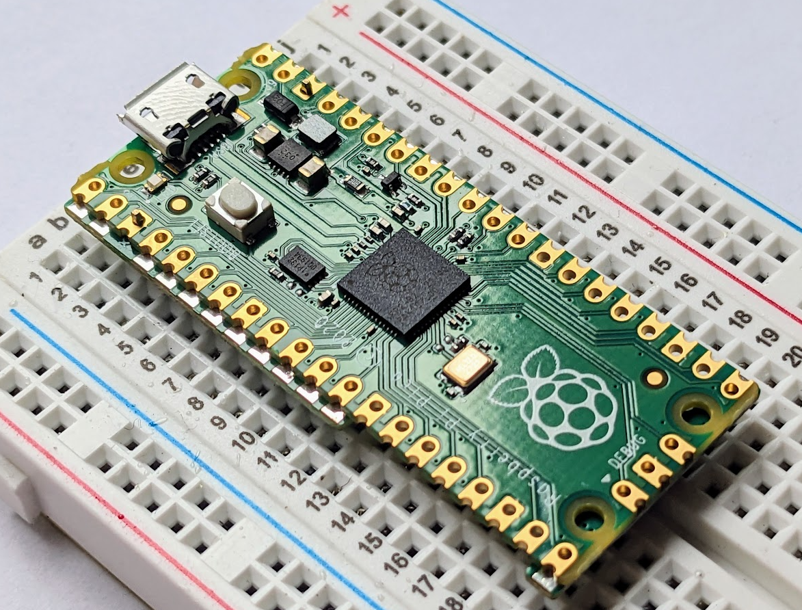

You want to make sure the pad of the Add-on Module is soldered to the edge of the RPi Pico.  Look for a nice connection.

Here is an example of a single pad having been soldered.  No need to "fill in" the hole.
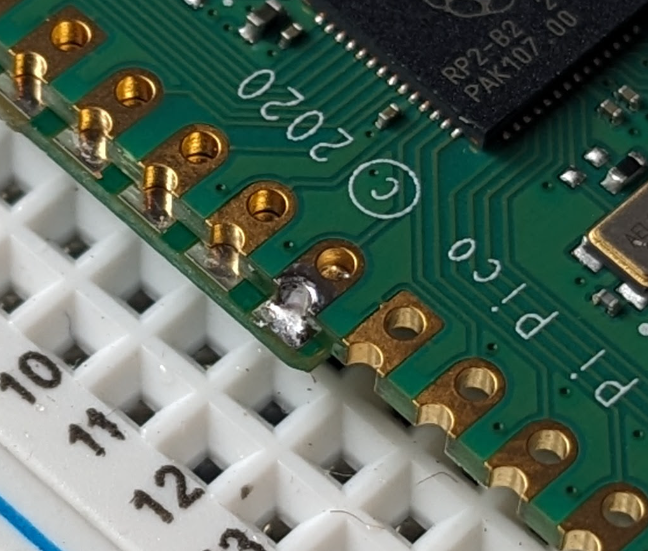

You are welcome to pile on the solder if you want to.  Any increase in weight will be small, so not a big deal.

This may be the preferred approach for students or those with less precise soldering equipment.
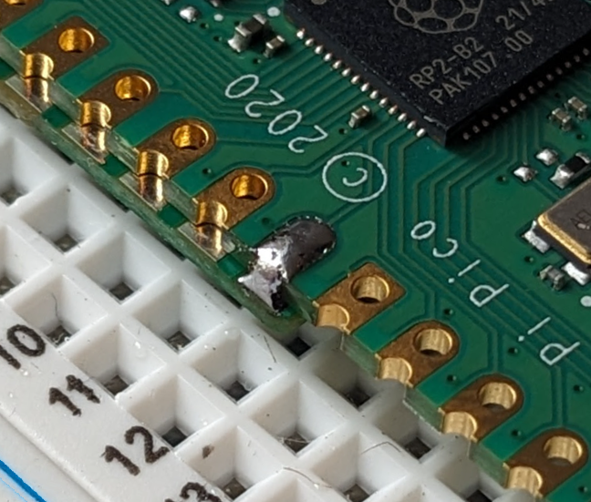

## Programming
            
Once you have assembled (soldered) your tracker, you must program it.

Programming means putting the tracker software onto the physical device hardware.  Without software, the tracker hardware does nothing.

!!! info "Programming instructions"
    - Plug the tracker into the computer via USB
    - (a removable drive appears, you can ignore the contents)
    - Drag/Drop the tracker software (.UF2 file) onto that removable drive
    - (the drive disappears, you are now done programming)
    - (there is no need to reboot or unplug the tracker, proceed to configuration)

!!! note "The .UF2 file download is available in the [Tracker Software Downloads](#tracker-software-downloads) section of this page."

## Configuration

You now have a functioning tracker, congratulations!  You can't fly yet, though, you have to configure it first!

Configuring the tracker means telling the tracker the information it needs to do its job.

You use this same information later to search for the tracker's path and telemetry, so write it down.

!!! info "You need to configure the tracker with"
    - The frequency band (usually 20m)
    - The <a href='/faq/channels/' target="_blank">channel</a> (pick one someone else isn't using)
    - Your callsign

Plug your tracker into USB and configure your tracker through the <a href="/faq/trackergui" target="_blank">Configuration GUI</a>.

!!! tip
    If you want to send test WSPR messages during configuration, solder on a short wire (eg 3 inches) to each antenna pad.  This will get replaced by a full-sized antenna later.

!!! note "Once you have configured your tracker, disconnect it from the computer."

## Power and Antennas

!!! info "Jetpack has 6 pads on its front for power and antennas"
    - Top two - Power pads (power during flight)
    - Middle two - Transmitter antenna
    - Bottom two - GPS antenna

!!! note "Jetpack must have power and antennas before it will work correctly."

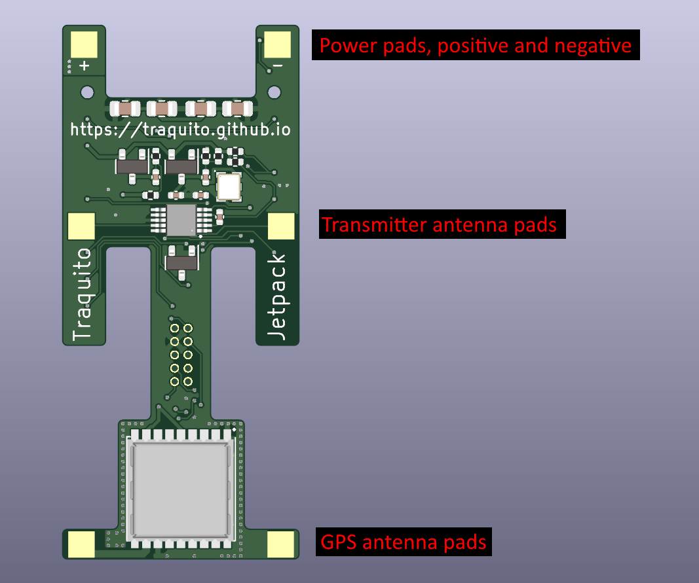

### GPS Antenna

The GPS antenna can have one leg, 5cm or 2 inches in length, on the left pad, extending away from the tracker.

I use [solid core 20 AWG wire](https://www.amazon.com/gp/product/B010T60BL2/ref=ppx_yo_dt_b_search_asin_title?ie=UTF8&psc=1" target="_blank){:target="_blank"} but really most anything works.

Example image (not to scale):
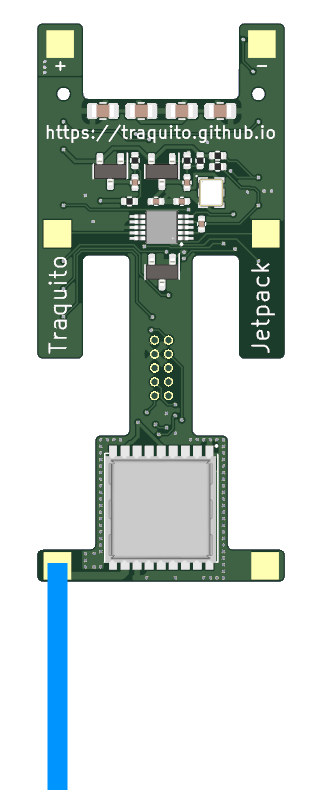

### Transmitter Antenna

The Transmitter antenna needs to have two legs, each 199.2" long (quite long), for 20m (different length for other bands).  This is due to the relationship between the transmission frequency and the antenna length.  This length is a "half wave" dipole.

!!! tip
    A common approach is to use a very thin (36AWG) enameled [magnet wire](https://www.amazon.com/gp/product/B00L5IUWZY/ref=ppx_yo_dt_b_search_asin_title?ie=UTF8&psc=1){:target="_blank"}. With this kind you don't even scrape the enamel off before soldering, it just melts away when you push inside a solder blob.

!!! tip
    You can read some tips on how to manage long lengths of wire like this, and launch tips, here: [https://www.picoballoons.com/trackers/wspr-launch-process](https://www.picoballoons.com/trackers/wspr-launch-process){:target="_blank"}

!!! tip
    You can also use the <a href="/WOM5000" target="_blank">Wind-O-Matic 5000</a> to do the winding for you!

## Solar Power
            
You're going to need to power your tracker when in flight and during testing.

Solar is a very common choice.

!!! tip
    Consider whether the Traquito <a href="/solar" target="_blank">Solar System</a> is right for you!
    

## Testing
            
Once your tracker is configured, antennas attached, and powered, you should do some testing before flying.

!!! tip
    A great way to test is to set up your computer to <a href="/faq/receiving/" target="_blank">receive WSPR messages</a> and run your tracker in the window (so the GPS has a clear view of the sky).

    You will see your tracker's transmitted messages exactly as they will be when your tracker is flying for real.

!!! tip
    The ideal testing setup is powering your tracker with the same solar panels you will use in flight.
    
    Using (for example) a power bank to power the tracker can be helpful for early testing, but doesn't prove the whole system works when flying.

!!! info "When your tracker transmits while in Flight Mode you will see 2 types of messages transmitted"
    - Regular Messages
    - Encoded Messages

!!! note "You can learn more about Regular and Encoded messages on the <a href="/faq/channels/" target="_blank">Channels FAQ</a>."

## Usage Policy
            
Please see the <a href="/faq/about/" target="_blank">About</a> page for more information.

## Hardware Design File Downloads

Use these files to order the Add-on Module from JLCPCB

!!! note "Ordering instructions can be seen here: <a href="/faq/jlcpcb" target="_blank">JLCPCB Ordering Instructions</a>."

| JLCPCB Assembly Files | Description |
| --------------------- | ----------- |
[bom_jlcpcb.2024-09-13.csv](./V1/files/bom_jlcpcb.2024-09-13.csv) [cpl_jlcpcb.2024-09-13.csv](./V1/files/cpl_jlcpcb.2024-09-13.csv) [TraquitoJetpack-gerbers.2024-09-13.zip](./V1/files/TraquitoJetpack-gerbers.2024-09-13.zip) | Released 2024-09-13

## Tracker Software Downloads
Use the most recent .UF2 file to program the tracker.

!!! warning "You <u>must</u> solder the Add-on Module to the RPi Pico before the software/tracker will work"
    The RPi Pico cannot run the software without the Add-on Module soldered on.

| Tracker Software | Description |
| --- | --- |
| TraquitoJetpack.2023-06-20.uf2 | Initial Release |
| TraquitoJetpack.2023-07-10.uf2 | General Changes: - Channel 0 supported now - Hot/Warm/Cold GPS reset uses CASIC commands not UBX - Startup blink shows system component power tests  Configuration Mode Changes: - Radio not active on startup (auto on during send) - All GPS NMEA sentences enabled - False lock duration fix  Flight Mode Changes: - Regular message reports 13 dBm instead of 17 dBm |
| [TraquitoJetpack.2023-07-11.uf2](./V1/files/TraquitoJetpack.2023-07-11.uf2) | General Changes: - performance update prevents dropped NMEA messages |

## Tracker not showing up in configuration selection window?

!!! warning "USB power cables don't work for configuration"
    Some USB cables are "power only" -- this won't work for Jetpack.
    
    You need a USB cable which has both data and power.

## Questions / Comments?
Please see the <a href="/faq/about/" target="_blank">About</a> page for more information.

