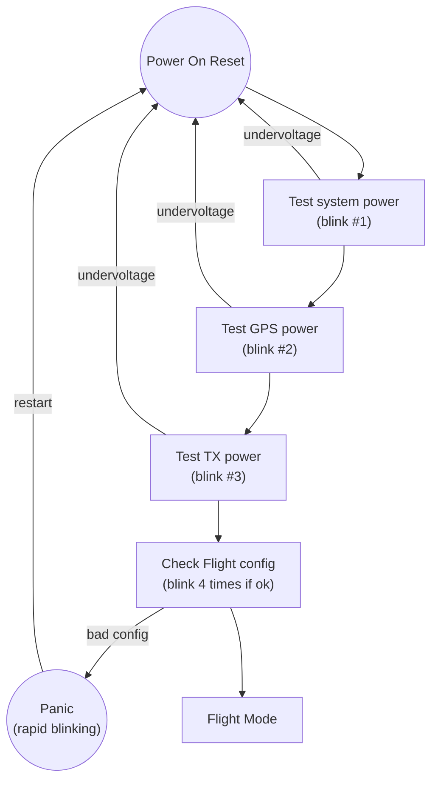
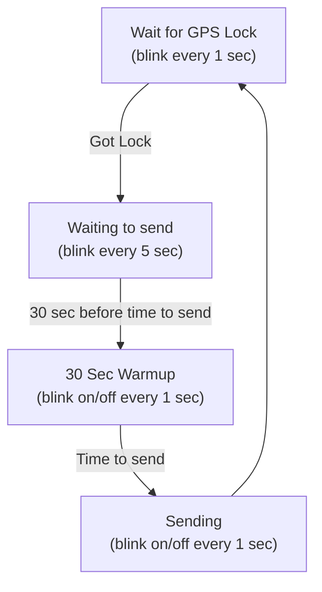
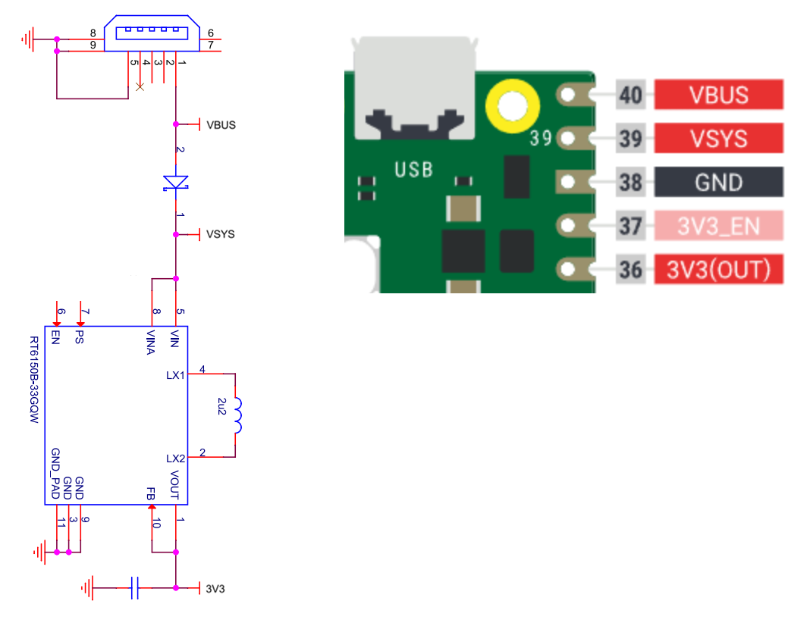

---
search:
  boost: 8

icon: material/details
---

# Jetpack Technical Details

## Jetpack Hardware

Jetpack inherits RPi Pico features and extends them through the Add-on Module.

### RPi Pico Component

!!! info "The RPi Pico provides"
    - RP2040 CPU
    - Flash Memory
    - Temperature sensor
    - USB and support for Drag/Drop software upload
    
The RP2040 is run at 48MHz speed to balance conserving power while retaining fast computation.

The flash memory is used to permanently store user configuration across power resets.

Temperature sensing makes use of the internal temperature sensor of the RP2040 instead of an external component, saving board space and cost.

The USB interface allows for both easy uploading of the Jetpack software, as well as interactive configuration and testing of the device before flight.

### Add-on Module Component

!!! info "The Add-on Module provides"
    - GPS (ATGM336H)
    - Radio Transmitter (SI5351A) + 0.5ppm TCXO
    - Voltage Monitor

#### GPS Details

The GPS uses signals from both the US GPS satellite system as well as the BEIDOU GPS satellite system.

The design places the GPS and its antenna pads far away from electrical noise, for improved lock speed and quality.

Sensitive GPS areas are shielded with a special arrangement of vias designed to reduce interference.

#### Radio Transmitter Details

The Radio Transmitter consists of the SI5351A device.

For stronger transmissions, instead of a single clock source used as the radio signal, two clocks are used, 180 degrees phase from one another for double driving power.

Each clock drives one leg of the dipole antenna, each at the maximum output current (8mA).

No TCXO calibration or correction is required for proper operation.

The Radio Transmitter antenna pads are placed away from sources of noise.

To avoid transmission frequency drift in cold or changing temperatures, the radio is powered up 30 seconds before transmissions to allow for stabilization.

#### Voltage Monitor Details

Solar-powered flight is common in pico balloon tracker configurations.

The unpredictable and wide range of supplied power from solar can sometimes create instability in hardware designed to operate within a specific range.

Jetpack incorporates a dedicated hardware-only voltage monitoring device which can rescue the system in the event of a lockup due to under-power conditions.

The monitor looks for supply voltages below 2.6v as an indication of system fault and holds the system in reset for a short period to clear the issue.

## Jetpack Software

The software that operates the Jetpack tracker hardware is designed to be simple, intuitive, and fault-tolerant.

!!! info "Jetpack software operates in two modes"
    - Configuration Mode
    - Flight Mode

### Configuration Mode
Configuration mode is automatically selected whenever you plug Jetpack into the computer through USB.

!!! note "Simply providing power via USB will lead to Flight Mode operation. See [A Note about USB](#a-note-about-usb) for clarification."

Jetpack assumes you want to configure or test your device, so the GPS is turned on automatically and the radio made ready in preparation.

In this mode, you have flexibility to set your flight details (band, channel, callsign) as well as test the hardware features of the device.

Configuring and interacting with Jetpack is easy.  Jetpack speaks WebSerial, meaning you use a web browser, mouse, and keyboard to interact with it just as you would any other webpage.

The settings you supply are saved in permanent memory and persist across reboots and power outages.

!!! note "In Configuration Mode, you can test sending Regular messages, but encoded Telemetry cannot be sent."
    Encoded telemetry is only sent during Flight Mode.

    See the [help](../../trackergui/help/README.md) page of the [Configuration GUI](../../trackergui/README.md) for details.
    

### Flight Mode

When Jetpack is disconnected from the computer, it automatically enables Flight Mode.

On startup in Flight Mode, Jetpack first checks that you have saved Flight Configuration (band, channel, callsign).

If there is no saved Flight Configuration, a "panic" rapid-flashing LED pattern appears, the device resets itself a few moments later, and the cycle repeats.

You cannot fly a "default" configuration of any kind.  If you fly Jetpack with no configuration, it will do nothing, there will be no transmissions.

Assuming Flight Configuration is found, Jetpack looks up the transmission schedule associated with the band and channel, and begins its Tracker Cycle.

#### Tracker Cycle

!!! info "The Tracker Cycle consists of"
    - Get a GPS lock
    - Idle until 30 seconds before it is time to transmit
    - Turn on the radio transmitter early to warm it up and reduce frequency drift
    - Transmit Regular message, then Encoded message
    

Jetpack only transmits messages when a GPS lock has been acquired.

This cycle repeats endlessly as long as there is power.  If power is lost and later restored, this cycle starts again.

You can visually determine what phase of this sequence Jetpack is in by monitoring the blinking pattern of the LED on the RPi Pico.

### What's it doing?

The tracker indicates what it is doing through its LED blinking.

!!! info "Two sets of blinking patterns"
    - Startup Power Blinking Sequence
    - Tracker Cycle Blinking Sequence

#### Blinking Sequence Startup

!!! info "When the device is first turned on, or reset"
    - Blink #1 - System on, power sufficient
    - Blink #2 - GPS operational, power sufficient for this component
    - Blink #3 - TX operational, power sufficient for this component
    - 4 consecutive blinks - Flight Mode configuration found, ok to fly

#### Blinking Pattern Sequence Flight Mode

!!! info "When the device is in Flight Mode"
    - Short blink every 1 second - GPS is waiting for a lock
    - Short blink every 5 seconds - Idle period before transmission
    - Alternating on/off every 1 second - Radio operational for warmup and transmission

### Flight Mode Fault-Tolerance

In the event of a hardware malfunction or lockup, the system uses a [Watchdog timer](https://en.wikipedia.org/wiki/Watchdog_timer) that will reset the entire device within seconds instead of locking up for the entire day.

Jetpack can also deal with a malfunctioning GPS device.  If no GPS lock occurs within 20 minutes of the attempt, a software and hardware (power) reset of the GPS is performed, after which Jetpack resets itself, resolving any issue in the process.
            

### Telemetry

Telemetry is encoded in U4B protocol, which you can learn more in [Channel Map Help](../../channelmap/help/README.md).

!!! note "Voltage telemetry is handled specially"
    The measurement of the voltage is purposefully taken while the GPS is active and loading the power source (expected to be solar).
    
    This allows a view of the typically lower (sagged) voltage when under load.
            

### Jetpack Power Source

Jetpack can be powered from different sources -- USB or the dedicated pads on the top front of the Add-on Module.

In Configuration Mode, Jetpack is invariably plugged into USB, and so uses power from USB to operate (See [A Note about USB](#a-note-about-usb) for clarification).

In Flight Mode, Jetpack can be powered from USB (eg power bank, not computer) or through the dedicated pads on the top front of the Add-on Module.  It is expected that during actual flight, the dedicated front power pads are used.

You should not power the Jetpack Flight Mode pads when plugged into the computer via USB.

!!! info "The full power chain"
    - USB power (VBUS) enters and passes over a Schottky diode
    - VSYS is either the result of VBUS-via-Schottky, or powered directly
    - The RPi Pico regulator converts VSYS to 3v3, which powers the system

The Flight Mode power pads supply power to VSYS.

It is the VSYS input voltage which is reported as voltage telemetry during flight.

For clarity, here is a cut-down version of the RPi Pico [schematic](https://datasheets.raspberrypi.com/pico/pico-datasheet.pdf#page=25) alongside a pinout of the RPi Pico.

            

## A Note about USB

!!! info "There are two aspects of Jetpack behavior which relate to USB"
    - Configuration Mode
    - Power

When Jetpack is plugged into the computer (by USB), Jetpack gets power from the computer, but Jetpack also knows it is connected to a computer (because it communicates over data lines with the computer), and so enters Configuration Mode automatically.

When Jetpack is plugged into a USB power bank, Jetpack gets power from the power bank, and enters Flight Mode.  Jetpack does not enter Configuration Mode with a power bank because there is no computer data connection.

!!! warning "Some USB cables used with a computer are "power only" (no data lines)"
    If you aren't able to connect the GUI to your tracker, you may be accidentally using one of those cables.
    
    This scenario would lead to Flight Mode being used despite the cable being plugged into the computer.
            

## Jetpack Weight

Jetpack weighs a combined 5.3 grams for RPi Pico + Add-on Module.
            

## Jetpack Power Consumption

Jetpack requires a maximum of 70mA at 3.3v to operate.

The higher the voltage, the less current required.

!!! info "There are 3 major consumers of power (highest to lowest)"
    - Radio Transmitter
    - GPS
    - The board itself
    

Jetpack saves power in Flight Mode by only powering the Radio Transmitter and GPS when they are in use.

As a result, power consumption is not constant, but varies over time depending on the active operation.