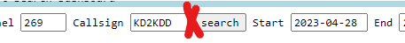
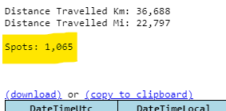
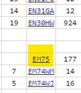
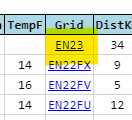
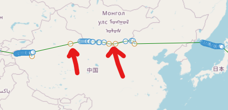
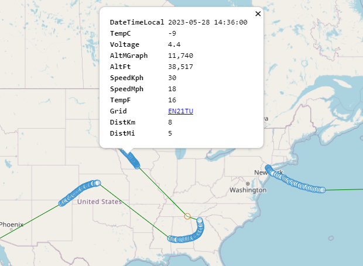
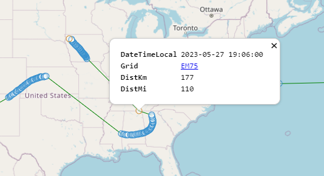

---
date:
  created: 2023-05-28

categories:
  - converted
  - site
---

# No search limit, spot counts, grid4 promotion, map spot colors

!!! note "This entry is based on a converted groups.io post, put here for any documentation value."

Hi, instead of starting a new thread for feature updates, I'll just reply to this.

A few changes I made worth noting:

**1. No more "Limit" input**

Now the page does "the right thing" and you can stop guessing what number to put in there.

**2. Now you get a count of the spots found with your search**

**3. Grid4 promotion**

In some cases, it is useful to map the grid4 value despite not having a full grid6.

These cases are defined to be:

- the first spot

- any gap between spots where the grid4 lands on a different grid not already covered by either neighbor

- the most recent spot, provided enough time has gone by that the encoded telemetry should have arrived already

**4. Grid4 colored differently on the map**

The blue marks are for grid6, and orange for grid4.

Can be helpful for sporadic reception where interesting locations were passed over but only grid4 received.

Can also be a little unhelpful if the spot is clearly not lined up with the trend.

The mode of the page which only uses grid4 is all orange.

**5. Popups**

Now you can click on any spot and see a cut-down selection of data available about that spot.

Grid6 points have more data available than grid4.

Thanks.

Doug

