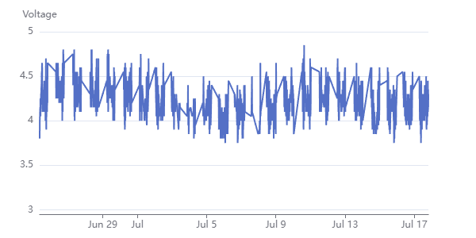
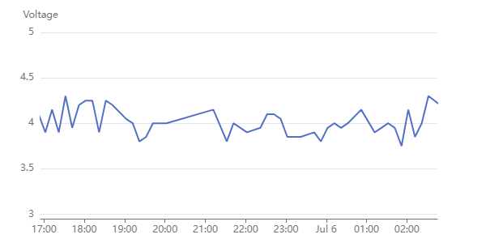
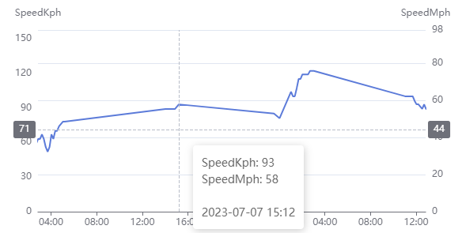
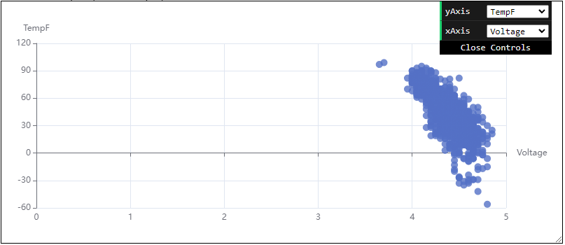
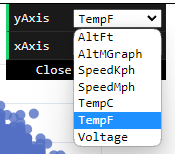
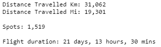

---
date:
  created: 2023-07-17

categories:
  - converted
  - site
---

# Better and new graphs, more flight info

!!! note "This entry is based on a converted groups.io post, put here for any documentation value."

Hi,

Minor updates to the website, mostly about graphing.

<strong>Graphs are easier to zoom in/out:</strong>

Just put your mouse over the chart, scroll up to zoom in, scroll down to zoom out, click+drag to pan left or right.

The x-axis automatically adapts to the zoom level.

<strong>Graphs show tooltips with both metric and imperial (and no more double-lines):</strong>

<strong>Experimental Graphs (only one for now):</strong>

Underneath the regular graphs is a new expandable section.

At the moment it has a user-configurable scatterplot that lets you (say) compare the temperature to reported voltage.

You can compare any measurement to any other measurement, however, and the graph just updates its view.

Here are two searches that have relatively long histories that may be interesting to look at:

<ul>

<li>(<a href="https://traquito.github.io/search/spots/dashboard/?band=20m&amp;channel=352&amp;callsign=K6STS&amp;dtGte=2023-06-25&amp;dtLte=2023-07-17" target="_blank" rel="noopener">link</a>) K6STS</li>

<li>(<a href="https://traquito.github.io/search/spots/dashboard/?band=20m&amp;channel=304&amp;callsign=WD0HXN&amp;dtGte=2023-06-26&amp;dtLte=2023-07-17" target="_blank" rel="noopener">link</a>) WD0HXN</li>

</ul>

I didn't want to burden the typical page viewer with too much information, but happy to take feedback about what is/isn't useful to see.

<strong>The graphs are much faster to load and snappier to use.</strong>

Can't take a screenshot of that but the page hopefully feels even zippier.

<strong>Info section has more info</strong>

A few additional stats got added.

Flight duration just does the math for you by looking at the earliest and latest spot in your search and working out the difference.

Thanks.

Doug

