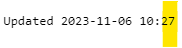

---
date:
  created: 2023-11-06

categories:
  - converted
  - site
---

# Map auto-updates

!!! note "This entry is based on a converted groups.io post, put here for any documentation value."

Hi, new feature on the website.

<strong>Auto-Update</strong>

The page will now automatically search for and display new spots for you.

The page does not "refresh," instead, a background query is done, and new data is added to the graphs and map.

So, you don't need to refresh the page anymore.  It will just have the latest data if there is any.

Enabling

This feature is automatically enabled when the "End Date" is today or in the future.

Update Indication

A new status has been added to indicate the latest time that an update was performed.

Update Frequency

Every 10 minutes, aligned to your specific channel "start minute."

The page aligns to 5 minutes after the start of transmission before getting the latest data.  This accounts for the 4 minutes of transmit time, plus another minute since it takes a while for that data to make its way through the various databases.

Regardless of when you load the page initially, the page logic will "snap" to align to that time.

The specific refresh time is calculated as:

<ul>

<li>Start minute + 5 minutes</li>

<li>Plus another 7 seconds since 5 minutes sometimes isn't enough</li>

<li>Plus a random number of seconds between 0-5 (to ensure not all pages re-query at the same time)</li>

</ul>

eg channel 227 has start minute 2, so 2+5=7 minutes each 10 minute slot, plus between 7-13 seconds.

Data for 227:

Automatic update:

Map Behavior

The map will keep its current center and zoom, and simply add additional spots to the map.

That is:

<ul>

<li>The map will not re-center on the new spot</li>

<li>The map will not go back to the default zoom.</li>

</ul>

The effect of this is that new spots will show up, off-center, possibly out of the current view.  This is an intentional decision (as opposed to re-centering automatically).  Happy to discuss whether this is the right behavior.

Graph Behavior

The graphs will not keep their zoom level, they will be zoomed all the way out.

Stats Behavior

Stats will update automatically.

Data Table Behavior

Data will update automatically.

What about non-channel-query behavior?

Also works.  Updates every 2 min on even minutes (plus 7 sec and randomness).

Thanks.

Doug

