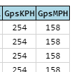
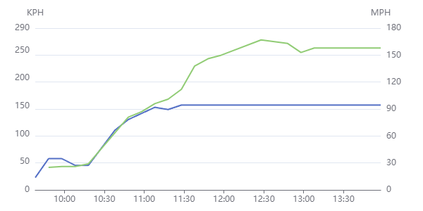
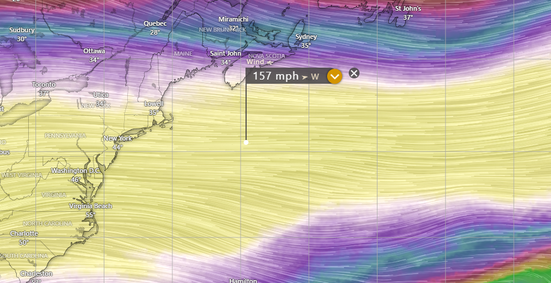

---
date:
  created: 2023-11-11

categories:
  - converted
  - site
---

# GPS-based speed calculation

!!! note "This entry is based on a converted groups.io post, put here for any documentation value."

Hi, another update -- <strong>GPS location used to calculate speed</strong>.

You will now see new columns of data.

You will also see that data graphed on the speed graph, blue is the telemetry, green is the location-derived speed.

Example flight: <a href="https://traquito.github.io/search/spots/dashboard/?band=20m&amp;channel=185&amp;callsign=KD2KDD&amp;dtGte=2023-11-11&amp;dtLte=2023-12-10" target="_blank" rel="noopener">https://traquito.github.io/search/spots/dashboard/?band=20m&amp;channel=185&amp;callsign=KD2KDD&amp;dtGte=2023-11-11&amp;dtLte=2023-12-10</a>

The GPS location data is smoothed (averaged) and only calculated in some circumstances.

The data is calculated only between adjacent 6-char maidenhead grids which are consecutive 10-minutes apart.

The data is then smoothed with a rolling 3 to 5 sample average, where the current value is averaged against a minimum of two of its neighbors or their neighbor's neighbor.

The reason for the averaging is because the data was very spikey otherwise, even 6-char grids are pretty imprecise, and a left-to-right move is much smaller than a diagonal move.  This would cause aliasing and the visual appearance of dramatic changes in speed, even though we know that's not really what's going on.

The change, of course, works for all historical flights as well, so feel free to check them out if you have any old favorites.

Thanks.

Doug

