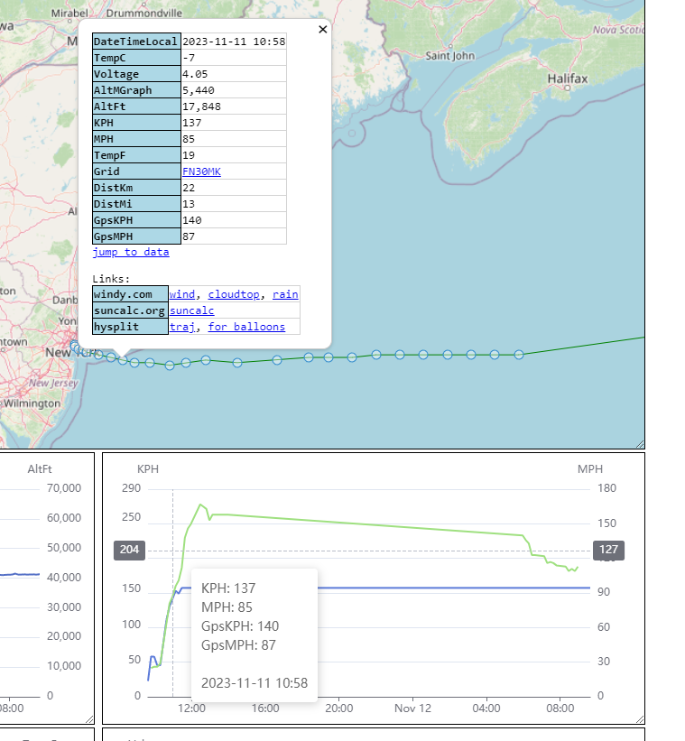
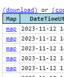
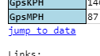

---
date:
  created: 2023-11-12

categories:
  - converted
  - site
---

# Jump between map and data

!!! note "This entry is based on a converted groups.io post, put here for any documentation value."

Hi, a few new features to mention.

It's all about page interactivity.

<strong>Focus the map from the graph</strong>

When you hover over a graph, you see a tooltip showing you the date/time of where your cursor is.

Now, when you click any graph at a given time, the map will center on that spot and pop-up the info dialog.

<strong>Focus the map from data</strong>

A new "Map" column has been added with a link per-row.

Click the link, and the page will jump to the map, and the map will center on that spot and pop-up the info dialog.

<strong>Jump to data from map</strong>

A new "jump to data" link is visible in the map spot pop-up.

Click the link, and the page will jump to the data.

<strong>Generally</strong>

The idea is that it can be hard to look at data and find the corresponding map location, and vise versa, especially when looking at long flights.

Hopefully this makes exploring the data a little easier.

Example long flight:

<a href="https://traquito.github.io/search/spots/dashboard/?band=20m&amp;channel=315&amp;callsign=KN4IUD&amp;limit=2000&amp;dtGte=2023-09-09&amp;dtLte=2023-12-09" target="_blank" rel="noopener">https://traquito.github.io/search/spots/dashboard/?band=20m&amp;channel=315&amp;callsign=KN4IUD&amp;limit=2000&amp;dtGte=2023-09-09&amp;dtLte=2023-12-09</a>

Thanks.

Doug

