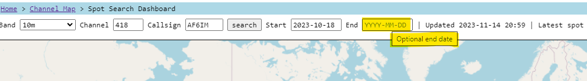

---
date:
  created: 2023-11-14

categories:
  - converted
  - site
---

# End Date optional

The "End Date" is now optional.

As in, if you want to see all your spots from <StartDate> until <infinity> you can just leave the End Date blank.

This is useful for bookmarking when you don't already know the end date of your new flight and want to keep checking in on it or share the link.

When End Date is blank, the auto-update feature of the dashboard will always look for new spots, forever.  When you have an End Date set, the auto-update feature only looks for new spots when the End Date is in the future.

For me, I update my bookmark when a flight ends to have a precise End Date.  This update means I can start my bookmark with no End Date in mind (always optimistic my flight lives on for months!).

Thanks Kevin for the idea.

Thanks.

