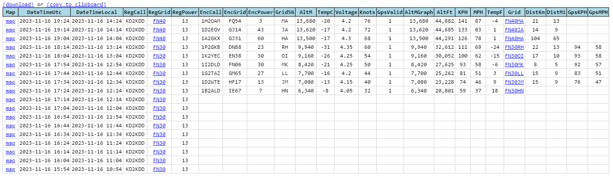
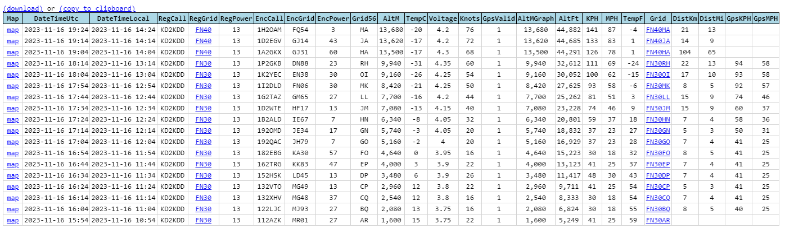

---
date:
  created: 2023-11-16

categories:
  - converted
  - site
---

# Better flight data identification (fingerprinting)

Happy to announce I have improved the fingerprinting feature further, and it now successfully resolves an ongoing conflict on channel 248.

There are two flights on 248 at the moment:

- ([link](https://traquito.github.io/search/spots/dashboard/?band=20m&channel=248&callsign=KD2KDD&dtGte=2023-11-16&dtLte=)) KD2KDD
- ([link](https://traquito.github.io/search/spots/dashboard/?band=20m&channel=248&callsign=VE3VRO&dtGte=2023-11-16&dtLte=)) VE3VRO

They both were flying Traquito Jetpack, both flying over the Atlantic just off the coast, at the same time, and both were on channel 248.

The Traquito Web previously was not able to determine which encoded data was valid (two candidates), and so the first half of the flight data was left without decoded data.  Example KD2KDD:


Now with the enhanced fingerprinting, the full flight details are available for both.  Example KD2KDD:


The fingerprinting algorithm stays the same, mostly.

Previously, matching receivers for both regular and encoded, and a transmit frequency within 5 Hz, then it's a match.  If more than one set of telemetry matches, give up.

Now, if more than one set of telemetry matches, tighten the frequency limit iteratively.  As in, go to 4 Hz, then 3 Hz, etc.  If you narrow down to one set of telemetry, you win.  If not, give up.

```javascript
if (qualifiedList.length > 1)
{
    while (freqDiffLimit > 0 && qualifiedList.length != 1)
    {
        --freqDiffLimit;
        
        qualifiedList = FnGetQualifiedCandidates(value.regRxDetailsList, value.encCandidateList, freqDiffLimit);
    }
}
```

Notably this works thanks to NOT calibrating the TCXO precisely.

Thanks.


Doug


