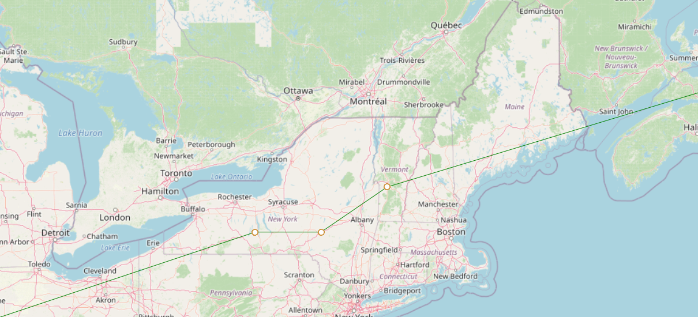
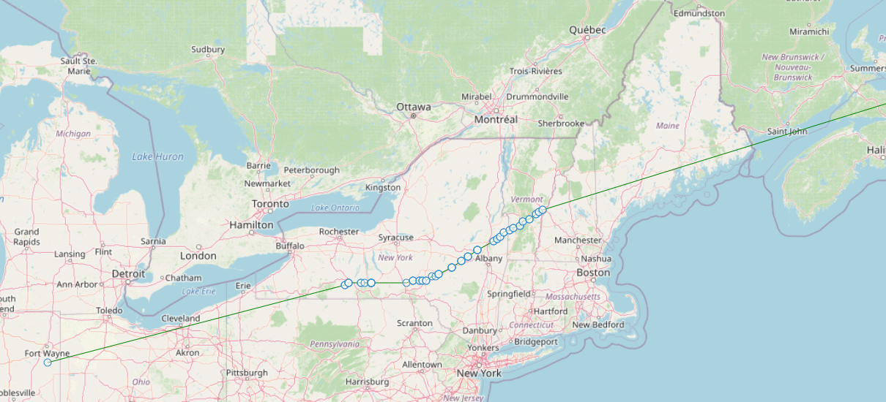
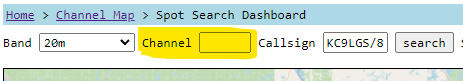

---
date:
  created: 2024-02-18

categories:
  - converted
  - site
---

# ZackTek 6 char grids

!!! note "This entry is based on a converted groups.io post, put here for any documentation value."
Hi, update.

ZackTek trackers, which can report 6-char grids in a single "regular" report, now show up on the map with 6-char precision (instead of the 4 char grid previously supported).

Before:

After:

As always, a channel-less flight search is one where you leave the Channel field blank on the spot search dashboard.  This applies to any tracker, but this change allows the ZachTek-specific behavior to shine though, whereas I believe no other tracker does 6-char grid reporting.

An example ZachTek flight is here:
https://traquito.github.io/search/spots/dashboard/?band=20m&channel=&callsign=KC9LGS%2F8&limit=2000&dtGte=2023-12-31&dtLte=2024-01-06

If anyone has prior flights from a ZachTek tracker, share some links, I'd be interested to see how they look!

Caveat -- there are some situations where wsprnet will force a 4-char grid (say, from another tracker that only reports 4) to become 6-char.  See ([this](https://groups.io/g/picoballoon/topic/98540803)) link for more details.  Basically this is unlikely to affect anyone but thought I'd mention it.

Thanks.

Doug

