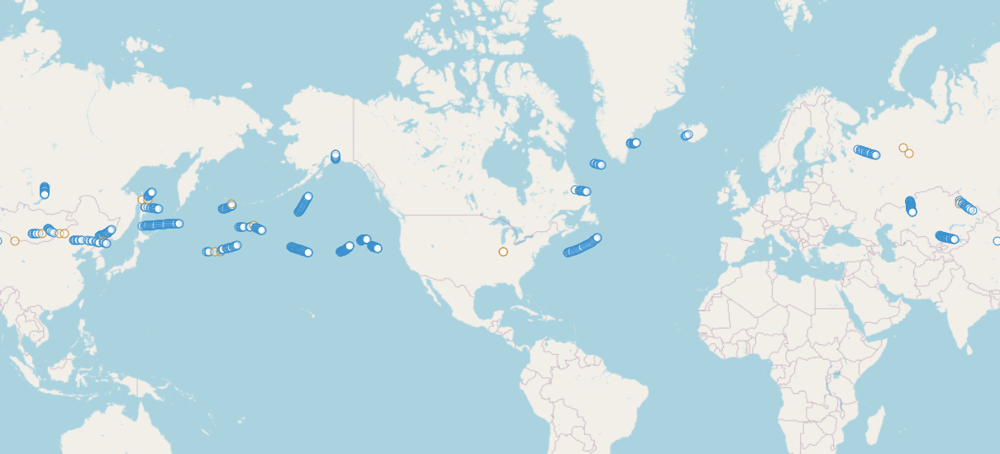
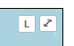

---
date:
  created: 2024-02-20

categories:
  - converted
  - site
---

# Toggle map lines

Update,

Map now allows you to turn on/off the lines connecting spots.

Toggled on:

Toggled off:

The toggle is the "L" button in the upper-right hand corner.

This is based on the request from John about his flight (pictured above, linked [here](https://traquito.github.io/search/spots/dashboard/?band=20m&channel=264&callsign=KC9IKB&dtGte=2023-11-29&dtLte=)) having long durations of missing data, and the lines connecting them making the path appear incorrect.

The logic for lines is just "connect the dots."  When there are many missing data points, this can lead to the situation above.

Thanks.

Doug

