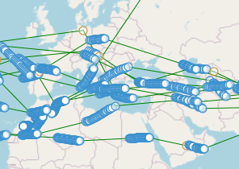
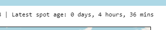
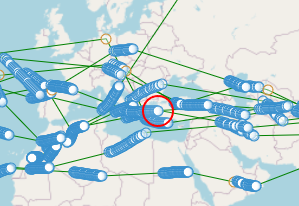

---
date:
  created: 2024-03-07

categories:
  - converted
  - site
---

# Latest spot highlighting

!!! note "This entry is based on a converted groups.io post, put here for any documentation value."
Update,

The map can now highlight your latest spot for you.

For those with long flights, who leave the map open and occasionally check for their latest updates, finding the latest location of your balloon can be challenging amongst all the spots.

The headline banner talking about your latest spot has now been upgraded.  Hover your mouse over it, and a red circle will appear on the map over your latest spot.

Which is the latest?

Now there is a solution.

Hover over this text:

Circle appears:

A refresh of the page will activate this feature.

Thanks.

Doug
