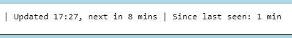

---
date:
  created: 2024-03-22

categories:
  - converted
  - site
---

# Latest spot age at a glance

!!! note "This entry is based on a converted groups.io post, put here for any documentation value."

Update,

Dashboard simplifies the "Updated" and "Spot age" indicators with easier to understand values.

(new view)

The "Updated":

- eliminates the date (it's today)
- calculates how long until the next update, refreshed each minute

The "Spot age":

- used to calculate (time now) - (timestamp of the latest regular message)
    - this is annoying because it's always at least 5 minutes old
        - (because we have to wait to receive it)
- this is now changed to something easier to understand -- "Since last seen"

The "Since last seen":

- shows you how many minutes ago a search was performed that found a new spot
    - if you're under 10 minutes old, your spots are current
    - if you're over 10 minutes old, missing spot
- updated each minute
- also eliminates the "0 days, 0 hours, ..." prefix if all zero durations

Basically the change is meant to

- reduce visual clutter
- make the values directly useful, no mental math required

Thanks.

Doug

