---
date:
  created: 2024-07-01

categories:
  - converted
  - site
---

# KML Export (Google Earth)

!!! note "This entry is based on a converted groups.io post, put here for any documentation value."

Update,

**KML Export**

The dashboard now supports KML export of the flight path. Useful to import into Google Earth.

I thought to do this because my father's flight ([link](https://traquito.github.io/search/spots/dashboard/?band=17m&channel=161&callsign=KN4IUD&dtGte=2024-06-13&dtLte=)) has gone off the map toward the North Pole and has become difficult to conceptualize on a 2D map. This feature addresses that, and is also just kind of neat.

2D Map struggling to show updates, map doesn't appear to show above +/- 85 degrees latitude.

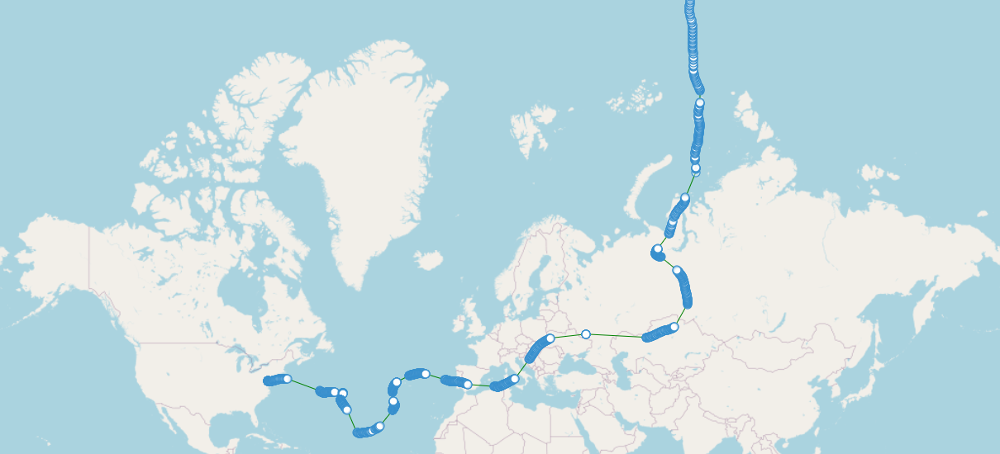

Here is that same flight, plotted on google earth:

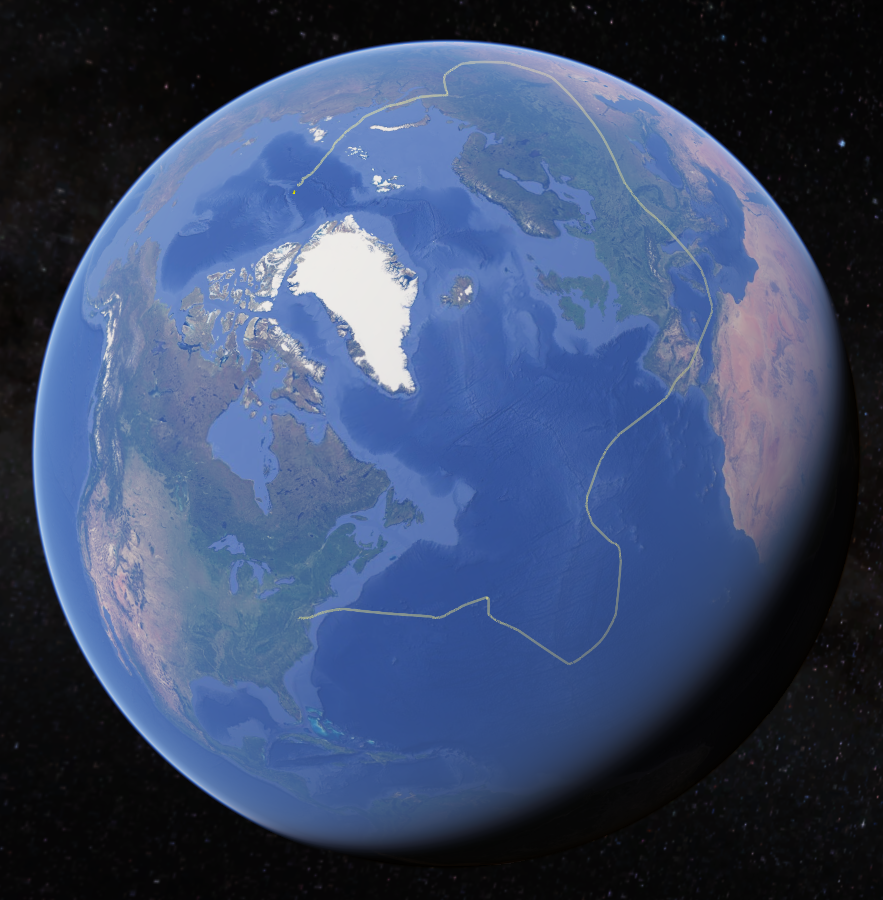

The KML file automatically defines both the North and South Pole, so if you're close, you can easily see it.

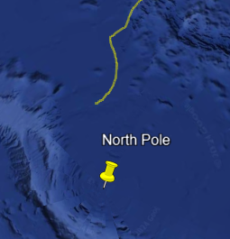

**How to Use**

Just above the table of data, there are two new options, KML with altitude, and KML without.

Click the link, and you get a file download popup.

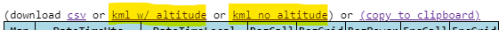

**Pros / Cons**

The KML with altitude has pros/cons, as does the no-altitude version.

With Altitude Pros:

- Neat ability to see altitude changes (eg launch or weather trouble)

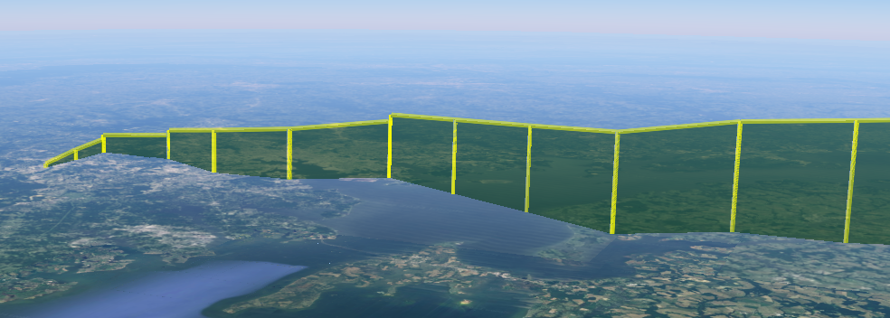

With Altitude Cons:

- GPS jamming, or intermittent spots, means consecutive spots may have a straight-line path through the Earth, hiding the line from view.

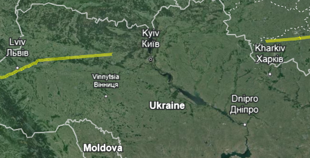

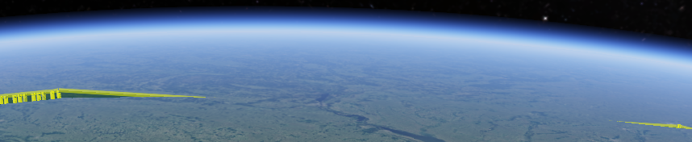

No-Altitude Pros/Cons:
- Doesn't suffer downsides, but not as neat

**More KML Features**

I may enhance this further to add more information into the KML, but it's kind of just a prototype for now.  Feel free to make suggestions.

Unfortunately I don't see a way to get a live updating google earth feed with the technology in use at the moment.

I also don't see a way to link directly to Google Earth from the dashboard, so the intermediate step of a file download is necessary (sucks).

**Stuff about Google Earth**

I only tried this on the web version of Google Earth. Hopefully it works in any application (let me know if not).

Google Earth Web: https://earth.google.com/ (chrome only)

You import the downloaded file like this:

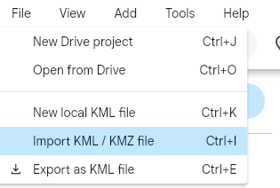

You'll then get a track which has all the spots broken out. You can fly to any given spot using the menu (3 dots) next to it.

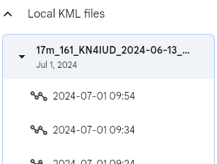

I find it helpful to turn off layers like clouds

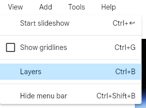

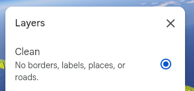

Google Earth also lets you measure distance in case you want to see distance from a thing. In this case, I'm measuring distance to the North Pole.

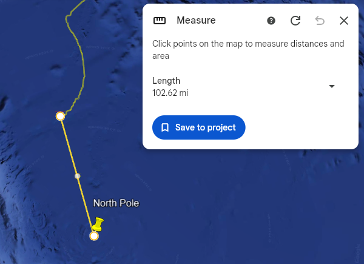

Thanks and enjoy!

Doug

