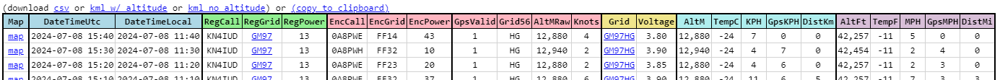
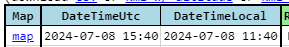
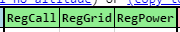
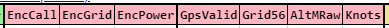
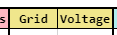
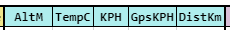
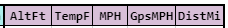
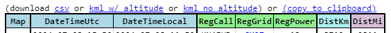

---
date:
  created: 2024-07-08

categories:
  - converted
  - site
---

# Data Column cleanup (order, colors)

!!! note "This entry is based on a converted groups.io post, put here for any documentation value."

Small update -- the column headers of the data table on the dashboard are now colored and grouped more intelligently for easier reading.

Map and DateTime columns remain in the same order and color, but the times are partitioned off from the Map column.

The Regular message is now Green, and partitioned.

The Encoded message is now LightPink and partitioned along with some (not all) of the decoded values from the Encoded message.

In short, you can ignore everything in LightPink unless you have a reason to look at it. Everything in the LightPink will be reflected in other columns in some actually-useful way or another, so there's unlikely to be anything here you want to look at on a regular basis.

Grid and Voltage are colored and partitioned away from the other metrics because they aren't metric/imperial values, they are a single unit we all understand.

The altitude, temperature, tracker-reported speed, gps speed, and distance traveled are now colored and partitioned, each now grouped within that set of data where the units are metric or imperial.

The same approach is done for the channel-less mode, which has far fewer columns.

Thanks.

Doug
