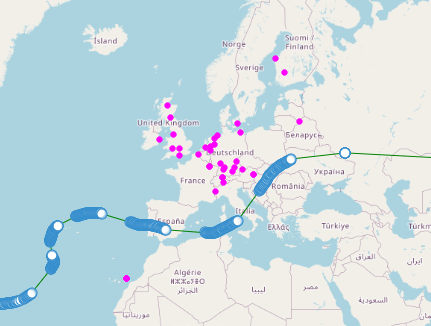
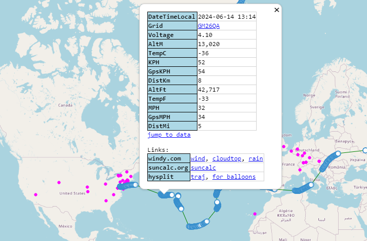
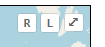
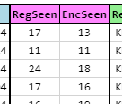

---
date:
  created: 2024-07-08

categories:
  - converted
  - site
---

# Receving Station support

!!! note "This entry is based on a converted groups.io post, put here for any documentation value."

Update - initial support for receiving station data.

Wondering which stations received your transmission? The map now indicates (purple dots).

By default, the latest spot rx stations will be visible.

You can mouse over any spot, though, and its receiving stations will become visible.

If you click on a spot, the spot popup appears, and freezes the rx stations on the map until you close the popup.

If you want to see behind the popup, you can actually just scroll the map to the left or right, and when the world wraps around, all the spots and rx stations are visible, but no popup. (this is kind of a hack).

If you don't want to see rx stations, there is a new "R" button in the upper-right corner. Click it to disable all rx spots. Click again to re-enable.

For the moment, the R-button affects all search pages together, and is remembered after you close and re-open the page. So it's basically a site-wide on/off switch. Let me know if that matches your desire or not (and what you'd rather see for functionality).

There are two new columns added, counting the number of rx stations which heard your regular and encoded transmission.

Note -- the number of rx stations heard can/will differ from the number of points on the map. The columns show how many of each were heard. For a telemetry spot, though, the fingerprinting must match up the regular and encoded. The number of stations where fingerprinting was effective is what is shown on the map.

At the moment this functionality isn't yet implemented for channel-less search.

Thanks.

Doug
