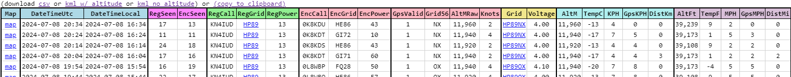
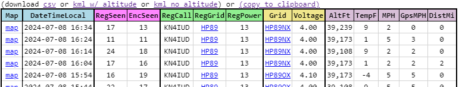
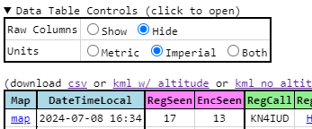

---
date:
  created: 2024-07-08

categories:
  - converted
  - site
---

# Show/Hide units, encoded data

!!! note "This entry is based on a converted groups.io post, put here for any documentation value."

Update, you can now select fewer columns to show in the data table (since it's so wide now).

Before:

After:

This is controlled by a new (initially hidden) Data Table Control, found directly above the Data Table. Click the title to reveal the control panel.

Raw Columns - Hide: hide all the columns which aren't directly useful, since they are just the inputs for computing the actually-useful columns.

The Raw Columns are:

- DateTimeUtc
- EncCall
- EncGrid
- EncPower
- GpsValid
- Grid56
- AltMRaw
- Knots

The Units selector lets you decide between the metrics being displayed in Metric, Imperial, or Both.

Both of the selections apply to any balloon you track, and are remembered when you close and reopen any search page.

!!! note "Downloads from the Data Table still have the full contents, this is just a display feature, the data is all still there."

Thanks.

Doug
