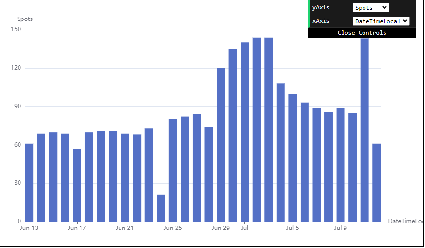
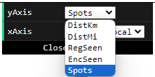

---
date:
  created: 2024-07-12

categories:
  - converted
  - site
---

# Bar Chart of daily metrics

!!! note "This entry is based on a converted groups.io post, put here for any documentation value."

Update, new graph available showing daily counts.

eg total spots per day:

It is found under the Detailed Graphs section, so not visible by default without a click on first page load.

You can look at the count for a number of metrics:

You can also see in local or UTC time:

I found it interesting in general, but also due to my father's flight (link) which repeatedly has been so far North that it's getting 24 hours of sun. Looking at the spot counts, multiple days have received the maximum number of spots possible (144). Nice!

As usual, this, and all other changes, work for old flights, too, so feel free to look at old flights which might be interesting!

Thanks.

Doug
