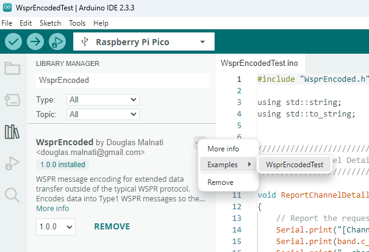

---
date:
  created: 2024-11-19

categories:
  - site
  - arduino
  - telemetry
---

# Arduino Library Released

The v1 version of an Arduino-compatible library for Telemetry has been made available.

<!-- more -->

## Library Details

I made a version 1.0.0 Arduino-compatible library available. The Arduino Library Manager sources the code from this repo: https://github.com/traquito/WsprEncoded.

Using the v2 IDE, you can look for the WsprEncoded library and install it. Works for RP2040 targets. Is that what everyone is using?

From there, click the "..." next to the name, Examples, WsprEncodedTest. You can then compile/run the example program.

The test program gives a demonstration of the way to use the library, and prints out all the inputs/outputs.

You should be able to install this library (and not modify it), and have it work in your tracker. Later, this library will be functionally extended to do more stuff, and your tracker will be seamlessly upgraded when you use the library manager.

It is also possible to use the repo as a submodule or just clone the repo. This is not tested yet, and in fact probably doesn't work properly yet, but can do if people announce a need.

The bottom line is -- if we standardize on a library, we can enhance it, and all the trackers benefit from the consistency and new functionality. If people copy/paste/tweak/etc the code then it's a mess. Don't change the code in your project! We'll change it on github!

This library will be documented as well.

Test program output:

!!! quote
        --------------
        Start of tests
        --------------

        [Channel details for band 20m, channel 368]
        id1 : 1
        id3 : 8
        id13: 18
        min : 4
        freq: 14097060

        [Testing Non-Clamped Encoded Values]
        Encoded WSPR U4B Type1 Message for:
        id13      : input as  : Q5
                  : clamped to: Q5
        grid56    : input as  : JM
                  : clamped to: JM
        altM      : input as  : 5120
                  : clamped to: 5120
        tempC     : input as  : -5
                  : clamped to: -5
        voltage   : input as  : 3.25
                  : clamped to: 3.25
        speedKnots: input as  : 25
                  : clamped to: 25
        gpsValid  : input as  : 1
                  : clamped to: 1

        callsign: QD5WPK
        grid4   : IR39
        pwrDbm  : 47

        Check decoding at: https://traquito.github.io/pro/decode/?decode=QD5WPK%20IR39%2047&encode=

        [Testing Clamped Encoded Values]
        Encoded WSPR U4B Type1 Message for:
        id13      : input as  : Q5
                  : clamped to: Q5
        grid56    : input as  : JM
                  : clamped to: JM
        altM      : input as  : 25000
                  : clamped to: 21340
        tempC     : input as  : 45
                  : clamped to: 39
        voltage   : input as  : 5.60
                  : clamped to: 4.95
        speedKnots: input as  : 96
                  : clamped to: 82
        gpsValid  : input as  : 1
                  : clamped to: 1

        callsign: QD5XUP
        grid4   : RK54
        pwrDbm  : 43

        Check decoding at: https://traquito.github.io/pro/decode/?decode=QD5XUP%20RK54%2043&encode=

Thanks.

Doug