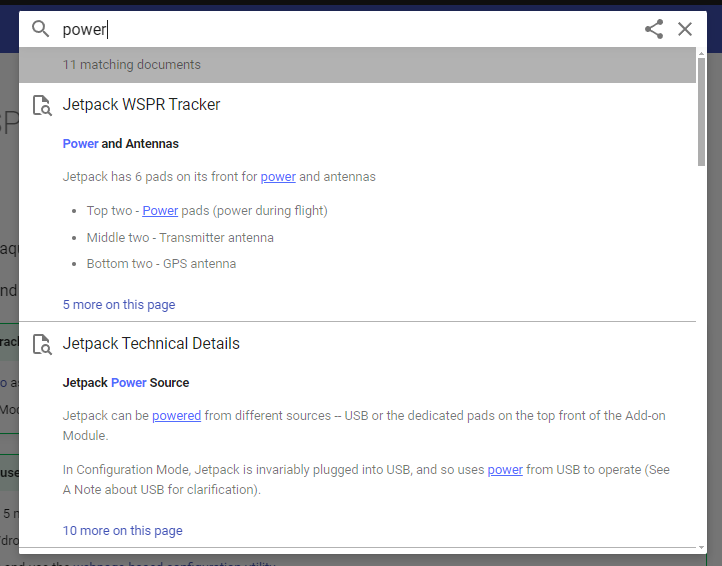
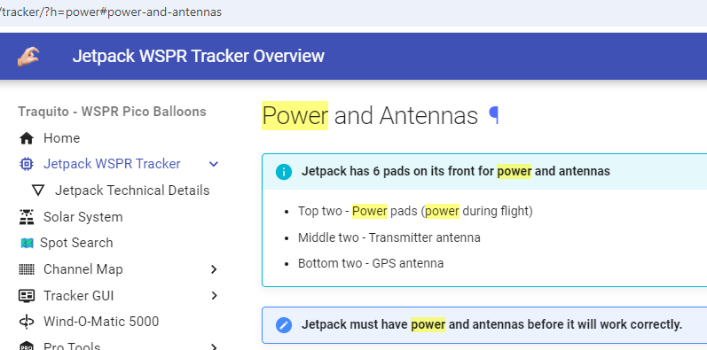
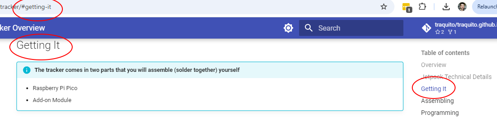
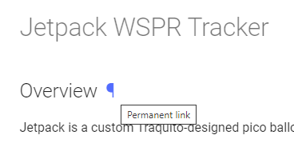
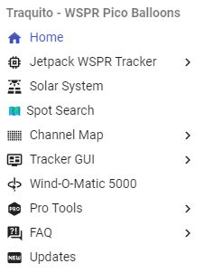
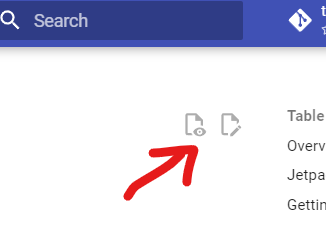
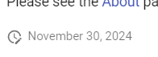
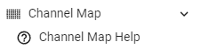

---
date:
  created: 2024-11-30

categories:
  - site
---

# Site overhaul

!!! success "Major overhaul! Major improvements!"

<!-- more -->

## Improvements

### Search works great!

Entire site is pre-indexed, lightening fast and well organized.

Search is embedded into the URL for sharing, and results highlighted on page.

### Table of contents

Each page has one, which updates the URL and highlights where you are on the page.

### Permanent links to page sections

Easier to share/bookmark.

### Site-wide navigation

An always-visible navigation section keeps information easier to navigate to.

Expand or collapse sub-sections.

### It's pretty

Supports very eye-catching call-outs, code blocks, and more.

!!! warning "This is a warning, did you see it?"

### Light/Dark mode.

Why not.

### Easier to maintain

Documentation is in markdown, easier to contribute and take pull requests.

Links to the underlying markdown available on every page.

### Page freshness

Every page has a marker indicating when it was last updated at the bottom of the page.

### Responsive design

Fits itself well into every device including mobile.

## Site Organization Changes

Added Updates section, which is basically a blog for change updates, which helps improve documentation.

Rearranged the hierarchy of some pages.

eg Channel Map Help is now visibly next to the Channel Map link.

## Technical Details

The site got moved to mkdocs technology (see link at bottom of page).

Most dynamic pages (tracker gui, decoder, etc) went along with the conversion.

The search dashboard was not converted, it's too complex. Perhaps one day.

## Feedback

If you spot any issues, please report them on the [Contact](../../../faq/contact/README.md) page!

