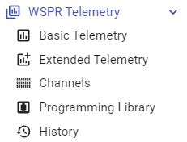

---
date:
  created: 2024-12-03

categories:
  - site
  - api
  - arduino
  - git
  - telemetry
---

# Telemetry's Future

## Overview

Common telemetry questions:

- Where is telemetry documented? (For implementation or curiosity)
- Can telemetry be extended? And to what?
    - Who decides these things?

This change aims to answer those questions and provide a path forward.

!!! note "Short answer -- it's documented here, we can extend it, and we all get to decide how."

<!-- more -->

## Telemetry Sections

!!! success "There are new sections in Pro"
    

The sections are:

| Section             | Description                                                                 |
|---------------------|-----------------------------------------------------------------------------|
| WSPR Telemetry      | Overview of the technique of encoding and examples of doing it by hand.     |
| Basic Telemetry     | Specific details of how Telemetry is encoded today.                         |
| Extended Telemetry  | Concrete proposal about how to dramatically extend Telemetry going forward. |
| Channels            | Details about how Channels work.                                            |
| Programming Library | Full C++ Arduino-compatible library for Telemetry Encoding/Decoding.        |
| History             | Acknowledgements.                                                           |

## Telemetry Steering Committee

It is worth putting a bit of a notional structure around the development of Telemetry going forward.

It makes sense to have a committee to discuss (in public on the forum) the pros/cons of any given change to Telemetry.

!!! info "Forum: [Telemetry Steering Committee](https://groups.io/g/picoballoon/topic/109902655){:target="_blank"}"

!!! info "Committee Membership List"
    - Everyone

!!! info "Areas of contribution (broadly; contribute how you like)"
    | Area                  | Description                                                                                                                                                                                                                                                                                                            |
    |-----------------------|------------------------------------------------------------------------------------------------------------------------------------------------------------------------------------------------------------------------------------------------------------------------------------------------------------------------|
    | General Comments      | Any comments whatsoever.                                                                                                                                                                                                                                                                                               |
    | Data Comments         | General comments on data they'd like to see available.  (eg pressure in hPa vs bar, or a collection of data points you'd like to see).                                                                                                                                                                          |
    | Message Type Comments | Specific comments on specifically the structure and standardization of enumerated [Extended Telemetry](../../../pro/telemetry/extended/README.md) message types.  (eg championing the structure of a GPS Message).                                                                                             |
    | Protocol Comments     | Specific highly-technical comments about the fundamental architecture of any extension to the [Basic Telemetry](../../../pro/telemetry/basic/README.md) scheme that exists today.  (ie technical critiques/contributions to [Extended Telemetry](../../../pro/telemetry/extended/README.md) in whatever form). |
    | Code Contribution     | Technical contributions to the body of code implementing all Telemetry and/or documentation.                                                                                                                                                                                                                           |

### Message Types Prototyping - Easy

There is a <a href="/pro/codec/" target="_blank">Extended Telemetry playground</a> tool available to let you prototype the set of fields that might exist in an Extended Telemetry message.

Have a play around with it, see what makes sense, and share with the group if you think you're on to something.

As usual, copying the URL of the page shares everything you see.

!!! example "See the [Example Message - GPS Stats](../../../pro/telemetry/extended/README.md#example-message-gps-stats) example in Extended Telemetry"

