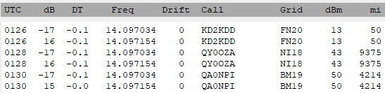

---
date:
  created: 2024-12-12

categories:
  - site
  - api
  - arduino
  - git
  - telemetry
---


# Extended Telemetry Milestone - First Send!

## Overview

A happy milestone, the first Extended Telemetry message was published over-the-air and decoded successfully!

<!-- more -->


## Transmission

A modified Jetpack tracker was set up to transmit the test message using the [WsprEncoded](https://github.com/traquito/WsprEncoded){:target="_blank"} library implementing [Extended Telemetry](../../../pro/telemetry/code/README.md), making use of the [UserDefined](../../../pro/telemetry/code/userdefined/README.md) type.

The message "HI_MOM" was encoded, sent over the air, received, and decoded.

The WSJT-X reception was in slot 2, immediately following Basic Telemetry.



WSJT text output:
```
0126  -17  -0.1   14.097034    0   KD2KDD        FN20     13     50
0126   16  -0.1   14.097154    0   KD2KDD        FN20     13     50
0128  -17  -0.1   14.097034    0   QY0OZA        NI18     43   9375
0128   16  -0.1   14.097154    0   QY0OZA        NI18     43   9375
0130  -17  -0.1   14.097034    0   QA0NPI        BM19     50   4214
0130   15  -0.0   14.097154    0   QA0NPI        BM19     50   4214
```


## Steps

The message field definition was first mocked up in the online Extended Telemetry [Playground](https://traquito.github.io/pro/codec/?codec=%7B%20%22name%22%3A%20%22C1%22%2C%20%20%20%20%22unit%22%3A%20%22Char%22%2C%20%20%22lowValue%22%3A%20%20%200%2C%20%22highValue%22%3A%2025%2C%20%20%20%20%22stepSize%22%3A%201%20%20%20%20%7D%2C%0A%7B%20%22name%22%3A%20%22C2%22%2C%20%20%20%20%22unit%22%3A%20%22Char%22%2C%20%20%22lowValue%22%3A%20%20%200%2C%20%22highValue%22%3A%2025%2C%20%20%20%20%22stepSize%22%3A%201%20%20%20%20%7D%2C%0A%7B%20%22name%22%3A%20%22C3%22%2C%20%20%20%20%22unit%22%3A%20%22Char%22%2C%20%20%22lowValue%22%3A%20%20%200%2C%20%22highValue%22%3A%2030%2C%20%20%20%20%22stepSize%22%3A%201%20%20%20%20%7D%2C%0A%7B%20%22name%22%3A%20%22C4%22%2C%20%20%20%20%22unit%22%3A%20%22Char%22%2C%20%20%22lowValue%22%3A%20%20%200%2C%20%22highValue%22%3A%2025%2C%20%20%20%20%22stepSize%22%3A%201%20%20%20%20%7D%2C%0A%7B%20%22name%22%3A%20%22C5%22%2C%20%20%20%20%22unit%22%3A%20%22Char%22%2C%20%20%22lowValue%22%3A%20%20%200%2C%20%22highValue%22%3A%2025%2C%20%20%20%20%22stepSize%22%3A%201%20%20%20%20%7D%2C%0A%7B%20%22name%22%3A%20%22C6%22%2C%20%20%20%20%22unit%22%3A%20%22Char%22%2C%20%20%22lowValue%22%3A%20%20%200%2C%20%22highValue%22%3A%2025%2C%20%20%20%20%22stepSize%22%3A%201%20%20%20%20%7D%2C&decode=QA0NPI%20BM19%2050%0A&encode=Q0%202%207%208%2030%2012%2014%2012){:target="_blank"}.

Field defs:
```
{ "name": "C1",    "unit": "Char",  "lowValue":   0, "highValue": 25,    "stepSize": 1    },
{ "name": "C2",    "unit": "Char",  "lowValue":   0, "highValue": 25,    "stepSize": 1    },
{ "name": "C3",    "unit": "Char",  "lowValue":   0, "highValue": 30,    "stepSize": 1    },
{ "name": "C4",    "unit": "Char",  "lowValue":   0, "highValue": 25,    "stepSize": 1    },
{ "name": "C5",    "unit": "Char",  "lowValue":   0, "highValue": 25,    "stepSize": 1    },
{ "name": "C6",    "unit": "Char",  "lowValue":   0, "highValue": 25,    "stepSize": 1    },
```

Since I wanted a fun test message, but ASCII fields aren't really a thing in Extended Telemetry, I defined the fields as integer offsets from the letter `A`. (In normal messages you wouldn't do a thing like this, it's just for fun.)

Each field can hold letters `A-Z`, but I defined the `C3` field is defined as going all the way up to the underscore `_` just for demo purposes.

Once that was seen working, I coded it up, using the [UserDefined API Guide](../../../pro/telemetry/code/userdefined/README.md#api-guide) as a reference.

```c++
#include "WsprEncoded.h"

// ...

void SendTestUserDefinedMessage(const char *id13, uint8_t slot)
{
    WsprMessageTelemetryExtendedUserDefined<6> msg;

    // set up field defs
    msg.DefineField("C1", 0, 25, 1);
    msg.DefineField("C2", 0, 25, 1);
    msg.DefineField("C3", 0, 30, 1);
    msg.DefineField("C4", 0, 25, 1);
    msg.DefineField("C5", 0, 25, 1);
    msg.DefineField("C6", 0, 25, 1);

    // set values
    msg.Set("C1", 'H' - 'A');
    msg.Set("C2", 'I' - 'A');
    msg.Set("C3", '_' - 'A');
    msg.Set("C4", 'M' - 'A');
    msg.Set("C5", 'O' - 'A');
    msg.Set("C6", 'M' - 'A');

    // encode
    msg.SetId13(id13);
    msg.SetHdrSlot(slot);
    msg.Encode();

    // send
    // ...
}
```

Once WSJT-X received the data, I was able to manually decode the data using the Playground link above.

```
==========================
QA0NPI BM19 50
==========================
ExtTel (HdrRESERVED 0, HdrSlot 2, HdrType 0)
id13: Q0
C1  : 7
C2  : 8
C3  : 30
C4  : 12
C5  : 14
C6  : 12
```

Working out the above, it's "HI_MOM" as expected!


## Next Milestones

The search dashboard is undergoing a complete re-write to fully support Extended Telemetry.

This will mean the ability for users to:

- Define their own UserDefined telemetry
- Send it
- Have the dashboard decode it, tabulate the extracted values, and graph the values
- No coordination between that user and anyone else necessary

Further ahead, Jetpack will be extended to:

- Send Extended Telemetry on a regular basis (eg Enhanced Basic Telemetry, etc)
    - Automatically, that is
- Take configuration which allows non-programmers to send data from sensors they attach to Jetpack (UserDefined telemetry)
- And more!

Stay tuned!
