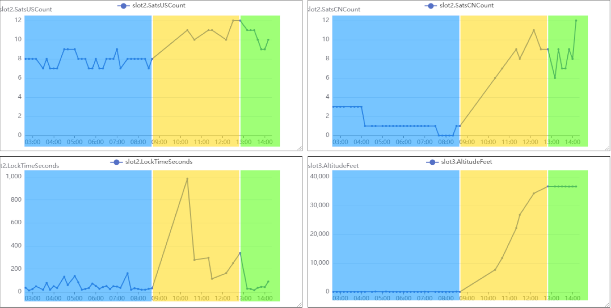
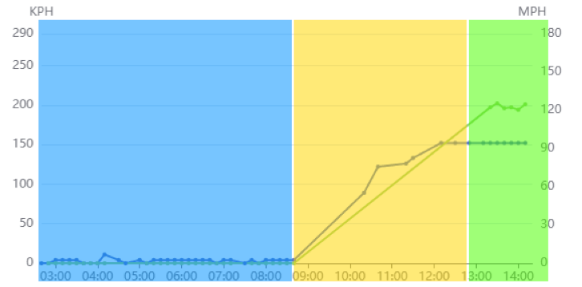
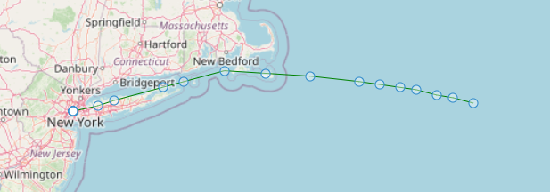
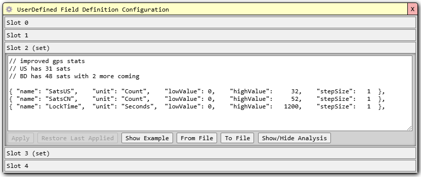

---
date:
  created: 2024-12-17

categories:
  - telemetry
  - gps
---

# GPS Analysis from First Airborne ET Flight

## Overview

I wanted to share some very interesting GPS data collected during the first flight of an Extended Telemetry UserDefind message set carrying GPS stats.

The results challenge some of my established beliefs about GPS performance relating to lock time. Some more epxeriments will shed more light on this.

The results have provided new insight and evidence into an ongoing mystery about why my tracker almost always has a 1-hour blackout period on initial launch before transmissions are received.

## Major Takeaway Summary

!!! info "Summary"
    - The GPS appears to have a <b>huge problem with getting locks while rising</b>
        - Compared to, say, staying at ground level, or floating at altitude
        - Not seemingly correlated with ground speed
    - There is approximately a 1 hour period of time from launch in my area (NYC area) to first transmission, seemingly due to GPS inability to get a lock
    - The number of Chinese GPS satellites visible in flight rises significantly during flight

<!-- more -->

## Flight Stats

The flight is [configured](https://traquito.github.io/pro/codec/?codec=%2F%2F+improved+gps+stats%0A%2F%2F+US+has+31+sats%0A%2F%2F+BD+has+48+sats+with+2+more+coming%0A%0A%7B+%22name%22%3A+%22SatsUS%22%2C++++%22unit%22%3A+%22Count%22%2C++++%22lowValue%22%3A+0%2C++++%22highValue%22%3A+++++32%2C++++%22stepSize%22%3A+++1++%7D%2C%0A%7B+%22name%22%3A+%22SatsCN%22%2C++++%22unit%22%3A+%22Count%22%2C++++%22lowValue%22%3A+0%2C++++%22highValue%22%3A+++++52%2C++++%22stepSize%22%3A+++1++%7D%2C%0A%7B+%22name%22%3A+%22LockTime%22%2C++%22unit%22%3A+%22Seconds%22%2C++%22lowValue%22%3A+0%2C++++%22highValue%22%3A+++1200%2C++++%22stepSize%22%3A+++1++%7D%2C&decode=010DWV+IB18+47%0AQI1VRL+JO07+37%0A&encode=00+2+10000++4+16+2.7+++6%0AQ1+3+22000+45++1+7.7+105%0A){:target="_blank"} to capture 3 sets of stats relating to GPS operation.

!!! info "Stats"
    - Number of USA GPS satellites in view at lock
    - Number of Chinese GPS satellites in view at lock
    - Duration of time to obtain a GPS lock

## Window Testing vs Flight Results

| Stat                  | Window Test                          | Flight Results         |
|-----------------------|--------------------------------------|------------------------|
| USA Satellite Count   | 7-9 range                            | 9-12 range             |
| China Satellite Count | 0-3 range                            | 6-12 range             |
| GPS Lock Time         | 0-2 min range (all over, really) | Extremely high and low |

It is the GPS lock time values which are most interesting.

## Reading the Graphs

There are 4 graphs below, the 3 GPS stats, and Altitude (in feet).

!!! info "The colors relate to what was happening to the tracker at the time."
    - Blue - Not moving, sitting overnight in a window
    - Yellow - Ascent
    - Green - Achieved Float

The GPS lock times were HORRIBLE during ascent. The maximum value was 16 minutes! The other values were also higher than at either of the other two phases.

The lock times were great when the balloon wasn't rising, though. Both at rest and at float.

Is speed a factor? I don't see evidence here that it was.

Here is the speed graph, same color coding:

In other words, the balloon was flying very quickly both during ascent and during float.

It was only when float was achieved (at a higher speed, notably) that the GPS lock times settled to smaller numbers.

!!! Note "Makes me realize it isn't obvious how long it has been taking the tracker to obtain a lock at elevation."
    Window tests seemingly did not tell the whole story.

## More observation on GPS lock time

In my area (NYC area), every time I launch, there is a "blackout" period where no transmissions are reported received, and then they start, usually as the balloon is near 7-10k altitude.

The graph above, showing the GPS lock time, shows the _first_ reported message was a 16-minute lock duration. Ok, so that accounts for 16 of the missing hour-ish minutes. Where's the rest?

I theorize that actually the GPS wasn't able to get a lock for the entire time until then.

The tracker waits up-to 20 minutes for a GPS lock, and then reboots hoping to clear any issue. I think that's possibly what's going on.

!!! question "The specific sequence could be:"
    - Tracker launched
    - Tries to get a gps lock, fails after 20 minutes, restarts
    - Tries to get a gps lock, fails after 20 minutes, restarts
    - Tries to get a gps lock, gets it after 16 minutes, transmits
    - This equals the nearly hour it typically takes

Thanks extra stats for a lead!

It is, of course, a completely different question as to _why_ the GPS takes so long to get a lock in my area.

I do know I've had my own balloons lap the world, come back directly overhead, and not have an issue getting a GPS lock. So, seemingly, it's "sub-10k near the ground near NYC" that has an issue.

## Theories

Why does the tracker, here, seemingly reliably, not get a GPS lock on initial ascent?

I want to think it's related to the NYC area somehow, but the balloon was out beyond Massachusetts at 12:50pm and still getting bad lock times. So, not the NYC area I think.

## Other Questions

Why are so many more Chinese satellites visible at altitude than window (unlike USA satellites)?

Does vertical ascent give GPS trouble locking, generally?

Has Dave collected GPS lock timing stats during flight in his part of the world that could help?

Am I actually using data from both constellations when both are enabled in my GPS code? Is this causing a problem?

## In the future

### Data

I want more data. I will look at collecting:

- Time to GPS time lock
- Time to GPS 2d lock
- Time to GPS 3d lock
- Time to GPS 3d lock + full datetime
- Number of satellites actually used for GPS lock (not just in view)

### Other Variables

More launches in this area, but with different physical configuration (try out two-legged anenna).

Launch in other geographical areas. (I'm in MD for the holidays, will be launching a high-altitude balloon there with this same firmware).

## Appendix

GPS Stats Field Definition:

!!! note "The 1200 seconds is 20 minutes"
    This is the max time the tracker waits to acquire a GPS lock before rebooting itself in an attempt to clear whatever the issue is.

